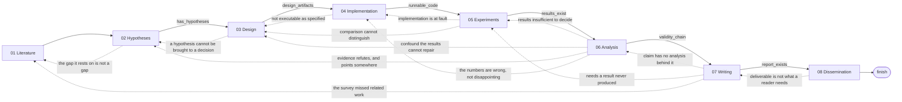
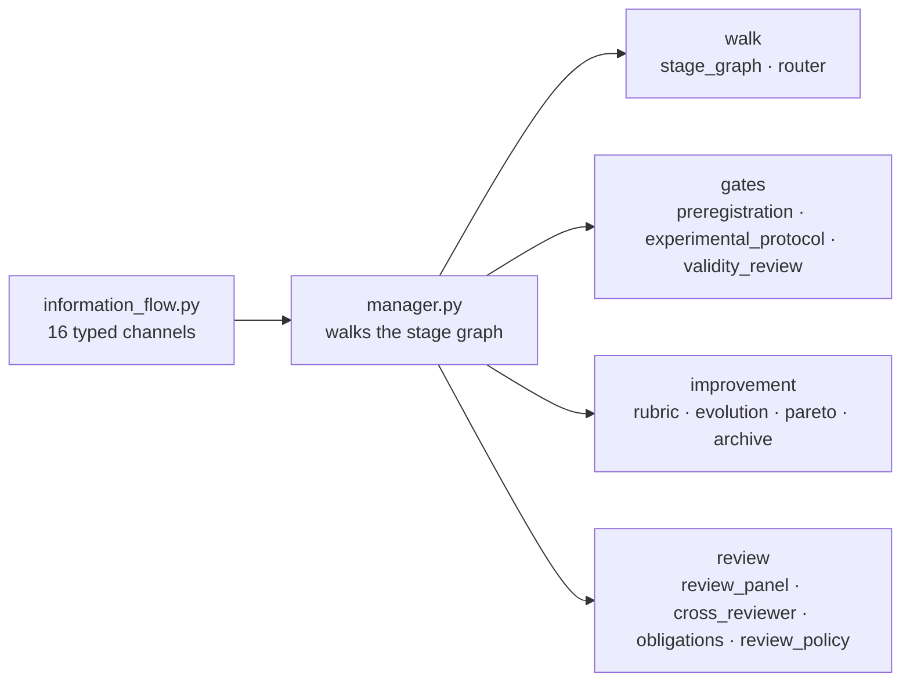

<h1 align="center">AutoR: A Recursive Research System</h1>

<p align="center">
  <strong>It proposes, tests, and tries to refute itself. The approval gate is the one thing it does not own — by default, that is you.</strong>
</p>

<p align="center">
  
  
  
  
  
  
  <a href="LICENSE"></a>
  <a href="https://github.com/tangxiangru/AutoR"></a>
</p>

<p align="center">
  <strong>Start here:</strong>
  <a href="docs/tutorial_en.md">English Guide</a> ·
  <a href="docs/tutorial_zh.md">中文教程</a> ·
  <a href="docs/">Full Documentation</a>
</p>

<p align="center">
  
</p>

---

## What AutoR is

Most autoresearch systems optimize for autonomy. AutoR takes a different position: research is too
important to hand over as a blind end-to-end loop. The goal is not to remove humans from research.
The goal is to give them a stronger execution system.

AutoR runs a research project as eight stages wired into a directed graph: six of the eight forward
edges are guarded by artifacts on disk, thirteen backward edges let a late finding send the run back — Stage 07
can reopen the literature survey. Hypotheses are frozen and hashed when Stage 04 is approved, every
one must be adjudicated at Stage 06 against a named result file, and every paper claim traced at
Stage 07; a `supported` or `refuted` verdict resting on one run is refused unless the run records
why one run settles it. An adversarial reviewer attacks Stage 05's results and Stage 06's analysis,
and the stage after each must answer every finding in writing or the gate refuses it. Drafts are
scored and a refinement that does not improve is reverted. Every stage still stops at an approval
gate, and by default that gate is you.

"Recursive" is eight mechanisms, each of them a file you can open:

| Move | What runs | Where |
| --- | --- | --- |
| **Propose** | Five proposers work from distinct lenses — mechanism, contrarian, adjacent field, null/artifact, regime — blind to each other; two statements whose Jaccard overlap reaches 0.5 collapse into one idea | [`ideation_panel.py`](src/ideation_panel.py) |
| **Test** | Every baseline declares `why_competent` and a `tuning_budget` before it runs; the hypothesis set is frozen and hashed before any result exists, and a later change is legal only as a recorded amendment | [`experimental_protocol.py`](src/experimental_protocol.py)<br />[`preregistration.py`](src/preregistration.py) |
| **Refute** | An adversarial pass asks why the result is wrong across ten named failure modes — confound, leakage, `metric_cherry_picking`, `effect_within_noise`, six more; a round can close as `converged`, `refine_design`, `new_hypothesis` or `abandon` | [`validity_review.py`](src/validity_review.py)<br />[`research_rounds.py`](src/research_rounds.py) |
| **Critique** | Five seats review independently, cross-examine anonymised, then converge; a blocking objection is turned into a refusal in code against the panel's own chair, and a different model family audits the approval as a veto | [`review_panel.py`](src/review_panel.py)<br />[`cross_reviewer.py`](src/cross_reviewer.py) |
| **Iterate** | Every valid draft is scored against a rubric read off disk; the champion is kept and a losing polish round is reverted before anyone reads it; a draft that loses on the weighted total but is non-dominated on the criterion vector is kept anyway | [`rubric.py`](src/rubric.py)<br />[`evolution.py`](src/evolution.py)<br />[`pareto.py`](src/pareto.py) |
| **Learn** | Each finished run records its route and measured fitness; a fitness comparison is keyed on the set of stages the run actually measured, so a run cannot score well by stopping early. No real observation has reached it yet — the archive is empty on a fresh install ([what has and has not been measured](docs/self-improvement.md#what-has-and-has-not-been-measured)) | [`archive.py`](src/archive.py) |
| **Deliberate** | A stage that hits a genuine crux stops, names the question, and pulls in theorist / empiricist / critic / pragmatist plus an expert brief, then continues with an answer that names its own falsifier; budgeted, and measured against what the agent already believed | [`deliberation.py`](src/deliberation.py) |
| **Localise** | A reviewer quotes the passage it objects to instead of refusing the whole stage; the revision is told to change only those spans and is diffed against them, so "preserve the correct parts" is measured rather than hoped for | [`stage_comments.py`](src/stage_comments.py) |

Four of those eight are on for every run: **Test**, **Refute**, **Iterate** (`--evolve` defaults on)
and **Learn**, which records on every run but only reaches a routing decision under
`--archive-steer`. **Propose** needs `--ideation-panel`; **Critique** needs `--review-panel` and
`--cross-review`; **Deliberate** needs `--deliberation`. **Localise** runs whenever a reviewer
quotes a passage. The `--rigor` dial sets several of these together and defaults to `standard`,
which turns effort tiering on.

Each of those moves keeps its own ledger, and at the end of a run
[`scorecard.py`](src/scorecard.py) reads all of them into `workspace/reviews/scorecard.md`: which
optional machinery earned its cost on this run, which flags to turn off next time, and — kept
separate on purpose — which ones could not be measured at all.

**AutoR does not run itself.** Manual approval is the default — `approval_mode` is `manual` unless a
flag opts out ([`main.py`](main.py)) — and `--full-auto`, `--review-panel` and `--approval-mode
agent` are those flags. Seven of the eight moves above can only score, refuse, revert or re-order;
none of them can approve a stage. The eighth, the review panel, *is* an approval gate, and it exists
only on the runs where you hand it the gate. Recursion did not change who decides; it changed what
reaches the desk. The research unit is unchanged: one reproducible run under `runs/<run_id>/`,
isolated, resumable, with redo and rollback.

Approved stage summaries are the only *free-text* memory. Every other cross-stage edge is a typed
artifact with a declared reader: sixteen typed channels in
[`information_flow.py`](src/information_flow.py) each name the exact stage slugs that consume them,
and the eight produced inside the walk name their producing stage as well. `obligations.json` and
`review_policy.json` cross stages without touching a summary at all — both only behind an agent
approval gate.

Many systems aim to generate research outputs that *look* ready. So the question is not

> Does it look ready?

It is

> Can you verify every part of it?

The answer is the validity chain — freeze at Stage 04, adjudicate at Stage 06, trace at Stage 07
([`preregistration.py`](src/preregistration.py)) — and the edge into writing stays shut until every
frozen hypothesis carries a verdict (`_guard_validity_chain`, [`stage_graph.py`](src/stage_graph.py)).

## What changed, measured

Every node used to be contractually required to restate its inbound edge. That heading is gone from
the stage contract, and the effect on a scripted run was measured at the commit that removed it
(`dd54947`):

| Measured across one `--fake-operator` run, at `dd54947` | Before | After |
| --- | --- | --- |
| Words a node emits | grew 235 → 1,211 | flat, 228-292 per stage |
| Share of stage output that was relay | 64% | 0% |
| Assembled prompt text | 21,236 words | 20,353 words |

Dated on purpose, and the recipe matters as much as the number: wrap `build_prompt`, sum
`len(prompt.split())` over one `--fake-operator --full-auto` run, and hold the goal string fixed —
the goal alone moves the total by a few hundred words, which is why an undated, un-recipe'd figure
here is not re-derivable by anyone. Re-run at `be76a34` with one goal held constant, `dd54947` gives
20,401 and HEAD gives 25,415: the assembled prompt is a quarter larger than when the relay heading
came out. The relay heading is still gone; the growth is later work adding context channels of its
own, not a regression of this one, and the honest form of a before/after is the commit it was taken
at.

The sharpest single case: the mutable Stage 02 hypotheses and the frozen preregistration were both
delivered from Stage 05 on — the same hypothesis twice, one copy labelled editable, sitting next to
the frozen one at exactly the stages where the freeze is the point. The `hypotheses` channel now
stops at `04_implementation`, where the freeze supersedes it
([`information_flow.py`](src/information_flow.py)).

The shape of the system, in counts you can re-derive from named symbols in the source: eight stages
plus `FINISH`, six guarded forward edges (`_ADVANCE_GUARDS`), thirteen backward edges
(`REVISIT_EDGES`), one conditional terminal (`TERMINAL_EDGES`), and sixteen typed information
channels (`CHANNELS`) — twenty-two edges in the adaptive graph altogether. Alongside the gates that ask whether a file
exists, seven `validate_*` functions form the scientific-validity chain and ask whether a *claim*
is warranted; they are named in full under
[the stage contract](#-the-stage-contract-and-what-gets-validated). (`validate_stage_artifacts`
dispatches seventeen validators in total and `src/` defines twenty — the seven are the subset the
code itself labels as the validity chain.)

## News

- **2026-08-06** — Per-stage output is flat at 228-292 words where it used to grow 235 → 1,211,
  relay is 0% where it was 64%, and assembled prompt text fell by about 900 words across a run
  (measured at `dd54947`; see [What changed, measured](#what-changed-measured) for the recipe).
  Behind those numbers: the stages became a directed graph with a router that must justify its move
  and is refused off-menu (`stage_graph.py`, `router.py`); every valid draft is scored and held to a
  champion ratchet (`rubric.py`, `evolution.py`, `pareto.py`); the cross-run archive keys every
  fitness comparison on the stages a run actually measured (#137); plus a deliberating review panel
  (#126), research rounds (#127), a cross-model veto (#128), a divergent ideation panel (#131),
  obligations carried forward (#132), self-improvement on by default (#134),
  shared prompt fragments (#136) and typed information edges (`dd54947`). Opt out with
  `--stage-graph linear`, `--routing off`, `--no-evolve`, `--no-archive`; details in [Recursive Self-Improvement](docs/self-improvement.md).
- **2026-06-02** — `--codex-sandbox danger-full-access` for runs that intentionally need remote GPU or SSH execution. Codex still defaults to `workspace-write`, and the setting persists in `run_config.json`.
- **2026-05-10** — Stage 00 clarification flow: questions asked one at a time with selectable options, custom answers and skip, then a compact refine / approve / abort menu on the revised brief.
- **2026-04-20** — `--full-auto`: the manual approval gate can be replaced by a strict reviewer agent, with reviewer settings persisted in `run_config.json`.
- **2026-04-19** — AutoR Studio merged into main: a local browser workspace over the same run directories, with live stage monitoring, review, restart-safe recovery, paper preview and a Notebook view.
- **2026-04-13** — Literature evidence ledgers and citation verification outputs, typed hypothesis manifests, and hardened experiment-manifest parsing.

## Showcase

`runs/20260330_101222` is the full example run the docs work from. Run directories are gitignored,
so what ships in the repository is the artifacts lifted out of it, under `assets/`.

| What the run produced | What it demonstrates |
| --- | --- |
| [example_paper.pdf](assets/examples/example_paper.pdf) | A compiled manuscript inside a larger research package |
| Executable research code | The run is not a writing pipeline |
| Machine-readable datasets and result files | Claims are backed by inspectable experiment outputs |
| Real figures used in the package | Publication-style visuals, not placeholders |
| Review and dissemination materials | The run continues past writing into release readiness |

`AGSNv2` reached **36.21 ± 1.08** on Actor, and the run preserved the full human approval trail.
The shot at the top of this page is the real terminal UI: colored stage panels, parsed backend
event streams, display-width-aware wrapping, keyboard-selectable menus.

<table>
  <tr>
    <td align="center" valign="top"><strong>Accuracy Comparison</strong><br /></td>
    <td align="center" valign="top"><strong>Ablation + Actor Results</strong><br /></td>
    <td align="center" valign="top"><strong>Two-Layer Narrative</strong><br /></td>
  </tr>
</table>

### Research output gallery

Four artifact-backed runs, two pages each: the framing page and an evidence page.

<table>
  <tr><td valign="top" width="23%"><strong>Output 1</strong><br />A complete end-to-end AutoR run.</td>
    <td align="center"><br /><strong>Page 1</strong></td>
    <td align="center"><br /><strong>Evidence Page</strong></td></tr>
  <tr><td valign="top"><strong>Output 2</strong><br /><em>Do More Experts Help?</em> A parameter-matched MoE-LoRA study.</td>
    <td align="center"><br /><strong>Page 1</strong></td>
    <td align="center"><br /><strong>Evidence Page</strong></td></tr>
  <tr><td valign="top"><strong>Output 3</strong><br /><em>Attention Sink Onset in Tiny Transformers</em> A controlled factorial study.</td>
    <td align="center"><br /><strong>Page 1</strong></td>
    <td align="center"><br /><strong>Overview Page</strong></td></tr>
  <tr><td valign="top"><strong>Output 4</strong><br /><em>HSOD: Harmonic Spectral Operator Decomposition</em> A stability-focused time-series study.</td>
    <td align="center"><br /><strong>Page 1</strong></td>
    <td align="center"><br /><strong>Analysis Page</strong></td></tr>
</table>

### What the human changed, and what they check now

In that run the human intervened where direction mattered: Stage 04 pushed the system to download
real datasets and run pre-checks, Stage 05 forced experimentation to continue until real benchmark
results existed, Stage 06 redirected the story from leaderboard framing to mechanism analysis.

What a human checks at Stage 02 has since changed. The headline feature there is now the opposite
of narrowing — `--ideation-panel` exists to widen the pool. The prompt instead requires a
`- Decision rule:` line on every empirical hypothesis, stating in advance what observation would
count as support and what would count as refutation
([`02_hypothesis_generation.md`](src/prompts/02_hypothesis_generation.md)); those are the
hypotheses frozen at Stage 04 and adjudicated at Stage 06. "Narrow it to one claim" is advice about
scope. "Make each one refutable" is advice about a gate that now exists.

## Quick Start

### Prerequisites

- Python 3.10+
- Claude CLI or Codex CLI available on `PATH` for real runs
- Local TeX tools are only needed for `--output-format latex`; the default markdown output needs no TeX
- `pip install google-genai` and a Gemini key in `GOOGLE_API_KEY` or `GEMINI_API_KEY` — needed by three paths, not only the diagram one: `--web-search gemini`, required where the backend's own `WebSearch` tool is disabled (`build_genai_client`, src/web_search.py); the cross-model veto `--cross-review auto|gemini`, which builds the same client (src/cross_reviewer.py); and `--research-diagram`, which also reads `configs/diagram_config.yaml` (see `configs/diagram_config.template.yaml`)
- The SDK is **not** a default dependency. Without it the diagram step prints `Diagram generation failed: No module named 'google'` and the run continues; cross-review records itself unavailable rather than agreeing

### Common commands

| Goal | Command |
| --- | --- |
| Start a run (the goal is prompted for if omitted) | `python main.py --goal "Your research goal here"` |
| Start with preloaded resources | `python main.py --goal "Your research goal here" --resources paper.pdf refs.bib data.csv` |
| Run a local smoke test without a real agent backend | `python main.py --fake-operator --goal "Smoke test"` |
| Run with the automated reviewer gate | `python main.py --full-auto --goal "Your research goal here"` |
| Choose how much optional machinery to run | `python main.py --rigor thorough --goal "..."` |
| Give the panel a researcher persona to stand in for | `python main.py --review-panel --persona docs/persona-example.md --goal "..."` |
| Seat the panel across different models | `python main.py --review-panel --panel-models pi=opus skeptic=codex:default --goal "..."` |
| Keep the strong model for the steps that matter | `python main.py --effort-tiers --model opus --routine-model sonnet --goal "..."` |
| Choose the execution backend and model | `python main.py --operator claude --model opus` or `python main.py --operator codex --model default` |
| Choose the reviewer backend separately | `python main.py --full-auto --review-operator claude --review-model opus` |
| Allow Codex-backed SSH / remote GPU execution | `python main.py --operator codex --codex-sandbox danger-full-access --goal "Your research goal here"` |
| Produce a LaTeX paper package instead of a markdown report | `python main.py --output-format latex --goal "..."` |
| Stop once the report is written, skipping dissemination | `python main.py --final-stage 07_writing --goal "..."` |
| Choose a writing venue profile | `python main.py --venue neurips_2025` or `python main.py --venue nature` or `python main.py --venue jmlr` |
| Resume the latest run | `python main.py --resume-run latest` |
| Redo a stage inside the same run | `python main.py --resume-run 20260329_210252 --redo-stage 03` |
| Roll back to a stage inside the same run | `python main.py --resume-run 20260329_210252 --rollback-stage 03` |
| Re-enter an existing project instead of starting over | `python main.py --project-root ~/code/my-project --goal "..."` |
| Seed the run from your own prior papers | `python main.py --paper-corpus ~/papers --goal "..."` |
| Store runs on another disk | `python main.py --runs-dir /mnt/big-disk/runs --goal "..."` |
| Raise the per-attempt ceiling for long training runs | `python main.py --stage-timeout 43200 --goal "..."` |
| Give a stubborn stage more retries | `python main.py --max-attempts 10 --goal "..."` |
| Let Stages 03-06 run as a repeatable round, so a refuted hypothesis can start a second one (default 1) | `python main.py --max-rounds 2 --goal "..."` |
| Skip the intake stage | `python main.py --skip-intake --goal "..."` |
| Add a generated method diagram to the paper | `python main.py --research-diagram --goal "..."` |
| Search the web where the agent's own `WebSearch` is disabled | `python main.py --web-search gemini --goal "..."` |
| Benchmark AutoR on ResearchClawBench | `python rcb_agent.py --workspace <WORKSPACE> --prompt <PROMPT>` |

Every flag, its default, and what is preserved on resume: **[docs/cli-reference.md](docs/cli-reference.md)**. Stage identifiers accept `03`, `3` or `03_study_design`; `--venue` defaults to `neurips_2025`.

**Two flags in that table remove the human from the gate.** `resolve_unattended` returns `True` for both `--full-auto` and `--review-panel` (main.py), and `approval_mode = "agent" if (args.full_auto or args.review_panel)` (main.py). So both replace the approval menu with an agent reviewer, never block on terminal input, and auto-skip a stage that exhausts its retries, up to `--max-auto-skips` (default 3). Under a badge reading *Human approval required*, the flag that looks like more review is the flag that removes the reviewer. Three headline mechanisms — obligations, the standing review policy, the cross-model veto — also run only behind that agent gate. Manual approval is the default and remains the path for work you intend to publish.

For Codex-backed runs, AutoR defaults to `--codex-sandbox workspace-write`. If a verified remote experiment needs SSH or external GPU access, use `--codex-sandbox danger-full-access` intentionally. This grants the Codex backend unrestricted local/remote execution ability, so it should not be the default for untrusted tasks.

```bash
# Self-improvement is on by default: navigate the graph, score every draft, keep the
# best, and record the route in ~/.autor/archive.
python main.py --goal "..."
python main.py --archive-report                   # what the archive has learned so far
python main.py --goal "..." --evolve-rounds 4     # spend more on improvement
python main.py --goal "..." --evolve-rounds 0     # measure and ratchet, no extra passes
python main.py --goal "..." --archive-steer       # let the archive pick the topology

# Opt out entirely: the strict 01-through-08 sequence, last draft wins.
python main.py --goal "..." --stage-graph linear --routing off --no-evolve --no-archive
```

### Studio (browser UI)

A local web UI over the same Claude-backed runs: create a project, watch stages execute, approve or send feedback, read the compiled paper. It needs the Claude CLI on `PATH` to start a run.

```bash
python studio.py                                # http://127.0.0.1:8000/studio/
python studio.py --host 0.0.0.0 --port 8765     # bind externally, see the warning below
python studio.py --runs-dir /path/to/runs       # override runs directory
```

> The Studio API has **no authentication**. It binds to `127.0.0.1` by default; anything that can reach it can start runs, approve stages, and read every file under the runs directory. For remote access prefer an SSH tunnel over `--host 0.0.0.0`. See [SECURITY.md](SECURITY.md).

One honest limit, then the walkthrough: the Studio's lazy-resume approve path picks the next stage arithmetically — the first stage with a higher number (src/backend/studio_runner.py) — and never consults the router, so graph routing and backward moves are a CLI capability today. Page-by-page walkthrough and the full HTTP API: **[docs/studio.md](docs/studio.md)**.

## How it works: the stage graph

Eight stages are the nodes; a `finish` node closes the walk. Stage 00 intake is not one of
them — it runs before the walk starts, and `_graph_entry_stage` → `_select_stages_for_run`
(`src/manager.py`) only ever yields the eight. Solid edges advance, dotted
edges go back; `--stage-graph linear` is the solid edges alone, and the guards come off with
the backward ones (`_advance_edges(guarded=False)`, src/stage_graph.py) — one edge out of
each node leaves nothing to choose, so a guard there could only halt a run that the stage's
own validation is about to fail anyway.



Six of the eight forward edges carry a guard, one per target stage
(`_ADVANCE_GUARDS`, src/stage_graph.py); 01→02 and 08→`finish` are
unguarded. Thirteen dotted edges go back (`REVISIT_EDGES`). The longest is
07→01: writing it up showed the finding relates to work the survey missed. The
Stage 07 guard is the strictest — every preregistered empirical hypothesis needs a
verdict **and** at least one figure under `workspace/figures`
(`_guard_validity_chain`).

**Who decides the move.** AutoR decides which moves are *admissible*, by evaluating
each edge's guard against the artifacts on disk. With `--routing auto` (the default,
src/utils.py) the agent chooses among them and states a reason; `--routing off`
always takes the graph's default. An off-menu choice — an unlisted target, or one
with no stated reason — is refused, written to `evolution/routing_refusals.jsonl`
(src/router.py), and replaced by the forward edge.

Two design calls worth naming. Blocked moves are handed to the agent *with the
reason they are blocked* (`StageGraph.moves`) — the useful thing to say is not
"you may go to 06" but "07 is closed because H2 has no verdict", and an agent that
sees why writing is closed routes to the analysis that opens it. And a revisit whose
justification repeats one already on the path is refused (`repeats_a_previous_reason`): going again on the same grounds is a loop, not an iteration.

**A backward move is only ever a deliberate choice.** The default is always the
forward edge, and when a guard has closed it the default advances anyway and lets
the stage's own validation — still refusing a Stage 07 that writes up unadjudicated
hypotheses — be the gate it always was. A guard is a routing preference; the gate is
the gate. So a refusal, a routing failure, or a run nobody is steering all come out
as the linear pipeline rather than as a stall.

A stage is a node with a visit budget, not a position in a sequence:
`DEFAULT_MAX_VISITS = 3` (`--graph-max-visits`); `--graph-max-steps` bounds the whole walk at 20.

### The eight stages, and what you check at each

| Stage | Role | What the human is checking |
| --- | --- | --- |
| `00_intake` (before the walk) | Align the goal, resources, constraints, target venue and success criteria. | Answer the clarification questions, add the missing constraints, and narrow the project until it is executable. |
| `01_literature_survey` | Build the related-work base, organize the evidence, identify the real gap. | Reject shallow paper lists; require task framing, benchmarks, baselines, differences, and structured literature files. |
| `02_hypothesis_generation` | Convert the direction into typed, testable hypotheses and provisional paper claims. | A `- Decision rule:` line on every empirical hypothesis, stating in advance what would count as support and what would count as refutation (src/prompts/02_hypothesis_generation.md:52-58). These are the hypotheses frozen at 04 and adjudicated at 06. |
| `03_study_design` | Turn the hypotheses into an executable plan and a declared protocol. | Datasets, metrics, ablations, budgets, failure criteria, machine-readable data artifacts — and a baseline set where every entry says `why_competent` and names its `tuning_budget`. |
| `04_implementation` | Build the runnable code, configs, data preparation and sanity checks. | This is the freeze point: approving the stage hashes the hypothesis set into `workspace/notes/preregistration.json`. Check the set you are freezing, and do not approve skeletons. |
| `05_experimentation` | Run the planned experiments and write machine-readable results. | The declared baselines and the seeds: a supported or refuted verdict off a single seed is refused unless the run states why one run settles it (`MIN_SEEDS_FOR_A_VERDICT = 2`, src/experimental_protocol.py). |
| `06_analysis` | Interpret the results, produce figures, adjudicate every frozen hypothesis. | A verdict for each one, backed by a result file the validator can find. The forward edge stays closed until then. |
| `07_writing` | Produce the deliverable: a markdown report with embedded figures, or a venue-aware LaTeX package with a compiled PDF. | That every claim traces. A `confirmatory` claim whose hypothesis is not in the supported set is already refused, so what is left to check is whether the exploratory ones are honestly labelled. |
| `08_dissemination` | Package the run for review, release, reproduction or presentation. | Readiness notes, review materials, manifests and outward-facing deliverables exist. |

### Self-Improvement Rounds

Every valid stage draft is measured against a rigour rubric read off disk — do the
paths it names resolve, do the numbers it reports appear in a results file, did it
produce artifacts during *this* execution, is the decision ledger four different
things rather than one sentence four times.

**Measuring is free and always on.** The rubric reads the run off disk and never
calls a backend, so the property it buys costs nothing: the draft that gets
promoted is the best one the run produced, not the last one. That is the half that
was missing before — AutoR could iterate, but "later" was the only ordering it had,
so a refinement that dropped a resolving reference was promoted on exactly the same
terms as one that fixed something.

**Improvement rounds are the half that costs**, and they are budgeted separately
from `--max-attempts`, which bounds a stage that is *failing* rather than one being
improved. Two per stage by default, and a stage whose rubric has no shortfall worth
acting on spends none of them — a round aimed at a criterion already at full marks
produces churn, so AutoR does not buy one. `--evolve-rounds 0` measures without
polishing; `--no-evolve` restores the old behaviour entirely.

One edge of that budget is worth knowing before you resume a run. `state()` rehydrates the
champion and the Pareto frontier from disk and nothing else (src/evolution.py), so
`--resume-run` restarts `rounds_spent` and the patience counter at zero: the best draft
survives the resume, the *spend cap* does not, and a stage resumed twice can buy the two
rounds twice.

A round that scores worse is reverted, so a stage can only improve. A round that
changes a hypothesis verdict is rejected outright, whatever it scored — the rubric
is blind to what the run concluded, which removes the incentive, and the drift
check removes the possibility.

A revision a *human* asked for always stands, whatever it measures. The ratchet
governs AutoR's own rounds, not the direction it is given.

Full mechanism, and the reasoning behind each refusal, in
[docs/self-improvement.md](docs/self-improvement.md).

### Approval semantics

- Stage 00 has a dedicated manual intake flow. On the first pass, AutoR asks the clarification questions one by one with selectable options, custom answers, and skip. On the revised pass, the user sees a compact intake brief and chooses refine, approve, or abort.
- Stages 01-08 use the standard six-action review menu: `1 / 2 / 3` continue with an AI refinement suggestion, `4` continues with custom feedback, `5` approves, and `6` aborts.

The division of labour is not "AutoR drives, the agent types": AutoR owns the menu of admissible moves, the agent owns the pick and has to justify it, and the human owns the approval without which there is no next move at all.

### The archive: which moves paid, across runs

Every finished run is recorded into `~/.autor/archive` — the route it took, the rubric
fitness it reached, and the set of stages it actually measured (`Archive.record_run`,
src/archive.py, from `record_into_archive`, main.py). `edge_payoffs` compares runs
that *took* an edge against runs that reached the same node and did not, and
`propose_variant` turns a payoff that is believable — enough observations, and a
delta above `min_gain` — into a child variant that moves that one edge one step up or down
the preference order.

A variant is only a reordering. It never opens a guarded edge, never adds one that was not
declared, and never removes one: the guards are the correctness argument for letting an
agent route at all, and the component that learns from outcomes is precisely the one that
must not be able to weaken them. Promotion is as conservative — a challenger has to beat the
incumbent *within every comparability basis* rather than on a pooled mean, because "runs
that stopped early" is the cheapest composition for a topology to win on (`promote`).

Two limits, stated here rather than left to be assumed:

- **The archive records and proposes on every run; it steers only when you ask.** The
  proposed variant is written down and reported, but the topology a run walks comes from
  the archive only under `--archive-steer` (`resolve_graph` in `main.py`). Without it, `resolve_graph`
  returns the declared topology unchanged.
- **A payoff comparison cannot reach an edge nothing has taken.** No takers means no
  evidence in either direction, so such an edge is never proposed and never preferred — and
  the backward edges start unpreferred, so they are the ones this strands.
  `propose_exploration` and `unexplored_edges` (src/archive.py) are written for
  exactly that blind spot, and `record_into_archive` reaches them only when `propose_variant`
  declines — so exploration is the fallback, never the first choice.

### Obligations carried forward

The reviewer's insight used to be captured only when it refused. But most stages are
approved, and an approval discarded everything the reviewer noticed — which is where most
of the review actually lives. A real reviewer approving a literature survey says "fine, but
you owe me a power analysis at design time", and then checks.

An approving reviewer can now attach **obligations** to a later stage. Each is injected into
that stage's prompt *and* into its review, so the reviewer who inherits one is asked whether
it was met:

```
approval ──obligation──▶ later stage prompt ──▶ that stage's review ──▶ discharged
                                                          │
                                                 not met ─┴──▶ refusal
```

Recorded in `runs/<run_id>/obligations.json`. Three rules keep it from becoming theatre:

- **Only a reviewer may discharge one.** The stage that owes it cannot mark its own
  homework — it can do the work and say so, and a reviewer decides.
- **Deferral is counted, never silent.** A stage may push an obligation later, but it stays
  open and its deferral count is shown to every subsequent reviewer, so "carried forward"
  cannot quietly become "dropped".
- **Bounded and deduplicated**, so a reviewer restating itself cannot manufacture rigour.

Together with the two mechanisms below, refusals teach rules, approvals set debts, and a
different model family can veto either.

### Cross-model review

The approval gate runs a coding agent with tools, so it can re-read a paper and re-execute
an analysis before judging. But it is the same model family as the executor — usually the
same model. Opus judging opus shares the blind spots that produced the work, which is
exactly what a review is supposed to catch.

So when the primary reviewer **approves**, a reviewer from a different model family reads
the same evidence and decides whether that approval is defensible. It is a **veto, never an
override**:

- It only audits approvals. A refusal already sends the stage back.
- It cannot approve anything the primary refused, so enabling it can only make the gate
  stricter — which is why `--cross-review auto` turns it on whenever a Gemini backend is
  configured.
- An auditor that errors or returns unparseable output is recorded as *unavailable*, not as
  agreement. Silence is never laundered into a passed audit.

A cross-model veto is recorded as a standing rule, so a blind spot caught once is checked
on every stage after it.

### Self-improving review

The approval gate does not just judge each stage — it **accumulates the corrections it
demands and applies them to every stage after**. A reviewer that once insisted on a stated
power analysis keeps insisting, so the same class of weakness cannot recur later in the run:

```
stage N review  ──demands a correction──▶  standing rule
                                              │
stage N+1 review  ◀──rule is now checked──────┘
```

Two properties keep this honest rather than decorative:

- **It is auditable.** The policy is a plain artifact at `runs/<run_id>/review_policy.json`,
  and every rule names the stage and attempt that produced it, so the claim can be checked
  against the record instead of believed.
- **It cannot inflate.** Rules are deduplicated on normalized text — casing, punctuation and
  stage numbers collapse — and the set is bounded, so a reviewer restating one complaint
  does not manufacture the appearance of learning.

A rollback is recorded at higher weight than a routine refinement, because it is the
strongest evidence a review can produce: an approval already given turned out to be wrong.
Approvals teach nothing and are not recorded.

### Unattended runs

`--full-auto` — equivalently `--approval-mode agent`, and implied by `--review-panel` — removes the human entirely, which is what benchmark harnesses and overnight sweeps need:

- The reviewer agent decides every approval, including the Stage 00 intake flow.
- `--unattended` on its own is only half of that. It stops AutoR blocking on stdin, but it does not install a reviewer: `approval_mode` stays `manual` (main.py), so the first approval menu raises `UnattendedInputError` instead of being decided. For a run with nobody at the terminal, pass `--full-auto`.
- The resource prompt is skipped even on a TTY. Pass resources with `--resources` instead.
- A stage that exhausts its retry budget is auto-skipped rather than aborting the run, bounded by `--max-auto-skips` (default 3). The skip is promoted as an explicit skip summary so downstream stages know the work is missing.
- Any interactive prompt still reachable raises `UnattendedInputError` instead of waiting on stdin — a prompt added later fails on its first unattended run rather than silently hanging an overnight job.

`python rcb_agent.py` runs AutoR against a [ResearchClawBench](https://github.com/InternScience/ResearchClawBench) workspace on this basis and exports the benchmark's deliverables (`report/report.md`, `report/images/`, `code/`, `outputs/`). See [docs/researchclawbench.md](docs/researchclawbench.md).

## ✅ The Stage Contract and What Gets Validated

AutoR does not consider a run successful just because it generated a plausible markdown summary.

**Required stage summary shape.** Seven headings, in this order — `REQUIRED_STAGE_HEADINGS` ([src/utils.py](src/utils.py)):

```md
# Stage X: <name>

## Objective
## What I Did
## Key Results
## Files Produced
## Decision Ledger
## Suggestions for Refinement
## Your Options
```

There was an eighth heading, retired in this branch: a section in which each stage restated the approved summaries of the stages before it. It made every node contractually required to relay its inbound edge. Stage output grew 235 → 1,211 words across a run and 64% of it was relay of context the stage had just been handed; without the section, relay is 0% and output is flat at 228-292 words per stage.

Also required, and checked: exactly 3 numbered refinement suggestions, exactly the fixed 6 user options, concrete file paths under `Files Produced`, and no `[In progress]`, `[Pending]`, `[TODO]` or `[TBD]` placeholders.

**Artifact gates.** Most start by asking whether a file is there — and the rows below that say
"valid", "resolving" or "matching" then parse it:

| Stage | Required non-toy output |
| --- | --- |
| Stage 01 | A cross-referenced evidence ledger: `sources.json` and `claims.json`, where every cited `source_id` resolves |
| Stage 03+ | Machine-readable data under `workspace/data/` |
| Stage 05+ | Machine-readable results under `workspace/results/`, plus a valid `experiment_manifest.json` |
| Stage 06+ | Real figure files under `workspace/figures/` |
| Stage 07+ (markdown) | `report/report.md` with resolving figure references, at most 5 figures under `report/images/`, `citation_verification.json`, `self_review.json`, `report_review.json` |
| Stage 07+ (latex) | `main.tex` matching the venue, `sections/*.tex`, a bibliography, a compiled PDF, `build_log.txt`, `citation_verification.json`, `self_review.json`, `layout_review.json` |
| Stage 08+ | Review and readiness assets under `workspace/reviews/` |

Requirements are cumulative, and the stage that *produces* a class of artifact must produce it **during that stage's execution** — a re-run is not credited with the previous attempt's files. The cutoff is `stage_execution_started_at` feeding `recent_in` ([src/utils.py](src/utils.py)), and the rubric enforces the same rule independently in `_fresh_artifact_kinds` ([src/rubric.py](src/rubric.py)), so a Stage 07 draft cannot score on Stage 06's figures.

**Validity gates.** The same function — `validate_stage_artifacts` ([src/utils.py](src/utils.py)) — also runs seven validators that ask whether a *claim* is warranted rather than whether output exists: `validate_preregistration`, `validate_experimental_protocol`, `validate_hypothesis_outcomes`, `validate_outcome_statistics`, `validate_claim_provenance`, `validate_validity_response`, `validate_round_decision`. (Three of them do refuse on an absent file — the artifact they need is the record of the claim itself, so its absence *is* the unwarranted claim.) The code labels the split itself: "The scientific-validity chain, distinct from the artifact gates around it" ([src/utils.py](src/utils.py)). A run can fail because a claim is unwarranted, not only because a file is absent.

The complete gate, including every JSON schema that is parsed rather than merely counted, is in **[docs/stage-contract.md](docs/stage-contract.md)**.

## 🧠 Execution Model

Context is composed per consumer, not per availability. A stage's inbound block is built by `render_inbound(ChannelContext(...), CHANNELS)` ([src/manager.py](src/manager.py)) from the sixteen typed channels in [src/information_flow.py](src/information_flow.py). Each channel declares `produced_by`, a `consumed_by` set of real stage slugs, and a `rationale`; `test_every_narrowing_is_argued_for` ([tests/test_information_flow.py](tests/test_information_flow.py)) fails a channel that withholds itself from a stage without saying why. Withholding has to be argued for, not just done.

Three narrowings, because the abstraction is not the point:

- the **artifact index** skips Stages 00-02 — they produce no data, results or figures, so the index is empty noise there
- the **writing manifest** reaches Stage 07 alone
- the mutable **Stage 02 hypotheses** stop at `04_implementation` ([src/information_flow.py](src/information_flow.py)), because the freeze at Stage 04's approval supersedes them. Before that edge was typed, the same H1 went into every prompt from Stage 05 on twice — one copy labelled editable, sitting next to the frozen one at exactly the stages where the freeze is the point.

`dependency_edges()` returns every `(producer, consumer, channel key)` triple, so the information topology can be printed and diffed rather than reconstructed from sixteen `if` statements. `_record_inbound_channels` ([src/manager.py](src/manager.py)) writes the delivered channel keys per stage into the run log.

Honest scope: sixteen blocks are typed. Five more — `obligations_context`, `intake_context_text`, `web_search_context`, `approved_memory` and `handoff_context` — are still passed to `build_prompt` as ordinary arguments rather than declared as channels ([src/manager.py](src/manager.py)), so each one's delivery rule lives in `build_prompt` instead of next to a `consumed_by` set. Around them, `compose_stage_template` ([src/prompt_fragments.py](src/prompt_fragments.py)) assembles the stage's own instructions, the accepted-extension lists generated from the validators' constants rather than hand-copied, and the run-safety rules.

One duplication has already been cut: `build_prompt` withholds the handoff when approved memory is non-empty ([src/utils.py](src/utils.py)). The handoff was a strict subset of memory, so sending both put ~350 words of verbatim duplicate into every prompt from Stage 04 on. Assembled prompts across a run at `dd54947`: 21,236 → 20,353 words.

The assembled prompt is written to `runs/<run_id>/prompt_cache/`, per-stage session IDs to `runs/<run_id>/operator_state/`, and the selected CLI backend is invoked in live streaming mode. Alongside the prompt, AutoR installs an agent skill pack from [src/skills/](src/skills) into `runs/<run_id>/.claude/skills/` — the operator's working directory — so the agent can *pull* long-form craft guidance when it needs it. A skill costs nothing in the prompts that do not use it.

<details>
<summary><strong>Exact Claude CLI pattern</strong></summary>

First attempt for a stage:

```bash
claude --model <model> \
  --permission-mode bypassPermissions \
  --dangerously-skip-permissions \
  --session-id <stage_session_id> \
  -p @runs/<run_id>/prompt_cache/<stage>_attempt_<nn>.prompt.md \
  --output-format stream-json \
  --verbose
```

Continuation attempt for the same stage:

```bash
claude --model <model> \
  --permission-mode bypassPermissions \
  --dangerously-skip-permissions \
  --resume <stage_session_id> \
  -p @runs/<run_id>/prompt_cache/<stage>_attempt_<nn>.prompt.md \
  --output-format stream-json \
  --verbose
```

</details>

Important behavior:

- refinement attempts reuse the same stage conversation whenever possible
- streamed agent output is shown live in the terminal
- raw stream-json output is captured in `logs_raw.jsonl`
- if resume fails, AutoR can fall back to a fresh session
- if stage markdown is incomplete, AutoR can repair or normalize it locally

## 📂 Run Layout

Every run lives entirely inside its own directory. The tree is `build_run_paths` ([src/utils.py](src/utils.py)).

```text
runs/<run_id>/
├── user_input.txt      memory.md             run_config.json
├── run_manifest.json   artifact_index.json   intake_context.json
├── obligations.json    review_policy.json    # both per-run; nothing crosses runs
├── logs.txt            logs_raw.jsonl
├── prompt_cache/       operator_state/       handoff/        stages/
├── .claude/skills/     # the skill pack, pulled on demand by the agent
├── evolution/          # champion drafts, improvement_ledger.jsonl, summary.json,
│                       # stage_graph.json, routing_refusals.jsonl
└── workspace/
    ├── literature/  code/  data/  figures/  report/  writing/
    ├── bootstrap/   profile/
    ├── notes/       preregistration.json, experimental_protocol.json,
    │                research_rounds.json, round_decision.json, hypothesis_manifest.json
    ├── results/     experiment_manifest.json, hypothesis_outcomes.json
    ├── artifacts/   claim_provenance.json, review JSON, build metadata, compiled PDFs
    └── reviews/     validity_review_<stage>.json, panel/
```

`evolution/` sits outside `workspace/` on purpose, and the dataclass records the reason: it is "a record of how the run reached its answer, not part of the answer, and a benchmark export that swept it up would ship the losing drafts alongside the report" ([src/utils.py](src/utils.py)).

**Workspace semantics.** `literature/` reading notes, survey tables, benchmark notes · `code/` runnable code, scripts, configs, implementations · `data/` machine-readable datasets, manifests, processed splits · `results/` metrics, predictions, ablations, plus the standardized `experiment_manifest.json` · `report/` the markdown deliverable, `report.md` and the PNGs it embeds under `images/` · `writing/` LaTeX sources, sections, tables, bibliography (latex mode) · `figures/` plots and paper figures · `artifacts/` review JSON, build metadata, compiled PDFs, packaged deliverables · `notes/` the frozen files of the validity chain plus supporting notes · `reviews/` adversarial validity reviews, panel transcripts, readiness reviews.

Outside `workspace/`: `memory.md` is the approved free-text cross-stage memory; `handoff/<slug>.md` is the second free-text carrier, each approved summary trimmed to Objective / Key Results / Files Produced (`write_stage_handoff`, [src/utils.py](src/utils.py)) and sent only on a continuation attempt or when memory is still empty; every other cross-stage edge is a typed channel or a JSON artifact. `run_manifest.json` is the lifecycle state that resume, redo and rollback read; `artifact_index.json` indexes `data/`, `results/` and `figures/`; `prompt_cache/` holds the exact prompt of every attempt and repair.

## 🏗️ Architecture



| Module | What it owns |
| --- | --- |
| [main.py](main.py) | CLI entry: start, resume, `--redo-stage`, `--rollback-stage`, and the archive record at the end of a run |
| [src/manager.py](src/manager.py) | Walks the stage graph until it reaches finish or nothing is open — plus the router call, the evolution controller, the freeze/amend seam, the validity review, the round close, the obligation ledger, the cross-review veto and the inbound-channel record |
| [src/utils.py](src/utils.py) | Stage metadata, run paths, prompt assembly, markdown validation, the artifact gates and the validity-chain wiring |
| [src/review_panel.py](src/review_panel.py) | The deliberating panel; a blocking objection is enforced in code against its own chair |
| [src/rubric.py](src/rubric.py) | The rigour score over a draft and the artifacts it names. Never calls a backend |
| [src/archive.py](src/archive.py) | Cross-run routes and edge payoffs, keyed on a comparability basis; variant proposal and promotion |
| [src/stage_graph.py](src/stage_graph.py) | Stages as nodes: six guarded forward edges, thirteen backward edges, a conditional terminal, a per-stage visit budget |
| [src/ideation_panel.py](src/ideation_panel.py) | Divergent Stage 02 proposers across five lenses, deduplicated into a candidate pool |
| [src/evolution.py](src/evolution.py) | The champion ratchet: budgeted polish rounds, reverted when they do not improve |
| [src/preregistration.py](src/preregistration.py) | Freeze, amend, adjudicate, trace |
| [src/validity_review.py](src/validity_review.py) | The adversarial pass after Stages 05 and 06 |
| [src/information_flow.py](src/information_flow.py) | Sixteen typed information channels, each with declared readers |
| [src/router.py](src/router.py) | The agent's choice among admissible moves; an off-menu choice is refused and logged |
| [src/research_rounds.py](src/research_rounds.py) | Stages 03-06 as a repeatable round, bounded by `--max-rounds` |
| [src/obligations.py](src/obligations.py) | What a later stage still owes; only a reviewer can discharge it |
| [src/cross_reviewer.py](src/cross_reviewer.py) | A second opinion from a different model family. Veto only, never an override |
| [src/experimental_protocol.py](src/experimental_protocol.py) | Declared baselines, seeds and dispersion, fixed before the result exists |
| [src/pareto.py](src/pareto.py) | Non-dominated drafts kept beside the champion, and the pair worth merging |
| [src/review_policy.py](src/review_policy.py) | Standing review rules learned from this run's own corrections |
| [src/prompt_fragments.py](src/prompt_fragments.py) | Shared prompt blocks generated from the validators' own constants |

Supporting modules: [operator.py](src/operator.py) and [operator_codex.py](src/operator_codex.py) (the Claude and Codex CLI adapters — stage session state, live streaming, resume fallback), [approval_agent.py](src/approval_agent.py), [intake.py](src/intake.py), [manifest.py](src/manifest.py), [artifact_index.py](src/artifact_index.py), [experiment_manifest.py](src/experiment_manifest.py), [evidence_ledger.py](src/evidence_ledger.py), [hypothesis_manifest.py](src/hypothesis_manifest.py), [writing_manifest.py](src/writing_manifest.py), [bootstrap.py](src/bootstrap.py) and [project_bootstrap.py](src/project_bootstrap.py), [platform/foundry.py](src/platform/foundry.py), [run_skills.py](src/run_skills.py), [prompts/](src/prompts), [skills/](src/skills), and [backend/](src/backend) + [frontend/](src/frontend) for the Studio.

The full module map, the stage attempt loop and the extension points are in **[docs/architecture.md](docs/architecture.md)**.

## 📚 Documentation

The [docs/](docs/) directory is the reference documentation. This README is the overview; everything below is the detail behind it.

| | |
| --- | --- |
| [English Guide](docs/tutorial_en.md) · [中文教程](docs/tutorial_zh.md) | Install, run your first project end to end, review each stage, and write feedback that actually improves output. |
| [CLI Reference](docs/cli-reference.md) | Every flag on `main.py` and `studio.py`, defaults, what is preserved on resume, exit codes. |
| [Configuration](docs/configuration.md) | `run_config.json`, the venue registry, diagram setup, environment variables, hard-coded limits. |
| [Run Artifacts](docs/run-artifacts.md) | The run directory, file by file, and the schema of every machine-readable artifact. |
| [Stage Contract](docs/stage-contract.md) | Exactly what a stage must produce to be accepted, as `validate_stage_artifacts` enforces it. |
| [Recursive Self-Improvement](docs/self-improvement.md) | The stage graph, routing, the rigour rubric and the champion ratchet, the cross-run archive — and the constraints that stop a scored loop from optimising toward a nicer answer. |
| [Review Panel](docs/review-panel.md) | The five seats, the independent round and the cross-examination that only runs on disagreement, blocking objections, `--panel-models`, `--persona`, and the solo baseline every panel run measures itself against. |
| [Ideation Panel](docs/ideation-panel.md) | The five proposer lenses, Jaccard deduplication, scoring into a candidate pool, and the adoption measurement taken after the stage is approved. |
| [Studio Guide & API](docs/studio.md) | The browser workspace and its complete HTTP API. |
| [ResearchClawBench](docs/researchclawbench.md) | Running with no human in the loop: unattended execution, the benchmark adapter and its output contract, and Gemini-backed web search. |
| [ResearchClawBench Landscape](docs/researchclawbench-landscape.md) | How EvoScientist, ARIS Codex and MIRA actually score on the benchmark, which reported numbers reproduce, and the baseline any result must be quoted against. |
| [Architecture](docs/architecture.md) | Layers, the module map, the stage walk, prompt assembly by typed channel, recovery, extension points. |
| [Development](docs/development.md) | Dev setup, tests, CI, conventions, and recipes for adding a stage, venue, or backend. |
| [Troubleshooting](docs/troubleshooting.md) | Symptom-to-fix for the errors AutoR actually raises. |
| [Contributing](CONTRIBUTING.md) · [Security](SECURITY.md) · [Code of Conduct](CODE_OF_CONDUCT.md) | How to land a change; the security model, the sandbox trade-offs and how to report a vulnerability; community expectations. |

## 🚧 Limits

Seven things the mechanisms above do not close. Each is also the next thing worth building, named at the code that would have to change.

- **Nothing in this section has been measured on a real run.** The cross-run archive holds zero real observations and the paired-trial mechanism has never completed a trial — six pairs attempted on 2026-08-11 produced 46 attempts and zero recorded runs, every one refused by a Vertex quota. Every number quoted anywhere in these docs comes from a `--fake-operator` run, which measures the script. See [what has and has not been measured](docs/self-improvement.md#what-has-and-has-not-been-measured).
- **Exploration is a fallback, not a policy.** `propose_exploration` ([src/archive.py](src/archive.py)) runs only when `propose_variant` declines ([main.py](main.py)), so the archive spends a run on curiosity only when it has no believable payoff to act on. Since it has never held a real observation, that is currently every run — the wiring is exercised, the judgement behind it never has been.
- **A crashed adversarial pass is indistinguishable from a clean result.** `_write_review(..., failed=True)` records `reviewer_failed: true` ([src/validity_review.py](src/validity_review.py)) and no production code reads that flag. Zero findings and a reviewer that never returned are the same input to `validate_validity_response`: nothing owed, gate open.
- **Attribution stops at the log.** `_record_inbound_channels` ([src/manager.py](src/manager.py)) writes which channels reached each stage, but `RunRecord` ([src/archive.py](src/archive.py)) has no channel field, so "this edge helped" cannot yet become "this information helped".
- **The self-measurement files feed a report, not a decision.** `src/scorecard.py` reads all five ledgers — `panel_effect.json` among them — and renders a per-feature verdict, but nothing inside a run acts on it: the adoption marks `measure_adoption` writes back into `idea_pool.json` change no later decision. The files exist to say when a feature did not earn its cost, and the party they say it to is you.
- **Most of the recursion is opt-in or partial.** `--max-rounds` defaults to 1 ([main.py](main.py)), so a round that asks to go back is recorded with `acted_on: false` and a budget note, and the run continues to writing anyway ([src/manager.py](src/manager.py)); the archive steers the topology only under `--archive-steer`; and `REVIEWED_STAGE_NUMBERS = (5, 6)` ([src/validity_review.py](src/validity_review.py)), so nothing attacks Stage 07 or 08.
- **Studio does not route.** Its lazy-resume approve path picks the next stage by stage number ([src/backend/studio_runner.py](src/backend/studio_runner.py)) and never consults the router, so graph routing is a CLI capability today.

**Intentionally out of scope**: generic multi-agent orchestration, database-backed runtime state, concurrent stage execution, heavyweight platform abstractions, dashboard-first productization.

## 🤝 Contributing

Bug reports, feature requests, documentation fixes, and shared runs are all welcome. Setup is one clone and one command — AutoR's runtime imports nothing outside the standard library and there is no build step. Only the optional Gemini-backed paths (`--web-search gemini`, `--research-diagram`, the cross-model reviewer) need `google-genai`:

```bash
git clone https://github.com/tangxiangru/AutoR.git
cd AutoR
python -m unittest discover -s tests -p "test_*.py"
```

Read [CONTRIBUTING.md](CONTRIBUTING.md) before opening a pull request, and [docs/development.md](docs/development.md) before changing code. Security issues go through [SECURITY.md](SECURITY.md), not a public issue. Contributions are assigned to the copyright holder under Section 6 of the [LICENSE](LICENSE), and running AutoR requires written permission — see below.

## 📜 License

**AutoR is proprietary software. It is not open source.**

Copyright © 2026 **Xiangru Tang**. All rights reserved. See [LICENSE](LICENSE) for the full terms and [NOTICE](NOTICE) for the summary.

This repository is public so that AutoR's design and behaviour can be examined, cited, and discussed. **Publication is not a license.** No right to use, run, copy, modify, fork, or redistribute the Software is granted by its availability here.

| | |
| --- | --- |
| **Permitted** | Viewing this repository. Quoting short excerpts for academic citation, commentary, review, teaching, or news reporting, with attribution. |
| **Requires written permission** | Any use at all — running AutoR, deploying it, modifying it, forking it, redistributing it, or using it to train or evaluate a model. |
| **Not granted** | Any patent license. Any trademark license to the AutoR name or marks. |
| **Contributions** | Assigned to the copyright holder with a relicensable right (LICENSE §6). |

To request permission, open an issue or contact the copyright holder directly. Permission applies only to the specific use, party, and period stated in writing.
