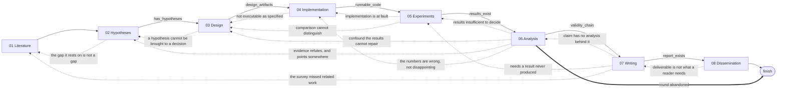
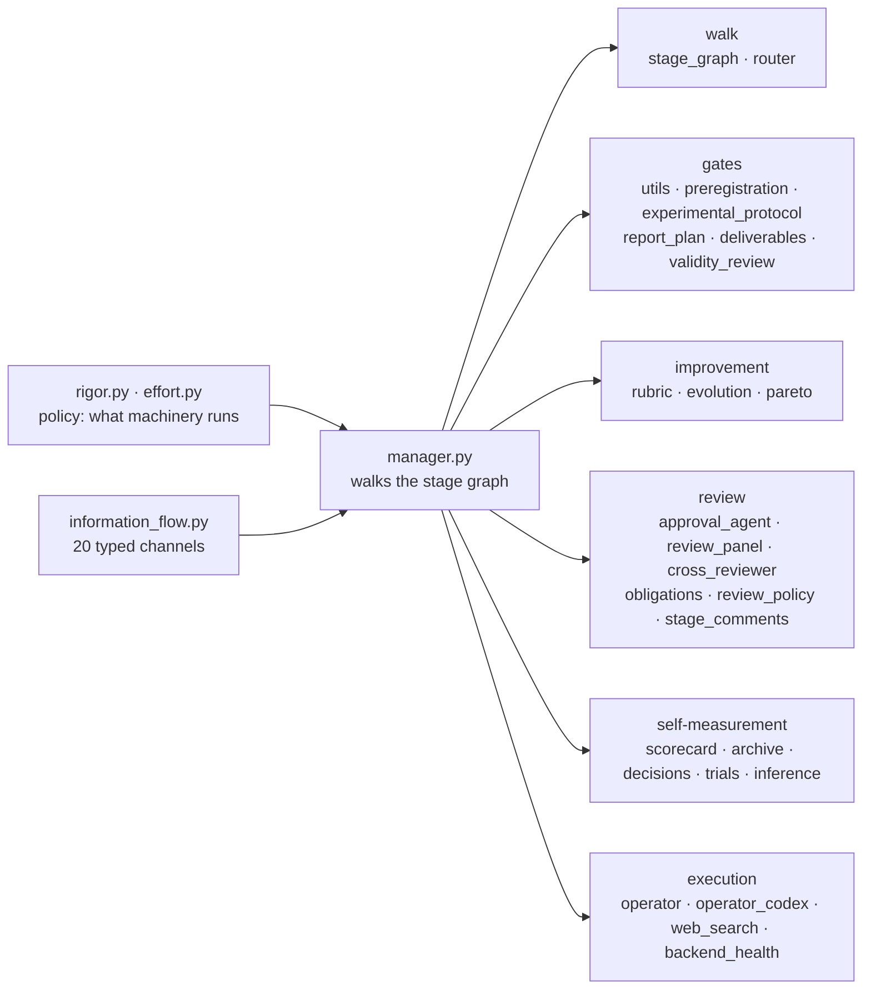

<h1 align="center">AutoR: A Recursive Research System</h1>

<p align="center">
  <strong>It proposes, tests, and tries to refute itself. The approval gate is the one thing it does not own — by default, that is you.</strong>
</p>

<p align="center">
  
  
  
  
  
  
  <a href="LICENSE"></a>
  <a href="https://github.com/tangxiangru/AutoR"></a>
</p>

<p align="center">
  <strong>Start here:</strong>
  <a href="docs/framework.md">The Framework</a> ·
  <a href="docs/tutorial_en.md">English Guide</a> ·
  <a href="docs/tutorial_zh.md">中文教程</a> ·
  <a href="docs/">Full Documentation</a>
</p>

<p align="center">
  
</p>

---

> AutoR is not a chat demo, not a generic agent framework, and not a markdown-only research toy.
>
> It is a structured research harness over a coding-agent execution layer:
> **the agent handles execution, the human owns the direction, and every run becomes an inspectable
> research artifact on disk.**

**[docs/framework.md](docs/framework.md)** is the single document that describes what this system is:
its implementation, its modules, what is new in it, and what it contributes. This README is the
overview and the operating manual.

## Contents

[What AutoR is](#what-autor-is) · [Quick start](#quick-start) · [The stage graph](#how-it-works-the-stage-graph) ·
[The rigor dial](#the-rigor-dial) · [Self-improvement rounds](#self-improvement-rounds) ·
[Review](#review-five-kinds-of-critic) · [The stage contract](#the-stage-contract-and-what-gets-validated) ·
[Execution model](#execution-model) · [Run layout](#run-layout) · [Architecture](#architecture) ·
[Benchmarks](#benchmarks) ([ResearchClawBench](#researchclawbench) ·
[FrontierScience](#frontierscience-research) · [AIRS-Bench](#airs-bench)) ·
[Documentation](#documentation) · [Limits](#limits) · [License](#license)

## What AutoR is

Most autoresearch systems optimize for autonomy. AutoR takes a different position: research is too
important to hand over as a blind end-to-end loop. The goal is not to remove humans from research.
The goal is to give them a stronger execution system.

AutoR runs a research project as **eight stages wired into a directed graph**. Six of the forward
edges are guarded by artifacts on disk; **thirteen backward edges** let a late finding send the run
back — Stage 07 can reopen the literature survey. Hypotheses are frozen and hashed when Stage 04 is
approved, every one must be adjudicated at Stage 06 against a named result file that exists, and
every paper claim traced at Stage 07; a `supported` or `refuted` verdict resting on a single seed is
refused unless the run records why one run settles it. An adversarial reviewer attacks Stage 05's
results and Stage 06's analysis, and the stage after each must answer every finding in writing or the
gate refuses it. Drafts are scored and a refinement that does not improve is reverted. Every stage
still stops at an approval gate, and by default that gate is you.

### "Recursive" is eight mechanisms, each of them a file you can open

| Move | What runs | Where |
| --- | --- | --- |
| **Propose** | Five proposers work from distinct lenses — mechanism, contrarian, adjacent field, null/artifact, regime — blind to each other; two statements whose Jaccard overlap reaches 0.5 collapse into one idea | [`ideation_panel.py`](src/ideation_panel.py) |
| **Test** | Every baseline declares `why_competent` and a `tuning_budget` before it runs; the hypothesis set is frozen and hashed before any result exists, and a later change is legal only as a recorded amendment | [`experimental_protocol.py`](src/experimental_protocol.py)<br />[`preregistration.py`](src/preregistration.py) |
| **Refute** | An adversarial pass asks why the result is wrong across ten named failure modes — confound, leakage, `metric_cherry_picking`, `effect_within_noise`, six more; a round can close as `converged`, `refine_design`, `new_hypothesis` or `abandon` | [`validity_review.py`](src/validity_review.py)<br />[`research_rounds.py`](src/research_rounds.py) |
| **Critique** | Five seats review independently, cross-examine anonymised, then converge; a blocking objection is turned into a refusal in code against the panel's own chair, and a different model family audits the approval as a veto | [`review_panel.py`](src/review_panel.py)<br />[`cross_reviewer.py`](src/cross_reviewer.py) |
| **Iterate** | Every valid draft is scored against a rubric read off disk; the champion is kept and a losing polish round is reverted before anyone reads it; a draft that loses on the weighted total but is non-dominated on the criterion vector is kept anyway | [`rubric.py`](src/rubric.py)<br />[`evolution.py`](src/evolution.py)<br />[`pareto.py`](src/pareto.py) |
| **Learn** | Each finished run records its route and measured fitness; a fitness comparison is keyed on the set of stages the run actually measured, so a run cannot score well by stopping early | [`archive.py`](src/archive.py)<br />[`decisions.py`](src/decisions.py) |
| **Deliberate** | A stage that hits a genuine crux stops, names the question, and pulls in theorist / empiricist / critic / pragmatist plus an expert brief, then continues with an answer that names its own falsifier; budgeted, and measured against what the agent already believed | [`deliberation.py`](src/deliberation.py) |
| **Localise** | A reviewer quotes the passage it objects to instead of refusing the whole stage; the revision is told to change only those spans and is diffed against them, so "preserve the correct parts" is measured rather than hoped for | [`stage_comments.py`](src/stage_comments.py) |

**What a default run (`--rigor standard`) actually uses.** **Test**, **Refute**, **Iterate** and
**Learn** are on: the validity chain is unconditional at every rigor level including `fast`,
`--evolve` defaults on, and the archive records every run — though it only *steers* under
`--archive-steer`. **Localise** runs whenever a reviewer quotes a passage, which requires an agent
reviewer. **Propose** and **Deliberate** need `--rigor thorough`; **Critique**'s panel needs
`--rigor max` and its cross-model veto is live on the `rcb_agent.py` path only. See
[the rigor dial](#the-rigor-dial) for the exact mapping.

**AutoR does not run itself.** Manual approval is the default: `approval_mode` is `manual` unless a
flag opts out. Seven of the eight moves above can only score, refuse, revert or re-order; none of
them can approve a stage. The eighth, the review panel, *is* an approval gate, and it exists only on
the runs where you hand it the gate. Recursion did not change who decides; it changed what reaches
the desk. The research unit is unchanged: one reproducible run under `runs/<run_id>/`, isolated,
resumable, with redo and rollback.

### The one thing the docs will not claim

Approved stage summaries are the only *free-text* cross-stage memory. Every other cross-stage edge is
a typed artifact with a declared reader: **twenty typed channels** in
[`information_flow.py`](src/information_flow.py) each name the exact stage slugs that consume them,
and the nine channels produced inside the walk name their producing stage as well. `obligations.json` and
`review_policy.json` cross stages without touching a summary at all — both only behind an agent
approval gate.

Many systems aim to generate research outputs that *look* ready. So the question is not

> Does it look ready?

It is

> Can you verify every part of it?

The answer is the validity chain — freeze at Stage 04, adjudicate at Stage 06, trace at Stage 07
([`preregistration.py`](src/preregistration.py)) — and the edge into writing stays shut until every
frozen hypothesis carries a verdict (`_guard_validity_chain`, [`stage_graph.py`](src/stage_graph.py)).

### The shape of the system, in counts you can re-derive

Every number below comes from a named symbol in the source. Re-derive them; that is the point of
naming them.

| Count | Symbol | Value |
| --- | --- | ---: |
| Stages (nodes in the walk) | `STAGES`, [src/utils.py](src/utils.py) | 8 |
| Guarded forward edges | `_ADVANCE_GUARDS`, [src/stage_graph.py](src/stage_graph.py) | 6 |
| Backward edges | `REVISIT_EDGES` | 13 |
| Conditional terminal edges | `TERMINAL_EDGES` | 1 |
| Edges in the default (`adaptive`) graph | `StageGraph.adaptive()` | 22 |
| Edges in `--stage-graph linear` | `StageGraph.linear()` | 9 |
| Typed information channels | `CHANNELS`, [src/information_flow.py](src/information_flow.py) | 20 |
| `validate_*` functions the stage gate calls | `validate_stage_artifacts`, [src/utils.py](src/utils.py) | 17 |
| Required stage-summary headings | `REQUIRED_STAGE_HEADINGS` | 7 |
| Rubric criteria (weighted, backend-free) | `CRITERIA`, [src/rubric.py](src/rubric.py) | 10 |
| Flags on `main.py` / `rcb_agent.py` | `parse_args` | 61 / 37 |
| Python modules / lines / tests | the tree | 243 / 129 k / 3898 |

`python -m unittest discover -s tests -p "test_*.py"` runs **3898 tests in ~440 s across 140 test
modules**, with no third-party dependency.

## Quick start

### Prerequisites

- Python 3.10+
- Claude CLI or Codex CLI on `PATH` for real runs
- Local TeX tools only for `--output-format latex`; the default markdown output needs no TeX
- `pip install google-genai` plus a key in `GOOGLE_API_KEY` or `GEMINI_API_KEY` — needed by three
  paths, not only the diagram one: `--web-search gemini`, required where the backend's own
  `WebSearch` tool is disabled (`build_genai_client`, [src/web_search.py](src/web_search.py)); the
  cross-model veto `--cross-review auto|gemini` ([src/cross_reviewer.py](src/cross_reviewer.py)); and
  `--research-diagram`, which also reads `configs/diagram_config.yaml`
- The SDK is **not** a default dependency. Without it the diagram step prints
  `Diagram generation failed: No module named 'google'` and the run continues; cross-review records
  itself unavailable rather than agreeing

### Common commands

| Goal | Command |
| --- | --- |
| Start a run (the goal is prompted for if omitted) | `python main.py --goal "Your research goal here"` |
| Start with preloaded resources | `python main.py --goal "..." --resources paper.pdf refs.bib data.csv` |
| Run a local smoke test without a real agent backend | `python main.py --fake-operator --goal "Smoke test"` |
| Run with the automated reviewer gate | `python main.py --full-auto --goal "..."` |
| Choose how much optional machinery to run | `python main.py --rigor thorough --goal "..."` |
| Give the panel a researcher persona to stand in for | `python main.py --review-panel --persona docs/persona-example.md --goal "..."` |
| Seat the panel across different models | `python main.py --review-panel --panel-models pi=opus skeptic=codex:default --goal "..."` |
| Seat the optional Area Chair as a sixth reviewer | `python main.py --review-panel --panel-roles pi domain method repro skeptic reader --goal "..."` |
| Keep the strong model for the steps that matter | `python main.py --effort-tiers --model opus --routine-model sonnet --goal "..."` |
| Choose the execution backend and model | `python main.py --operator claude --model opus` or `python main.py --operator codex --model default` |
| Choose the reviewer backend separately | `python main.py --full-auto --review-operator claude --review-model opus` |
| Allow Codex-backed SSH / remote GPU execution | `python main.py --operator codex --codex-sandbox danger-full-access --goal "..."` |
| Produce a LaTeX paper package instead of a markdown report | `python main.py --output-format latex --goal "..."` |
| Stop once the report is written, skipping dissemination | `python main.py --final-stage 07_writing --goal "..."` |
| Choose a writing venue profile | `python main.py --venue neurips_2025` · `--venue nature` · `--venue jmlr` |
| Resume the latest run | `python main.py --resume-run latest` |
| Redo a stage inside the same run | `python main.py --resume-run 20260329_210252 --redo-stage 03` |
| Roll back to a stage inside the same run | `python main.py --resume-run 20260329_210252 --rollback-stage 03` |
| Re-enter an existing project instead of starting over | `python main.py --project-root ~/code/my-project --goal "..."` |
| Seed the run from your own prior papers | `python main.py --paper-corpus ~/papers --goal "..."` |
| Store runs on another disk | `python main.py --runs-dir /mnt/big-disk/runs --goal "..."` |
| Raise the per-attempt ceiling for long training runs | `python main.py --stage-timeout 43200 --goal "..."` |
| Give a stubborn stage more retries | `python main.py --max-attempts 10 --goal "..."` |
| Let Stages 03-06 run as a repeatable round (default 1) | `python main.py --max-rounds 2 --goal "..."` |
| Escalate a crux to a four-voice panel | `python main.py --deliberation --max-deliberations 3 --goal "..."` |
| Widen Stage 02 with divergent proposers | `python main.py --ideation-panel --ideas-per-proposer 3 --goal "..."` |
| Skip the intake stage | `python main.py --skip-intake --goal "..."` |
| Add a generated method diagram to the paper | `python main.py --research-diagram --goal "..."` |
| Search the web where the agent's own `WebSearch` is disabled | `python main.py --web-search gemini --goal "..."` |
| Tag this run as one arm of a paired trial | `python main.py --trial t1 --capability review_panel --arm on --goal "..."` |
| Read the paired-trial analysis and exit | `python main.py --trial-report` |
| Benchmark AutoR on ResearchClawBench | `python rcb_agent.py --workspace <WORKSPACE>` |
| Score a finished benchmark run with the reference judge | `python tools/score_rcb_run.py --workspace <WORKSPACE> --bench <BENCH>` |
| Answer one FrontierScience question, with AutoR or with one direct call | `python fs_agent.py --task fs:043 --profile ideate` · `--profile direct` |
| Grade a FrontierScience answer against its rubric | `python tools/score_fs_run.py --task fs:043 --answer answer.md --out score.json` |
| Stage an AIRS-Bench task's data and workspace | `python tools/airs_setup.py --task <TASK> --repo <AIRS_BENCH> --raw-dir <RAW> --workspace <WS>` |
| Solve one AIRS-Bench task and score the submission | `python airs_agent.py --task <TASK> --repo <AIRS_BENCH> --raw-dir <RAW> --workspace <WS>` |
| Run one arm of an AIRS-Bench comparison — AutoR, or the same CLI with no AutoR | `python tools/airs_arm.py --arm autor --tasks <TASK>...` · `--arm bare` |

Every flag, its default, and what is preserved on resume:
**[docs/cli-reference.md](docs/cli-reference.md)**. Stage identifiers accept `03`, `3` or
`03_study_design`; `--venue` defaults to `neurips_2025`.

> **Three flags put an agent in the approval seat, not two** — and a fourth removes the human
> without replacing them. `approval_mode` becomes `agent` for `--approval-mode agent`, `--full-auto`
> and `--review-panel`, and `create_reviewer` is called only when it does. `--unattended` on its own
> is the odd one: `resolve_unattended` returns `True` for all four, but with `approval_mode` still
> `manual` there is no reviewer to install, so the first approval menu raises `UnattendedInputError`
> rather than being decided. For a run with nobody at the terminal, pass `--full-auto`.
>
> Because `--rigor` is resolved **before** `resolve_unattended` runs, a plain `--rigor max` sets
> `review_panel = True` and silently converts an interactive run into an unattended agent-gated one.
> Under a badge reading *Human approval required*,
> the flag that looks like more review is the flag that removes the reviewer. Three headline
> mechanisms — obligations, the standing review policy, the cross-model veto — also run only behind
> that agent gate, as do anchored comments. Manual approval is the default and remains the path for
> work you intend to publish.

For Codex-backed runs AutoR defaults to `--codex-sandbox workspace-write`. If a verified remote
experiment needs SSH or external GPU access, use `--codex-sandbox danger-full-access`
intentionally: it grants the Codex backend unrestricted local and remote execution, so it should not
be the default for untrusted tasks.

```bash
# Self-improvement is on by default: navigate the graph, score every draft, keep the
# best, and record the route in ~/.autor/archive.
python main.py --goal "..."
python main.py --archive-report                   # what the archive has learned so far
python main.py --goal "..." --evolve-rounds 4     # spend more on improvement
python main.py --goal "..." --evolve-rounds 0     # measure and ratchet, no extra passes
python main.py --goal "..." --archive-steer       # let the archive pick the topology

# Opt out entirely: the strict 01-through-08 sequence, last draft wins.
python main.py --goal "..." --stage-graph linear --routing off --no-evolve --no-archive
```

### Studio (browser UI)

A local web UI over the same Claude-backed runs: create a project, watch stages execute, approve or
send feedback, read the compiled paper. It needs the Claude CLI on `PATH` to start a run.

```bash
python studio.py                                # http://127.0.0.1:8000/studio/
python studio.py --host 0.0.0.0 --port 8765     # bind externally, see the warning below
python studio.py --runs-dir /path/to/runs       # override runs directory
```

> The Studio API has **no authentication**. It binds to `127.0.0.1` by default; anything that can
> reach it can start runs, approve stages, and read every file under the runs directory. For remote
> access prefer an SSH tunnel over `--host 0.0.0.0`. See [SECURITY.md](SECURITY.md).

One honest limit, then the walkthrough: the Studio's lazy-resume approve path picks the next stage
arithmetically — the first stage with a higher number
([src/backend/studio_runner.py](src/backend/studio_runner.py)) — and never consults the router, so
graph routing and backward moves are a CLI capability today. Page-by-page walkthrough and the full
HTTP API: **[docs/studio.md](docs/studio.md)**.

## How it works: the stage graph

Eight stages are the nodes; a `finish` node closes the walk. Stage 00 intake is not one of them — it
runs before the walk starts, and `_graph_entry_stage` → `_select_stages_for_run`
([src/manager.py](src/manager.py)) only ever yield the eight. Solid edges advance, dotted edges go
back. `--stage-graph linear` is the eight advance edges plus the conditional terminal — nine in all —
and the guards come off with the backward ones (`_advance_edges(guarded=False)`): one edge out of
each node leaves nothing to choose, so a guard there could only halt a run that the stage's own
validation is about to fail anyway.



Six of the eight forward edges carry a guard, one per target stage (`_ADVANCE_GUARDS`); 01→02 and
08→`finish` are unguarded. Thirteen dotted edges go back (`REVISIT_EDGES`) — the longest is 07→01:
writing it up showed the finding relates to work the survey missed. One conditional terminal
(`TERMINAL_EDGES`, carried by *both* topologies) lets an abandoned round finish from Stage 06. The
Stage 07 guard is the strictest: every preregistered empirical hypothesis needs a verdict **and** at
least one figure under `workspace/figures` (`_guard_validity_chain`).

**Who decides the move.** AutoR decides which moves are *admissible*, by evaluating each edge's guard
against the artifacts on disk. With `--routing auto` (the default, `DEFAULT_ROUTING_MODE`) the agent
chooses among them and states a reason; `--routing off` always takes the graph's default. An
off-menu choice — an unlisted target, or one with no stated reason — is refused, written to
`evolution/routing_refusals.jsonl` ([src/router.py](src/router.py)), and replaced by the forward edge.

Two design calls worth naming. Blocked moves are handed to the agent *with the reason they are
blocked* (`StageGraph.moves`) — the useful thing to say is not "you may go to 06" but "07 is closed
because H2 has no verdict", and an agent that sees why writing is closed routes to the analysis that
opens it. And a revisit whose justification repeats one already on the path is refused
(`repeats_a_previous_reason`): going again on the same grounds is a loop, not an iteration.

**A backward move is only ever a deliberate choice.** The default is always the forward edge, and
when a guard has closed it the default advances anyway and lets the stage's own validation — still
refusing a Stage 07 that writes up unadjudicated hypotheses — be the gate it always was. A guard is a
routing preference; the gate is the gate. So a refusal, a routing failure, or a run nobody is
steering all come out as the linear pipeline rather than as a stall.

A stage is a node with a visit budget, not a position in a sequence: `DEFAULT_MAX_VISITS = 3`
(`--graph-max-visits`); `DEFAULT_MAX_STEPS = 20` bounds the whole walk (`--graph-max-steps`).

### The eight stages, and what you check at each

| Stage | Role | What the human is checking |
| --- | --- | --- |
| `00_intake` (before the walk) | Align the goal, resources, constraints, target venue and success criteria. | Answer the clarification questions, add the missing constraints, and narrow the project until it is executable. |
| `01_literature_survey` | Build the related-work base, organize the evidence, identify the real gap. | Reject shallow paper lists; require task framing, benchmarks, baselines, differences, and structured literature files with a cross-referenced `sources.json`/`claims.json`. |
| `02_hypothesis_generation` | Convert the direction into typed, testable hypotheses and provisional paper claims. | A `- Decision rule:` line on every empirical hypothesis, stating in advance what would count as support and what would count as refutation. These are the hypotheses frozen at 04 and adjudicated at 06. |
| `03_study_design` | Turn the hypotheses into an executable plan, a declared protocol and a committed report plan. | Datasets, metrics, ablations, budgets, failure criteria, machine-readable data artifacts, a baseline set where every entry states `why_competent` and its `tuning_budget` — and the figures the report will carry, each naming the claim it supports. |
| `04_implementation` | Build the runnable code, configs, data preparation and sanity checks. | This is the freeze point: approving the stage hashes the hypothesis set into `workspace/notes/preregistration.json`. Check the set you are freezing, and do not approve skeletons. |
| `05_experimentation` | Run the planned experiments and write machine-readable results. | The declared baselines and the seeds: a supported or refuted verdict off a single seed is refused unless the run states why one run settles it (`MIN_SEEDS_FOR_A_VERDICT = 2`). |
| `06_analysis` | Interpret the results, produce figures, adjudicate every frozen hypothesis. | A verdict for each one, backed by a result file the validator can find. The forward edge stays closed until then. |
| `07_writing` | Produce the deliverable: a markdown report with embedded figures, or a venue-aware LaTeX package with a compiled PDF. | That every claim traces, and that the report answers what the task actually asked. A `confirmatory` claim whose hypothesis is not in the supported set is already refused, so what is left to check is whether the exploratory ones are honestly labelled. |
| `08_dissemination` | Package the run for review, release, reproduction or presentation. | Readiness notes, review materials, manifests and outward-facing deliverables exist. |

## The rigor dial

`--rigor` is the single source of truth for which optional machinery a run uses. The table is
generated from `_LEVEL_FEATURES` in [src/rigor.py](src/rigor.py); an explicit `--flag` / `--no-flag`
always beats the level, which is why those switches use `BooleanOptionalAction` with `default=None`.

| `--rigor` | `--effort-tiers` | `--deliberation` | `--ideation-panel` | `--review-panel` |
| --- | :---: | :---: | :---: | :---: |
| `fast` | – | – | – | – |
| `standard` *(default)* | **on** | – | – | – |
| `thorough` | **on** | **on** | **on** | – |
| `max` | **on** | **on** | **on** | **on** |

Two consequences worth stating out loud:

- **Effort tiers are on by default.** A default run therefore routes `04_implementation`,
  `05_experimentation` and `08_dissemination` to a lean prompt and a single reviewer
  (`DEFAULT_TIERS`, [src/effort.py](src/effort.py)). Under `--rigor max` the seated panel does not
  sit at those three gates unless you also pass `--no-effort-tiers`.
- **`--rigor max` makes the run unattended**, because it implies `--review-panel`. See the note
  under [Common commands](#common-commands).

The scientific-validity chain is *not* on this dial. It is unconditional at every level, `fast`
included.

## Self-improvement rounds

Every valid stage draft is measured against a rigour rubric read off disk — do the paths it names
resolve, do the numbers it reports appear in a results file, did it produce artifacts during *this*
execution, is the decision ledger four different things rather than one sentence four times. Nine
weighted criteria, `RUBRIC_VERSION = "8"`:

| Criterion | Weight | From | What it measures |
| --- | ---: | :---: | --- |
| `grounding` | 3.0 | 01 | References that resolve — every path the draft names exists on disk |
| `numeric_fidelity` | 3.0 | 05 | Reported numbers trace to a results file |
| `reproducibility` | 3.0 | 01 | The machine-readable validity chain is present and parses |
| `deliverable_coverage` | 3.0 | 01 | The draft speaks to each thing the *task statement* asked for, with a number an artifact holds |
| `source_figure_coverage` | 2.0 | 06 | Each panel the source published has a figure of this run's, published and referenced |
| `contract` | 2.0 | 01 | Contract compliance in substance, not just in headings |
| `artifact_breadth` | 2.0 | 01 | Artifacts produced *this* stage, in the directories this stage's prompt named |
| `quantification` | 2.0 | 04 | Findings carrying numbers rather than adjectives |
| `traceability` | 1.5 | 01 | The decision ledger is four different things, not one sentence four times |
| `commitment` | 1.5 | 01 | Reports work, not intentions |

`min_stage` exists so a criterion that cannot apply is not scored zero: Stage 01 has no experiment
manifest to produce, and grading it as if it failed to produce one would make every early stage look
worse than every late one — which would make the ratchet prefer late drafts for a reason unconnected
to quality.

`artifact_breadth` is scored against `STAGE_ARTIFACT_KINDS`, the set of workspace directories *this*
stage's prompt tells the agent to write — `literature/` at Stage 01, `artifacts/` + `reviews/` +
`writing/` at Stage 08, and so on. A test refuses any expectation the stage's own prompt never
asked for, so the criterion cannot drift into demanding work the run was never told to do. AutoR's
own bookkeeping does not count towards it: neither the `RECORD_ARTIFACTS` the experiment manifest
already excludes, nor the ideation pool, the writing and layout triage, the comment, crux and effort
ledgers, the panel's transcripts, the run scorecard or the adversarial reviewer's findings, all of
which the workflow manager writes into those same directories — six of them inside a stage's own
window, before its draft is scored. `_harness_written_records` names them, each imported from the
module that writes it, and a census over `src/` fails the suite on a path under one of those
directories that nobody has said who owns.

**Measuring is free and always on.** The rubric reads the run off disk and never calls a backend, so
the property it buys costs nothing: the draft that gets promoted is the best one the run produced,
not the last one. That is the half that was missing before — AutoR could iterate, but "later" was the
only ordering it had, so a refinement that dropped a resolving reference was promoted on exactly the
same terms as one that fixed something.

**Improvement rounds are the half that costs**, and they are budgeted separately from
`--max-attempts`, which bounds a stage that is *failing* rather than one being improved. Two per
stage by default, and a stage whose rubric has no shortfall worth acting on spends none of them — a
round aimed at a criterion already at full marks produces churn, so AutoR does not buy one.
`--evolve-rounds 0` measures without polishing; `--no-evolve` restores the old behaviour entirely.

One edge of that budget is worth knowing before you resume a run. `state()` rehydrates the champion
and the Pareto frontier from disk and nothing else ([src/evolution.py](src/evolution.py)), so
`--resume-run` restarts `rounds_spent` and the patience counter at zero: the best draft survives the
resume, the *spend cap* does not, and a stage resumed twice can buy the two rounds twice.

A round that scores worse is reverted, so a stage can only improve. A round that changes a hypothesis
verdict is rejected outright, whatever it scored — the rubric is blind to what the run concluded,
which removes the incentive, and the `verdict_drift` check removes the possibility. A revision a
*human* asked for always stands, whatever it measures. The ratchet governs AutoR's own rounds, not
the direction it is given.

Full mechanism, and the reasoning behind each refusal, in
[docs/self-improvement.md](docs/self-improvement.md).

### The archive: which moves paid, across runs

Every finished run is recorded into `~/.autor/archive` — the route it took, the rubric fitness it
reached, and the set of stages it actually measured (`Archive.record_run`, from `record_into_archive`
in [main.py](main.py)). `edge_payoffs` compares runs that *took* an edge against runs that were
**offered** it and declined ([src/decisions.py](src/decisions.py)), and `propose_variant` turns a
payoff that is believable — enough observations, and a delta above `min_gain` — into a child variant
that moves that one edge one step up or down the preference order. When no payoff is believable,
`propose_exploration` proposes an unexplored edge instead, so an edge nobody has taken is not
stranded forever.

A variant is only a reordering. It never opens a guarded edge, never adds one that was not declared,
and never removes one: the guards are the correctness argument for letting an agent route at all, and
the component that learns from outcomes is precisely the one that must not be able to weaken them.
Promotion is as conservative — a challenger has to beat the incumbent *within every comparability
basis* rather than on a pooled mean, because "runs that stopped early" is the cheapest composition
for a topology to win on.

**The archive records and proposes on every run; it steers only when you ask.** The proposed variant
is written down and reported, but the topology a run walks comes from the archive only under
`--archive-steer`. Without it, `resolve_graph` returns the declared topology unchanged.

### Paired trials

`--trial ID --capability NAME --arm LABEL` tags a run as one arm of a paired A/B trial in the
archive; `--trial-report` prints the within-pair rubric difference with a **two-sided sign-flip
p-value** and the smallest p-value the estimator behind it could possibly reach
([src/trials.py](src/trials.py), [src/inference.py](src/inference.py)). The p is exact by
enumeration up to `MAX_EXACT_PAIRS = 18`; above that it is a seeded sample of
`SAMPLED_SIGN_ASSIGNMENTS = 200,000` sign assignments over the same differences, and the report
says so and prints the seed. Below
`MIN_PAIRS_FOR_SIGNIFICANCE = 6` a trial is labelled `underpowered` rather than reported as a null.

This is the apparatus for answering "does this mechanism help?", not the answer. No paired trial has
been run yet. Read [docs/self-improvement.md](docs/self-improvement.md#what-has-and-has-not-been-measured)
before quoting anything from it.

## Review: five kinds of critic

Only two of the five are the approval gate. The other three cannot approve anything.

| Kind | What it is | Can it approve? |
| --- | --- | --- |
| **Solo reviewer** ([`approval_agent.py`](src/approval_agent.py)) | A coding agent with file tools returning one of six choices as JSON, through a parser that re-asks once and then falls back | **Yes** — this is the gate under `--full-auto` |
| **Review panel** ([`review_panel.py`](src/review_panel.py)) | Five role-differentiated seats review blind, cross-examine anonymised peers, then a chair synthesizes | **Yes** — this is the gate under `--review-panel` |
| **Cross-model veto** ([`cross_reviewer.py`](src/cross_reviewer.py)) | A different model family audits an *approval* only | No — veto only |
| **Adversarial validity review** ([`validity_review.py`](src/validity_review.py)) | Runs *after* Stages 05 and 06 are approved with the opposite instruction: "explain why this result is wrong" | No — it creates debts the next stage must answer |
| **Crux panel** ([`deliberation.py`](src/deliberation.py)) | The executing agent raises a question; four voices answer it while arguing against themselves | No — it is not a reviewer of a stage at all |

**The panel's teeth are mechanical.** If any final-round seat carries `blocking: true` and the chair
returned "approve", `_enforce_blocking_objections()` rewrites the approval into a refinement and
records `chair_overridden`. It is enforced in code precisely because the chair is a model that can be
argued out of a prompt-level rule. Blocking is read from the seat's own payload and only counts when
that payload's `decision` token is legible, so a seat whose verdict was unreadable cannot veto.

**Every panel run carries its own control arm.** The chair's round-1 verdict is one model, one call,
no peer input; `panel_effect.json` accumulates solo-vs-panel across the run and writes a verdict
sentence deliberately phrased to be unflattering — *"it did not earn that cost; consider dropping the
panel"* — when that is the truth. The same is true of the ideation panel, anchored comments, crux
deliberation and effort tiers; [`scorecard.py`](src/scorecard.py) reads all five ledgers at the end of
every run and writes `workspace/reviews/scorecard.md`, keeping "could not be measured" separate from
"changed nothing".

**Two ledgers run underneath.** `review_policy.json` turns every refusal into a standing rule injected
into every later solo review, deduplicated on normalized text so a reviewer restating one complaint
cannot manufacture the appearance of learning. `obligations.json` lets an approving reviewer attach a
debt to a later stage — *"fine, but you owe me a power analysis at design time"* — which only a later
reviewer may discharge; deferral is counted and shown, never silent.

**Anchored comments make a refusal local.** A reviewer quotes the exact passage it objects to
(minimum 12 characters, and an unfindable quote is dropped as `unanchored` rather than sent), the
revision is told to leave everything else byte-identical, and the next draft is diffed against the
quotes so collateral rewriting is counted rather than assumed away.

Full seat charters, the deliberation protocol and the measurement design:
[docs/review-panel.md](docs/review-panel.md), [docs/deliberation.md](docs/deliberation.md),
[docs/stage-comments.md](docs/stage-comments.md), [docs/scorecard.md](docs/scorecard.md).

## The stage contract and what gets validated

AutoR does not consider a run successful just because it generated a plausible markdown summary.

**Required stage summary shape.** Seven headings, in this order — `REQUIRED_STAGE_HEADINGS`:

```md
# Stage X: <name>

## Objective
## What I Did
## Key Results
## Files Produced
## Decision Ledger
## Suggestions for Refinement
## Your Options
```

Also required, and checked: exactly 3 numbered refinement suggestions, exactly the fixed 6 user
options, concrete file paths under `Files Produced`, and no `[In progress]`, `[Pending]`, `[TODO]` or
`[TBD]` placeholders.

**Artifact gates.** Most start by asking whether a file is there — the rows that say "valid",
"resolving" or "matching" then parse it.

| Stage | Required non-toy output |
| --- | --- |
| Stage 01 | A cross-referenced evidence ledger: `sources.json` and `claims.json`, where every cited `source_id` resolves |
| Stage 02+ | A `decision_rule` on every empirical hypothesis in `hypothesis_manifest.json` — held here, at the stage that writes them, rather than at the Stage 05 preregistration gate, where the set is already frozen and the only repair is a rollback |
| Stage 03+ | Machine-readable data under `workspace/data/`, plus a `report_plan.json` committing to the figures and headline numbers the report will carry |
| Stage 05+ | Machine-readable results under `workspace/results/`, plus a valid `experiment_manifest.json` |
| Stage 06+ | Real figure files under `workspace/figures/`, and every planned figure's `source_artifact` resolving to a non-empty file |
| Stage 07+ (markdown) | `report/report.md` with resolving figure references, between `min_report_figures` and 5 figures under `report/images/`, `deliverables_coverage.json`, `citation_verification.json`, `self_review.json`, `report_review.json` |
| Stage 07+ (latex) | `main.tex` matching the venue, `sections/*.tex`, a bibliography, a compiled PDF, `build_log.txt`, `citation_verification.json`, `self_review.json`, `layout_review.json` |
| Stage 08+ | Review and readiness assets under `workspace/reviews/` |

Requirements are cumulative, and the stage that *produces* a class of artifact must produce it
**during that stage's execution** — a re-run is not credited with the previous attempt's files. The
cutoff is `stage_execution_started_at` feeding `recent_in`, and the rubric enforces the same rule
independently in `_fresh_artifact_kinds`, so a Stage 07 draft cannot score on Stage 06's figures.

`min_report_figures` is a `run_config.json` field with no CLI flag, clamped to `[1, 5]`. It is 1 for
an ordinary run and **3** for a ResearchClawBench run (`BENCHMARK_MIN_REPORT_FIGURES`).

**Validity gates.** The same function — `validate_stage_artifacts` ([src/utils.py](src/utils.py)) —
also runs the validators that ask whether a *claim* is warranted rather than whether output exists.
Eighteen `validate_*` functions are reachable from it in all:

| Fires at | Validator | Refuses when |
| --- | --- | --- |
| 01 | `validate_literature_evidence` | A claim cites a `source_id` that is not in `sources.json` |
| 02+ | `validate_hypothesis_decision_rules` | An empirical hypothesis in `hypothesis_manifest.json` carries no `decision_rule`, or the manifest does not parse |
| 03+ | `validate_report_plan` | The plan has no task outputs, non-contiguous slots, a slot with no supported claim, or headline numbers without a quantity, unit and source |
| 05+ | `validate_preregistration` | Nothing is frozen, an empirical hypothesis has no decision rule, the frozen file disagrees with its own digest or with AutoR's stamped copy, or the manifest changed — or went missing — with no amendment on record |
| 05+ | `validate_experimental_protocol` | No primary metric, `planned_seeds < 1`, or a baseline missing `why_competent` / `tuning_budget` |
| 05+ | `validate_experiment_manifest` | The manifest does not parse into the declared shape |
| 06+ | `validate_hypothesis_outcomes` | A frozen hypothesis has no verdict, a verdict adjudicates something unpreregistered, or a `supported`/`refuted` verdict cites an evidence path that does not exist |
| 06+ | `validate_outcome_statistics` | A verdict has no `n_seeds`, an unrecognised `dispersion_type`, a single seed with no justification, or `dispersion_type: none` with two or more seeds |
| 06+ | `validate_report_plan_sources` | A planned figure or headline number's `source_artifact` is missing or empty |
| 06, 07 | `validate_validity_response` | The stage did not answer every adversarial finding from the one before it, with a status, a ≥40-character explanation, and evidence when it claims `addressed` — or the workspace copy of that review disagrees with AutoR's stamped copy |
| 06 | `validate_round_decision` | A round closes as `converged` with no supported hypothesis and no `negative_result: true` |
| 07+ | `validate_claim_provenance` | A manuscript claim is `confirmatory` on a hypothesis that is not `supported`, or cites no evidence file that exists |
| 07 md | `validate_markdown_report` | The report is under 1200 characters, carries placeholder text, references an image that does not resolve, or publishes fewer than `min_report_figures` |
| 07 md | `validate_report_plan_coverage` | A planned figure was never published or never referenced, or every slot was dropped |
| 07 md | `validate_deliverables_coverage` | The report does not answer a demanding sentence of the task statement, or a coverage entry quotes something that is not verbatim in the task |
| 07 md | `validate_report_review` | The AutoR-generated triage artifact is malformed |
| 07 latex | `validate_layout_review` | The LaTeX build triage artifact is malformed |
| 07+ | `validate_citation_verification` | The self-report has no status, a non-integer citation count, or an empty claim-coverage list |

The code labels the split itself: *"the scientific-validity chain, distinct from the artifact gates
around it"*. A run can fail because a claim is unwarranted, not only because a file is absent. The
06→07 router edge is closed on top of that, in the `adaptive` topology only.

**The frozen preregistration is checked against a copy the stage cannot reach.** A digest stored
beside the bytes it describes certifies nothing, and this one is worse than most: the agent is shown
it, because `format_preregistration_for_prompt` renders `digest` into the prompt. So AutoR keeps its
own copy of the frozen record at `runs/<id>/preregistration_stamp.json`, outside `workspace/`, and
`preregistration_tamper_findings` runs three comparisons rather than one — the hypotheses against
the digest the file states for them, that digest against the stamped one, and the length of the
amendment ledger. Each catches a rewrite the other two miss: an edited statement, an edited
statement with the header recomputed, and a deleted amendment row. Deleting the frozen file is not a
way around them either — `freeze_preregistration` restores the stamped record rather than deriving a
fresh one, and deleting *both* copies is refused rather than re-derived, because the first freeze is
witnessed in the run log. So a re-freeze cannot hand the run a post-results date and an empty
ledger, and the
disagreement it found is appended to the stamp's `repairs` list before the copy goes back.

The complete gate, including every JSON schema that is parsed rather than merely counted, is in
**[docs/stage-contract.md](docs/stage-contract.md)**.

## Execution model

Context is composed per consumer, not per availability. A stage's inbound block is built by
`render_inbound(ChannelContext(...), CHANNELS)` from the **eighteen** typed channels in
[src/information_flow.py](src/information_flow.py). Each channel declares `produced_by`, a
`consumed_by` set of real stage slugs, and a `rationale`;
`test_every_narrowing_is_argued_for` ([tests/test_information_flow.py](tests/test_information_flow.py))
fails a channel that withholds itself from a stage without saying why. Withholding has to be argued
for, not just done.

Four narrowings worth knowing, because the abstraction is not the point. Eighteen channels narrow;
these four are the ones whose reason is not readable off the key:

- the **artifact index** skips Stages 00-02 — they produce no data, results or figures, so the index
  is empty noise there
- the **writing manifest** reaches Stage 07 alone
- the mutable **Stage 02 hypotheses** stop at `04_implementation`, because the freeze at Stage 04's
  approval supersedes them. Before that edge was typed, the same H1 went into every prompt from
  Stage 05 on twice — one copy labelled editable, sitting next to the frozen one at exactly the
  stages where the freeze is the point.
- the **project bootstrap** narrows by exactly one stage and no more. `recommend_entry_stage` can
  return any stage from 01 to 08, so a fixed early set of readers would withhold the description of
  the repository from the run that re-enters latest — the one that has seen least of it. Stage 00 is
  the single exclusion, because `run()` scans the repository *after* intake has finished, so the
  block is empty there every time. This block deliberately overlaps `# Approved Memory`:
  `_adopt_project_bootstrap_baseline` copies each below-entry assessment into a stage summary, but
  `append_approved_stage_summary` keeps only the entries numbered below the stage it writes, so the
  first approval below the re-entry point erases them and this block becomes the only copy.

`dependency_edges()` returns every `(producer, consumer, channel key)` triple, so the information
topology can be printed and diffed rather than reconstructed from a pile of `if` statements.
`_record_inbound_channels` writes the delivered channel keys per stage into the run log.

Honest scope: twenty blocks are typed. Six more — `obligations_context`, `intake_context_text`,
`web_search_context`, `approved_memory`, `handoff_context`, and the `# What the Task Asks For` block
that `build_prompt` composes inline from
[`format_deliverables_for_prompt`](src/deliverables.py) — are still delivered by `build_prompt`
itself rather than declared as channels, so each one's delivery rule lives there instead of next to a
`consumed_by` set. Around them, `compose_stage_template`
([src/prompt_fragments.py](src/prompt_fragments.py)) assembles the stage's own instructions, the
accepted-extension lists generated from the validators' constants rather than hand-copied, and the
run-safety rules.

The assembled prompt is written to `runs/<run_id>/prompt_cache/`, per-stage session IDs to
`runs/<run_id>/operator_state/`, and the selected CLI backend is invoked in live streaming mode.
Alongside the prompt, AutoR installs an agent skill pack from [src/skills/](src/skills) into
`runs/<run_id>/.claude/skills/` — the operator's working directory — so the agent can *pull*
long-form craft guidance when it needs it. A skill costs nothing in the prompts that do not use it.

121 skills ship today: 66 general ones and 55 field-specific ones. Seventy-five of them were written against a scored arm's per-criterion losses on the
twenty-five ResearchClawBench tasks that lost, three per task. **A run is not offered all of
them.** Two filters narrow the pack, and a skill has to survive both:

1. **Field.** A skill named `<field>-...` is installed only for a run in that field, so twenty
   become two. A materials run does not benefit from being offered advice about observational
   astronomy, it just has one more description to read past.
2. **Shape.** A skill may carry an `applies_when` regex, matched against this run's own research
   brief and data manifest. Four skills are scoped this way today; measured over the forty
   ResearchClawBench briefs they select 3, 4, 6 and 8 tasks each, twenty-five tasks receive none of
   them, and no task receives more than three. `tools/skill_selectivity.py` prints the selection set
   for a corpus and `--expect` turns it into an assertion, because a predicate is a claim about a
   kind of research problem and it should be checkable.

The predicate reads the brief, never the task's identifier: a table of benchmark ids would select
the same tasks today and generalise to nothing.

3. **Pin.** There is one exception, and it is deliberate.
   [configs/task_skill_pins.json](configs/task_skill_pins.json) maps a task *identifier* to skills
   that are installed for it whatever the two filters say. A pin is not an inference about a kind of
   task — it is a record that this exact identifier already ran, already scored, and lost criteria
   whose subject is those skills, so it is the one routing input that cannot be derived from the
   task statement and does not generalise past the name it carries. Fifteen ResearchClawBench tasks
   are pinned today, twenty-four pins between them, at most three per task; four of the twenty-four
   are skills the two filters would have withheld, in each case a field skill whose content
   applies outside its own field. **A run that matches an entry writes `skill_pins` into its `run_config.json` and a
   `skills pinned_by_task_id` line into its log**, because a pinned arm and an unpinned arm are two
   configurations and a score from one is not a score from the other.

Pull-based is not the same as discoverable. Measured over a 40-task arm, the pack drew **78 `Skill`
calls in 789 hours of agent time**, 31 of them the one skill a stage prompt named imperatively —
and stage 05 launched none in any of the forty runs. So every general skill is now named at the
stage whose decision it covers, a task-scoped one is announced by the `task_shaped_skills` channel
for the runs that were selected for it, and
`tests/test_a_skill_is_named_where_it_is_needed.py` refuses a skill that nothing announces —
in either direction, since a prompt naming a skill most runs will not have is the same defect
reversed.

<details>
<summary><strong>Claude CLI invocation</strong></summary>

First attempt for a stage:

```bash
claude --model <model> \
  --permission-mode bypassPermissions \
  --dangerously-skip-permissions \
  --session-id <stage_session_id> \
  -p @runs/<run_id>/prompt_cache/<stage>_attempt_<nn>.prompt.md \
  --output-format stream-json \
  --verbose
```

Continuation attempt for the same stage replaces `--session-id` with `--resume`.

`_build_cli_command` ([src/operator.py](src/operator.py)) additionally inserts
`--mcp-config <run>/operator_state/mcp_config.json` whenever the MCP web-search server is active, and
`--tools <tools>` when a tool restriction is set.

</details>

**Web search where the backend has none.** Some deployments disable the agent's built-in `WebSearch`
tool. `--web-search gemini` starts a stdlib JSON-RPC MCP stdio server
([src/mcp_web_search.py](src/mcp_web_search.py)) that exposes one tool,
`mcp__autor-search__web_search`, backed by Gemini with grounded search, and passes it to the CLI via
`--mcp-config`. `assess_search_readiness()` refuses to promise a capability the environment cannot
deliver: a hard blocker (no key, no SDK) is reported before the run starts rather than discovered at
Stage 01.

Important behaviour:

- refinement attempts reuse the same stage conversation whenever possible
- streamed agent output is shown live in the terminal
- raw stream-json output is captured in `logs_raw.jsonl`
- if resume fails, AutoR can fall back to a fresh session
- if stage markdown is incomplete, AutoR can repair or normalize it locally before failing the stage
- a backend that is unreachable is classified by [src/backend_health.py](src/backend_health.py) and
  surfaces as `run.backend_unavailable`, so "the model was down" never reads as "the research failed"

## Run layout

Every run lives entirely inside its own directory. The tree is `build_run_paths`
([src/utils.py](src/utils.py)).

```text
runs/<run_id>/
├── user_input.txt      memory.md             run_config.json
├── run_manifest.json   artifact_index.json   intake_context.json
├── obligations.json    review_policy.json    # both per-run; nothing crosses runs
├── report_plan_stamp.json   preregistration_stamp.json   validity_review_stamp.json
│                       # AutoR's copies, outside workspace/ on purpose
├── stage_cost_ledger.json   # one row per stage visit: what it spent, why each attempt failed
├── logs.txt            logs_raw.jsonl
├── prompt_cache/       operator_state/       handoff/        stages/
├── .claude/skills/     # the skill pack, pulled on demand by the agent
├── evolution/          # champion drafts, improvement_ledger.jsonl, summary.json,
│                       # stage_graph.json, routing_refusals.jsonl
└── workspace/
    ├── literature/  code/  data/  figures/  report/  writing/
    ├── bootstrap/   profile/
    ├── notes/       preregistration.json, hypothesis_manifest.json, experimental_protocol.json,
    │                report_plan.json, research_rounds.json, round_decision.json,
    │                deliberation_request.json
    ├── results/     experiment_manifest.json, hypothesis_outcomes.json
    ├── artifacts/   claim_provenance.json, deliverables_coverage.json, citation_verification.json,
    │                self_review.json, report_review.json | layout_review.json, compiled PDFs
    └── reviews/     validity_review_<stage>.json, validity_response_<stage>.json,
                     comment_ledger.json, deliberations.json, scorecard.md, panel/
```

`evolution/` sits outside `workspace/` on purpose, and the dataclass records the reason: it is *"a
record of how the run reached its answer, not part of the answer, and a benchmark export that swept
it up would ship the losing drafts alongside the report"*. `report_plan_stamp.json`,
`preregistration_stamp.json` and `validity_review_stamp.json` are outside `workspace/` for the same
class of reason: the agent must not be able to backdate its own declaration, rewrite the commitment
it is being held to, or edit the record of the objections it owes an answer to. So is
`stage_cost_ledger.json`, which is a run's account of what each stage visit cost and why each
attempt failed — a receipt the payer prints is worth what it cost to print.

That row carries the backend's own dollar figure and its four token fields, wired out through
`OperatorResult`, `ReviewDecision` and `ValidityReviewOutcome` rather than scraped back out of
`logs_raw.jsonl`. A field the backend did not report is absent rather than zero, so a run smoke-tested
with `--fake-operator` says `not measured` instead of `$0.00`. At the end of a run — completed or
cancelled — AutoR prints one summary of it to the terminal, and to nothing else: the deliverable does
not change, and `logs.txt` keeps the attempts and the failure census without the money. **Nothing at
runtime decides on any of it.** Not the supervisor, not the router, not a gate: the fields may appear
in the record, in the summary and in the formatter, and in no condition anywhere under `src/`, which
`tests/test_cost_is_recorded_and_unread.py` asserts over the syntax of every module the way
`tests/test_router_budget.py` asserts it of `StageRouter.choose`.

The only state AutoR writes outside a run directory is the cross-run archive at `~/.autor/archive`
(`--archive`, `--no-archive`).

**Workspace semantics.** `literature/` reading notes, survey tables, benchmark notes · `code/`
runnable code, scripts, configs · `data/` machine-readable datasets, manifests, processed splits ·
`results/` metrics, predictions, ablations, plus the standardized `experiment_manifest.json` ·
`report/` the markdown deliverable, `report.md` and the PNGs it embeds under `images/` · `writing/`
LaTeX sources, sections, tables, bibliography · `figures/` plots and paper figures · `artifacts/`
review JSON, build metadata, compiled PDFs, packaged deliverables · `notes/` the frozen files of the
validity chain plus supporting notes · `reviews/` adversarial validity reviews, panel transcripts,
self-measurement ledgers, the run scorecard.

Outside `workspace/`: `memory.md` is the approved free-text cross-stage memory; `handoff/<slug>.md`
is the second free-text carrier, each approved summary trimmed to Objective / Key Results / Files
Produced and sent only on a continuation attempt or when memory is still empty. Every other
cross-stage edge is a typed channel or a JSON artifact. `run_manifest.json` is the lifecycle state
that resume, redo and rollback read; `prompt_cache/` holds the exact prompt of every attempt,
repair, review, panel seat and crux voice.

`evolution/artifact_provenance.json` records which stage wrote each workspace file and every
version it has held; `evolution/effects/<slug>.jsonl` is that stage's accumulated inverses, moved
to `<slug>.reverted.jsonl` once applied, and `evolution/effects/blobs/` is the content-addressed
store the rewinds read from. A rollback is not only a manifest edit: it applies those inverses in
reverse, deletes what the withdrawn stages created, rewinds what they amended back to the version
the last surviving stage left, and drops the withheld emissions in
`evolution/emissions.json`. Everything it moved is named in the run log under
`rollback recovery`, and the preview says it before the operator confirms.

Full file-by-file reference: **[docs/run-artifacts.md](docs/run-artifacts.md)**.

## Architecture



| Module | What it owns |
| --- | --- |
| [src/manager.py](src/manager.py) | Walks the stage graph until it reaches finish or nothing is open — plus the router call, the evolution controller, the freeze/amend seam, the validity review, the round close, the obligation ledger, the cross-review veto, the crux settlement and the inbound-channel record |
| [src/utils.py](src/utils.py) | Stage metadata, run paths, prompt assembly, markdown validation, the artifact gates and the validity-chain wiring |
| [src/operator.py](src/operator.py) | The Claude CLI adapter: stage session state, live streaming, resume fallback, MCP config, skill pack install |
| [src/review_panel.py](src/review_panel.py) | The deliberating panel; a blocking objection is enforced in code against its own chair |
| [main.py](main.py) | CLI entry: 61 flags, start, resume, `--redo-stage`, `--rollback-stage`, the archive record and the reports that print and exit |
| [src/report_plan.py](src/report_plan.py) | Figures and headline numbers committed at Stage 03, stamped outside the workspace, enforced at 03, 06 and 07 |
| [src/rcb.py](src/rcb.py) | The ResearchClawBench adapter core: workspace layout, goal construction, report synthesis, figure publication, export |
| [src/airsbench.py](src/airsbench.py) | The AIRS-Bench adapter core: task specifications, the scaffold-neutral brief both arms get, submission export that never writes a submission, and the benchmark's own normalized score |
| [src/stage_graph.py](src/stage_graph.py) | Stages as nodes: six guarded forward edges, thirteen backward edges, a conditional terminal, a per-stage visit budget |
| [src/archive.py](src/archive.py) | Cross-run routes and edge payoffs keyed on a comparability basis; variant proposal, exploration and promotion |
| [src/rubric.py](src/rubric.py) | The rigour score over a draft and the artifacts it names. Never calls a backend |
| [src/web_search.py](src/web_search.py) | Gemini-backed search, readiness assessment, MCP config construction |
| [src/deliberation.py](src/deliberation.py) | The crux panel: four voices, each arguing against itself, resolved into an answer that names its own falsifier |
| [src/ideation_panel.py](src/ideation_panel.py) | Divergent Stage 02 proposers across five lenses, deduplicated into a candidate pool |
| [src/evolution.py](src/evolution.py) | The champion ratchet: budgeted polish rounds, reverted when they do not improve, rejected on verdict drift |
| [src/writing_manifest.py](src/writing_manifest.py) | The Stage 07 inventory plus the AutoR-owned triage artifact for each output format |
| [src/provenance.py](src/provenance.py) | Which stage wrote each workspace file, every version it has held, and what a rollback withdraws or rewinds |
| [src/effects.py](src/effects.py) | The inverse of each write, accumulated per stage and applied in reverse on a backward edge; commutative and ordered keys |
| [src/emissions.py](src/emissions.py) | Acts that leave the run, withheld until the stage that asked for them is approved |
| [src/approval_agent.py](src/approval_agent.py) | The solo approval gate, its six-choice vocabulary and its unreadable-verdict fallback |
| [src/preregistration.py](src/preregistration.py) | Freeze, amend, adjudicate, trace |
| [src/information_flow.py](src/information_flow.py) | Twenty typed information channels, each with declared readers and a written rationale |
| [src/router.py](src/router.py) | The agent's choice among admissible moves; an off-menu choice is refused and logged |
| [src/validity_review.py](src/validity_review.py) | The adversarial pass after Stages 05 and 06, and the response gate that follows it |
| [src/research_rounds.py](src/research_rounds.py) | Stages 03-06 as a repeatable round, bounded by `--max-rounds` |
| [src/trials.py](src/trials.py) | Paired A/B trials over archived runs, with a sign-flip p-value — enumerated below 19 pairs, sampled above — and the attainable floor of whichever estimator ran |
| [src/stage_comments.py](src/stage_comments.py) | Anchored review comments and the collateral-change diff |
| [src/effort.py](src/effort.py) | Routine vs deliberative tiering, and the concentration of the strong model |
| [src/scorecard.py](src/scorecard.py) | Reads all five self-measurement ledgers and says which features earned their cost |
| [src/obligations.py](src/obligations.py) | What a later stage still owes; only a reviewer can discharge it |
| [src/decisions.py](src/decisions.py) | "Was offered the edge and declined" — the control arm the archive's payoffs are computed against |
| [src/cross_reviewer.py](src/cross_reviewer.py) | A second opinion from a different model family. Veto only, never an override |
| [src/experimental_protocol.py](src/experimental_protocol.py) | Declared baselines, seeds and dispersion, fixed before the result exists |
| [src/deliverables.py](src/deliverables.py) | Did the run answer what the task statement actually demanded? |
| [src/pareto.py](src/pareto.py) | Non-dominated drafts kept beside the champion, and the pair worth merging |
| [src/review_policy.py](src/review_policy.py) | Standing review rules learned from this run's own corrections |
| [src/inference.py](src/inference.py) | Exact permutation tests and attainable-p floors; derives the archive's `min_observations` rather than asserting it |
| [src/rigor.py](src/rigor.py) | The one dial: which optional machinery a level turns on |
| [src/backend_health.py](src/backend_health.py) | Distinguishes "the backend is down" from "the research failed" |
| [src/prompt_fragments.py](src/prompt_fragments.py) | Shared prompt blocks generated from the validators' own constants |

Supporting modules: [operator_codex.py](src/operator_codex.py) and
[operator_protocol.py](src/operator_protocol.py), [intake.py](src/intake.py),
[manifest.py](src/manifest.py), [artifact_index.py](src/artifact_index.py),
[experiment_manifest.py](src/experiment_manifest.py), [evidence_ledger.py](src/evidence_ledger.py),
[hypothesis_manifest.py](src/hypothesis_manifest.py), [mcp_web_search.py](src/mcp_web_search.py),
[diagram_gen.py](src/diagram_gen.py), [bootstrap.py](src/bootstrap.py) and
[project_bootstrap.py](src/project_bootstrap.py), [platform/foundry.py](src/platform/foundry.py),
[run_skills.py](src/run_skills.py), [terminal_ui.py](src/terminal_ui.py), [prompts/](src/prompts),
[skills/](src/skills), and [backend/](src/backend) + [frontend/](src/frontend) for the Studio.
Runnable tools: [tools/score_rcb_run.py](tools/score_rcb_run.py) (score a benchmark run with the
reference judge) and [tools/archive_sample_complexity.py](tools/archive_sample_complexity.py) (how
many runs the archive needs before an edge becomes believable).

The full module map, the stage attempt loop and the extension points are in
**[docs/architecture.md](docs/architecture.md)**. The design rationale — what is new here and why —
is in **[docs/framework.md](docs/framework.md)**.

## Benchmarks

AutoR is wired to three, and they measure different halves of it.
[ResearchClawBench](#researchclawbench) hands the agent a workspace of raw data and reference
papers and scores the report and figures it produces against the published paper — a test of
conducting research. [FrontierScience-Research](#frontierscience-research) hands it one written
examination question and grades the text of the answer against a ten-point rubric — no data, no
reference paper, no figure, no reference answer, and a test of what the system knows and can
derive. [AIRS-Bench](#airs-bench) hands it a prepared dataset and a metric and scores the
predictions it writes — no judge anywhere in the loop. A change that moves one need not move
the others.

The third one is worth having for a reason the first two cannot supply. Both of those reach
their number through a model reading what AutoR wrote, and on ResearchClawBench the choice of
reader is worth more than most of the effects being argued about — 16.2 points between two
judges on one identical artifact set, and 8.5 points between eight draws of the *same* judge.
AIRS-Bench runs `scipy` over a CSV: the same submission scores the same number every time. It
is the only one of the three where a one-task before-and-after is a measurement rather than a
draw from a distribution.

### ResearchClawBench

`python rcb_agent.py --workspace <WORKSPACE>` runs AutoR against a
[ResearchClawBench](https://github.com/InternScience/ResearchClawBench) workspace with no human in
the loop and exports the benchmark's deliverables (`report/report.md`, `report/images/`, `code/`,
`outputs/`). Scoring is the benchmark's own rubric judge; `tools/score_rcb_run.py` defaults to the
reference judge, **gpt-5.1**, which is what ResearchClawBench itself scores with.

**Judge choice can move a score by more than the gap between the top and the bottom third of the
leaderboard.** On one identical artifact set Gemini 2.5 Flash scored 37.0 where Opus scored 20.8, a
spread of 16.2; on another, Opus scored 52.6 where gpt-5.1 scored 46.0, a spread of 6.6. A number
carrying the wrong judge is not a smaller number, it is an incomparable one. Quote the judge with
every total.

**Fixing the judge does not fix the number.** Eight draws of `gpt-5.1` over one identical artifact
set — same workspace, same report, same five figures, nothing changed between draws — scored
41.4, 42.8, 45.5, 47.1, 49.1, 49.6, 49.8 and 49.9: a spread of **8.5 points** around a mean of 46.9,
sd 3.4. The variance is worst where it costs most, on the heaviest checklist item: that one is
weighted 0.5 and spanned 32 to 55 across the eight, 11.5 points of the total by itself. So a
single-draw score on a single task carries roughly ±4 points of pure sampling noise, and **any
one-task A/B comparison below about eight points is uninterpretable** — including a
before-and-after on the same task, which is the shape a harness change most tempts you into. Average
draws, or compare across tasks, or say nothing.

### Where AutoR lands, on all forty tasks

One attempt per task, Claude Opus executing and reviewing, judged by `gpt-5.1`. The three
comparison agents were re-scored from their public runs under that same judge:

| agent | mean | median | max | tasks scoring 0 |
|:---|---:|---:|---:|---:|
| Codex CLI | 19.53 | 17.73 | 48.40 | 2 |
| ResearchHarness (GPT-5.4) | 15.40 | 10.85 | 45.10 | 1 |
| ARIS Codex | 15.02 | 12.65 | 46.90 | 2 |
| **AutoR** | **14.16** | 11.50 | 47.70 | **7** |

**AutoR is last**, below the bare Codex CLI it can be configured to run on top of. Eight of the
forty runs shipped a 197-byte "incomplete run" stub, and the deficit is almost entirely those. Three
caveats travel with the number and none can be dropped: it is **single-attempt** where the
leaderboard aggregates the best score per (task, agent) pair; it is **cross-model**, since all three
comparators run GPT-5.4; and it is a `gpt-5.1` number.

### The re-run, and the control that matters more

#180 and #181 closed the routes that produced the stubs. Re-running all forty tasks on the repaired
code took the mean to **23.57** and removed six of the seven zeros; the seventh, `Information_002`,
still scores 0.0 and is the case §2.4.1 dissects. The same batch made the obvious control
cheap, and it had never been run: the same model, on the same machine, handed the same forty task
statements with no AutoR at all.

| arm | mean | zero criteria, of 154 | tasks won, of 40 |
|:---|---:|---:|---:|
| bare Claude Code (Opus) | **29.24** | 25 (16%) | 25 |
| AutoR (Opus), post-repair | 23.57 | 35 (23%) | 15 |

Paired over the forty tasks that is **−5.67 ± 1.84** — but the two arms were not given the same
budget, and the confound is about as large as the effect: the AutoR arm ran with
`--stage-timeout 1800` and 28 of its 40 runs logged `Stage timed out`, while the bare arm had no
per-stage cap. On the twelve AutoR runs that never hit the cap the paired deficit is **−3.93**
rather than −6.42. That is a post-hoc subgroup and not a corrected value, so the honest reading is
that the scaffold is behind and the published margin is unreliable
([§6.8](docs/framework.md#68-the-scaffold-is-currently-worth-less-than-no-scaffold)).
It is behind while writing 36% more prose — it covers less,
not less well. [§6.8](docs/framework.md#68-the-scaffold-is-currently-worth-less-than-no-scaffold) is
the account of why, and `RUBRIC_VERSION` 7 is the first change aimed at it.

[The framework document's §6](docs/framework.md#6-the-system-measured-against-itself) is the full
account, including the part that is worse than the mean: the two highest scores came from runs that
halted at hypothesis generation, and across 133 stage visits the graph took **one** backward edge.

### One task, before and after a targeted fix

Measured on `Astronomy_000`, reference judge gpt-5.1, before and after the export and figure-budget
fixes in #147 / #149 / #153:

| Checklist item | Weight | Before | After |
| --- | ---: | ---: | ---: |
| Text: data characterisation | 0.2 | 48 | 38 |
| Image: exclusion curve | 0.3 | 0 | 48 |
| Text: coupling limits | 0.5 | 0 | 48 |
| **Weighted total** | | **9.6** | **46.0** |

**This is one task out of forty and must not be extrapolated.** ResearchClawBench's published
leaderboard numbers are means over all 40 tasks; a single-task score is not comparable to one. For
what the reported systems actually score and which of their numbers reproduce, see
[docs/researchclawbench-landscape.md](docs/researchclawbench-landscape.md); for the adapter, its
output contract and the export rules, see
[docs/researchclawbench.md](docs/researchclawbench.md).

### AIRS-Bench

`python airs_agent.py --task <TASK> --repo <AIRS_BENCH> --raw-dir <RAW> --workspace <WS>`
runs AutoR against one of [AIRS-Bench](https://github.com/facebookresearch/airs-bench)'s
twenty machine-learning research tasks and exports the one thing it scores,
`submission.csv`. Scoring is the task's own `evaluate.py` — `scipy` over a CSV — so unlike
the other two benchmarks the same artifact scores the same number every time.

`tools/airs_arm.py` runs one arm of a comparison and its control: both arms are handed
`build_task_brief`'s output byte for byte, the same CLI, model, permission mode, denied
tools, workspace and wall-clock cap, and `--compare` refuses to print a delta between two
manifests that disagree on any of them.

**Five tasks, one seed, opus executing in both arms, 4 h of wall clock each, no web
search.** Scores are the benchmark's normalized score, where **1.000 is human SOTA**:

| arm | mean norm. score | tasks won | valid submissions | hit the 4 h cap |
|:---|---:|---:|---:|---:|
| bare Claude Code (opus) | **1.159** | **5** of 5 | 5 of 5 | **0** of 5 |
| AutoR (opus) | 0.986 | 0 of 5 | 5 of 5 | **5** of 5 |

Paired over the five tasks that is **−0.173**, and the mechanism is legible rather than
inferred: **three of the five AutoR runs never left Stage 01**, spending 13, 18 and 20
attempts on a literature survey for a task whose whole specification is "predict this
column", while the bare arm's longest run finished in 3 h 20 m and its shortest in 23
minutes. This is the ResearchClawBench result
([§6.8](docs/framework.md#68-the-scaffold-is-currently-worth-less-than-no-scaffold))
arriving through an instrument with no judge in it.

Two caveats travel with those numbers. Five paired tasks is five paired tasks — the tool
prints that warning itself. And **both arms are above human SOTA on three tasks** because
an agent with a shell and a network can `snapshot_download('Qwen/Qwen3-14B')` and run
inference; AIRS-Bench's own reference agents run in a container with no network, so the
figures are not comparable with the published leaderboard in that direction either. The
arms are comparable with each other: same machine, same access, same brief, same cap.
Every stream log was audited for the held-out labels, in text and separately inside the
agents' own tool calls — **zero tool-call hits in all ten runs**.

The adapter, the arm harness, the three defects running it surfaced in the benchmark
itself, and the one it surfaced in this adapter are in
[docs/airsbench.md](docs/airsbench.md).

### FrontierScience-Research

`python fs_agent.py --task fs:043 --profile ideate` answers one of the sixty questions of
[FrontierScience-Research](https://arxiv.org/abs/2601.21165) with AutoR entered at Stage 02 and
stopped there; `--profile direct` answers the same question with one call to the same model and
is the paired control. `tools/score_fs_run.py` grades an answer against the task's own rubric
with the paper's verbatim judge prompt. The dataset is pinned by digest rather than committed,
and is never downloaded automatically.

**The reference point, measured here.** A bare `claude-opus-4-5` answering directly, no tools,
one draw per task, all sixty tasks, graded by **gpt-5.1** at high reasoning effort:

| | value |
|:---|---:|
| mean rubric points | **4.291 / 10** |
| across-task sd | 2.795 |
| pass@≥7 | **13 / 60 = 21.7%** (binomial se 5.3 pp) |
| chemistry / biology / physics means | 5.044 / 4.801 / 3.028 |

The paper reports Claude Opus 4.5 at 17.5% over the same sixty tasks at thirty trials each,
under a **GPT-5** judge that returns 404 on the endpoint available here — and reports the same
chemistry-then-biology-then-physics ordering. Landing inside one standard error of that figure
and reproducing its ordering is **corroboration of the scoring path, not comparability of the
instruments**; judge choice is worth more than the difference being discussed, so no number
here may be placed beside the paper's table.

**What AutoR costs here.** A three-task calibration — both arms, real operator, `opus`
answering and reviewing — puts the `ideate` arm at 33 to 77 minutes a task, median 72, at 9 to
20 backend calls and 154k to 335k output tokens. Sixty tasks by two arms is about a day at a
concurrency of six, which makes a full paired campaign affordable.

**No difference is published from it.** The pipeline arm refused on one of three tasks against
the plan's 20% ceiling — a run that approved no stage and was refused by two clauses rather than
being handed a synthesized answer. Refusals are not random across arms, so the survivors are
biased in the direction that flatters the arm that refused, and the report says so instead of
averaging them.

The two pairs are worth stating as two observations: `fs:010` **2.500 against 9.375**, `fs:043`
4.000 against 4.000. The pipeline arm did not win a task — it lost one by twenty times the
judge's sampling noise and drew the other, at 7.4× and 5.6× the wall clock. Two pairs is two
pairs, but it points the same way as ResearchClawBench, where AutoR also lands below the bare
CLI it can be configured to run on top of.

The first pass of that calibration lost two of three single-call runs to the Claude CLI's own
300 s stream idle timeout, firing while the model was still thinking. `CLAUDE_STREAM_IDLE_TIMEOUT_MS`
is the knob — not the `BYTE_`-prefixed one, which changed nothing — and 1,800,000 is the ceiling
it clamps to. Raise both before any campaign: the failure exits cleanly, leaves a file behind,
and fires on thinking time, so what it removes is the hard questions.

The full table, why each arm refused, the ten admission clauses and the judge's measured noise
are in [docs/frontierscience.md](docs/frontierscience.md).

## Documentation

The [docs/](docs/) directory is the reference documentation. This README is the overview; everything
below is the detail behind it.

| | |
| --- | --- |
| [The Framework](docs/framework.md) | What AutoR is as a system: the implementation, every module and what it owns, what is new here, and what it contributes. Start here if you want the design, not the commands. |
| [English Guide](docs/tutorial_en.md) · [中文教程](docs/tutorial_zh.md) | Install, run your first project end to end, review each stage, and write feedback that actually improves output. |
| [CLI Reference](docs/cli-reference.md) | Every flag on `main.py`, `rcb_agent.py` and `studio.py`, defaults, what is preserved on resume, exit codes. |
| [Configuration](docs/configuration.md) | `run_config.json`, the venue registry, diagram setup, environment variables, hard-coded limits. |
| [Run Artifacts](docs/run-artifacts.md) | The run directory, file by file, and the schema of every machine-readable artifact. |
| [Stage Contract](docs/stage-contract.md) | Exactly what a stage must produce to be accepted, as `validate_stage_artifacts` enforces it. |
| [Recursive Self-Improvement](docs/self-improvement.md) | The stage graph, routing, the rigour rubric and the champion ratchet, the cross-run archive — and the constraints that stop a scored loop from optimising toward a nicer answer. |
| [Rigor Levels](docs/rigor.md) | The one dial, what each level turns on, and how an explicit flag overrides it. |
| [Effort Tiers](docs/effort-tiers.md) | Routine vs deliberative stages, tier promotion, and concentrating the strong model. |
| [Review Panel](docs/review-panel.md) | The five seats, the independent round and the cross-examination that only runs on disagreement, blocking objections, `--panel-models`, `--persona`, and the solo baseline every panel run measures itself against. |
| [Ideation Panel](docs/ideation-panel.md) | The five proposer lenses, Jaccard deduplication, scoring into a candidate pool, and the adoption measurement taken after the stage is approved. |
| [Crux Deliberation](docs/deliberation.md) | When a stage may stop and escalate, the four voices, and the falsifier the resolution must name. |
| [Anchored Comments](docs/stage-comments.md) | Quoting a passage instead of refusing a stage, and the collateral-change diff. |
| [Run Scorecard](docs/scorecard.md) | The five self-measurement ledgers and the end-of-run verdict on which flags earned their cost. |
| [Backend Health](docs/backend-health.md) | Telling "the model was unreachable" apart from "the research failed". |
| [Studio Guide & API](docs/studio.md) | The browser workspace and its complete HTTP API. |
| [ResearchClawBench](docs/researchclawbench.md) | Running with no human in the loop: unattended execution, the benchmark adapter and its output contract, and Gemini-backed web search. |
| [ResearchClawBench Landscape](docs/researchclawbench-landscape.md) | How EvoScientist, ARIS Codex and MIRA actually score on the benchmark, which reported numbers reproduce, and the baseline any result must be quoted against. |
| [AIRS-Bench](docs/airsbench.md) | The third benchmark: twenty ML research tasks scored by a deterministic metric over `submission.csv`. The adapter, the arm harness, three defects running it surfaced in the benchmark itself, and what AutoR scores. |
| [FrontierScience-Research](docs/frontierscience.md) | The second benchmark: sixty written science questions graded against a rubric by a judge model. The two profiles, the prompt contract, the judge's measured noise, the paired trial, and the two numbers that are not measured. |
| [Architecture](docs/architecture.md) | Layers, the module map, the stage walk, prompt assembly by typed channel, recovery, extension points. |
| [Development](docs/development.md) | Dev setup, tests, CI, conventions, and recipes for adding a stage, venue, or backend. |
| [Troubleshooting](docs/troubleshooting.md) | Symptom-to-fix for the errors AutoR actually raises. |
| [Contributing](CONTRIBUTING.md) · [Security](SECURITY.md) · [Code of Conduct](CODE_OF_CONDUCT.md) | How to land a change; the security model, the sandbox trade-offs and how to report a vulnerability; community expectations. |

## Showcase

`runs/20260330_101222` is the full example run the docs work from. Run directories are gitignored, so
what ships in the repository is the artifacts lifted out of it, under `assets/`.

| What the run produced | What it demonstrates |
| --- | --- |
| [example_paper.pdf](assets/examples/example_paper.pdf) | A compiled manuscript inside a larger research package |
| Executable research code | The run is not a writing pipeline |
| Machine-readable datasets and result files | Claims are backed by inspectable experiment outputs |
| Real figures used in the package | Publication-style visuals, not placeholders |
| Review and dissemination materials | The run continues past writing into release readiness |

`AGSNv2` reached **36.21 ± 1.08** on Actor, and the run preserved the full human approval trail.

<table>
  <tr>
    <td align="center" valign="top"><strong>Accuracy Comparison</strong><br /></td>
    <td align="center" valign="top"><strong>Ablation + Actor Results</strong><br /></td>
    <td align="center" valign="top"><strong>Two-Layer Narrative</strong><br /></td>
  </tr>
</table>

### Research output gallery

Four artifact-backed runs, two pages each: the framing page and an evidence page.

<table>
  <tr><td valign="top" width="23%"><strong>Output 1</strong><br />A complete end-to-end AutoR run.</td>
    <td align="center"><br /><strong>Page 1</strong></td>
    <td align="center"><br /><strong>Evidence Page</strong></td></tr>
  <tr><td valign="top"><strong>Output 2</strong><br /><em>Do More Experts Help?</em> A parameter-matched MoE-LoRA study.</td>
    <td align="center"><br /><strong>Page 1</strong></td>
    <td align="center"><br /><strong>Evidence Page</strong></td></tr>
  <tr><td valign="top"><strong>Output 3</strong><br /><em>Attention Sink Onset in Tiny Transformers</em> A controlled factorial study.</td>
    <td align="center"><br /><strong>Page 1</strong></td>
    <td align="center"><br /><strong>Overview Page</strong></td></tr>
  <tr><td valign="top"><strong>Output 4</strong><br /><em>HSOD: Harmonic Spectral Operator Decomposition</em> A stability-focused time-series study.</td>
    <td align="center"><br /><strong>Page 1</strong></td>
    <td align="center"><br /><strong>Analysis Page</strong></td></tr>
</table>

<p align="center">
  
</p>

The shot above is the real terminal UI: colored stage panels, parsed backend event streams,
display-width-aware wrapping, keyboard-selectable menus, and a Stage 00 clarification flow that asks
its questions one at a time.

## News

- **2026-08-11** — Documentation rebuilt against the code: [docs/framework.md](docs/framework.md)
  added, and every count in this README re-derived from a named symbol.
- **2026-08-08** — The report plan ([src/report_plan.py](src/report_plan.py)) and the task-deliverables
  contract ([src/deliverables.py](src/deliverables.py)): a run now commits at Stage 03 to the figures
  and headline numbers its report will carry, and Stage 07 is refused if the report does not answer
  what the task statement demanded.
- **2026-08-06** — **Recursive self-improvement is the default.** The eight stages became a directed
  graph with a router that must justify its move and is refused off-menu; every valid draft is scored
  and held to a champion ratchet; the cross-run archive keys every fitness comparison on the stages a
  run actually measured. Opt out with `--stage-graph linear`, `--routing off`, `--no-evolve`,
  `--no-archive`.
- **2026-08-04** — `--rigor {fast,standard,thorough,max}`: one dial over effort tiers, crux
  deliberation, the ideation panel and the review panel, ordered by what each costs and what evidence
  there is for it.
- **2026-06-02** — `--codex-sandbox danger-full-access` for runs that intentionally need remote GPU or
  SSH execution. Codex still defaults to `workspace-write`.
- **2026-04-20** — `--full-auto`: the manual approval gate can be replaced by a strict reviewer agent.
- **2026-04-19** — AutoR Studio merged into main: a local browser workspace over the same run
  directories.

## Limits

Things the mechanisms above do not close. Each is also the next thing worth building, named at the
code that would have to change.

- **A validity review that did not complete is disclosed, not enforced.** `_write_review(...,
  completion=...)` now records `completed` / `crashed` / `unreadable`
  ([src/validity_review.py](src/validity_review.py)), the manager re-asks once and names the stage in
  the run's closing line — but the gate still opens. `validate_validity_response` is deliberately not
  the enforcement point, because it feeds Stage 06's retry loop and a Stage 06 agent cannot re-run
  Stage 05's adversarial pass. So a stage whose reviewer never returned is approved with a banner
  rather than refused.
- **Attribution stops at the log.** `_record_inbound_channels` writes which channels reached each
  stage, but `RunRecord` ([src/archive.py](src/archive.py)) has no channel field, so "this edge
  helped" cannot yet become "this information helped".
- **The preregistration stamp is outside the tree the agent is told to write in, not outside the
  tree it can write to.** `preregistration_stamp_path` puts it under the run root, which the operator
  is invoked at; no prompt template names it and nothing renders it into a prompt, so a rewrite of
  the frozen set has to be a matching rewrite of two files in two trees, plus a truncation of the
  append-only run log that witnesses the first freeze, rather than an edit to one. That raises the
  cost and makes the cheapest remaining route a visible one; it does not close the door, and nothing
  under the run root can, because that is the directory the operator is invoked in with
  `bypassPermissions`. A run reaching Stage 05 with no stamp is no longer treated as a legacy run:
  the population that justified the leniency is empty, since the freeze runs before every attempt
  from Stage 05 on and every validation is post-attempt, so the only way to arrive without a stamp
  is to have deleted it.
- **Standing rules and obligations now reach a panel seat, but not the cross-model auditor.** Every
  seat and the chair are shown both, through `ReviewPanel._context_block`, and both return formats
  ask for `carry_forward` and `discharged`, so `--rigor max` no longer runs with fewer live
  mechanisms than `--rigor standard`. What is still outside is the third reviewer:
  `format_policy_for_prompt` and `format_for_review_prompt` are imported by
  [src/approval_agent.py](src/approval_agent.py) and [src/review_panel.py](src/review_panel.py) and
  by nothing else, so `CrossModelReviewer.build_prompt` audits an approval without being told what
  this run has already required of it or what it still owes.
- **The cross-model veto now reaches both front ends, but no test runs it against a real model, it
  does not survive a resume, and it never sees a human approval.** `main.py` seats it through
  `create_cross_reviewer`, which both `ResearchManager` constructions call — and which refuses the
  auditor outright under `--fake-operator`, as `ResearchManager.__init__` then does again for any
  caller. That refusal is not a nicety: `--cross-review` defaults to `auto`,
  `VERTEX_PROJECT_ENV_VARS` includes `ANTHROPIC_VERTEX_PROJECT_ID`, and
  `tests/test_fake_pipeline_end_to_end.py` approves every stage twice, so without it the suite would
  buy a Gemini call per approval on any developer box and let a live model veto a scripted draft. The
  price is that the audit is only ever exercised against a stubbed verdict. The mode is also absent
  from the keys `load_run_config` reads, so unlike `--web-search` a resumed run re-decides it from
  whatever credentials are in the environment that day; and `_collect_review_decision` returns before
  `_apply_cross_review` whenever no automated reviewer is seated, so under a manual gate the reviewer
  is built and nothing consults it.
- **The validity chain is bypassable in unattended mode, and past the skip budget it is bypassed
  deliberately.** A stage that burns its attempts against the gate is auto-skipped, up to
  `--max-auto-skips` (default 3). Past that, `_route_to_deliverable` routes to the writing stage
  *around* the validity guard rather than exiting with nothing — the rule and its cost are
  [§2.7](docs/framework.md#27-a-gate-an-unattended-run-cannot-satisfy-must-disclose-not-refuse).
  What the run owes instead is disclosure: every stage the route stepped over is named in the
  report. Whether a banner is enough is a fair thing to push on.
- **No mechanism here has evidence that it improves a research output.** `src/trials.py` is the
  apparatus built to produce that evidence; not one paired trial has been run. The scorecard says
  when a feature did not change a decision *in this run*, which is a different and weaker claim.
- **Most of the recursion is opt-in or partial.** `--max-rounds` defaults to 1, so a round that asks
  to go back is recorded with `acted_on: false` and the run continues to writing anyway; the archive
  steers only under `--archive-steer`; and `REVIEWED_STAGE_NUMBERS = (5, 6)`, so nothing attacks
  Stage 07 or 08.
- **Studio does not route.** Its lazy-resume approve path picks the next stage by stage number and
  never consults the router, so graph routing is a CLI capability today.

**Intentionally out of scope**: generic multi-agent orchestration, database-backed runtime state,
concurrent stage execution, heavyweight platform abstractions, dashboard-first productization.

## Contributing

Bug reports, feature requests, documentation fixes, and shared runs are all welcome. Setup is one
clone and one command — AutoR's runtime imports nothing outside the standard library and there is no
build step. Only the optional Gemini-backed paths (`--web-search gemini`, `--research-diagram`, the
cross-model reviewer) need `google-genai`:

```bash
git clone https://github.com/tangxiangru/AutoR.git
cd AutoR
python -m unittest discover -s tests -p "test_*.py"    # 2282 tests, no dependencies
```

Read [CONTRIBUTING.md](CONTRIBUTING.md) before opening a pull request, and
[docs/development.md](docs/development.md) before changing code. Security issues go through
[SECURITY.md](SECURITY.md), not a public issue. Contributions are assigned to the copyright holder
under Section 6 of the [LICENSE](LICENSE), and running AutoR requires written permission — see below.

## License

**AutoR is proprietary software. It is not open source.**

Copyright © 2026 **Xiangru Tang**. All rights reserved. Licensed under the AutoR Proprietary
License 1.0 (`LicenseRef-AutoR-Proprietary-1.0`) — see [LICENSE](LICENSE) for the full terms and
[NOTICE](NOTICE) for the summary.

This repository is public so that AutoR's design and behaviour can be examined, cited, and discussed.
**Publication is not a license.** No right to use, run, copy, modify, fork, or redistribute the
Software is granted by its availability here.

| | |
| --- | --- |
| **Permitted** | Viewing this repository. Quoting short excerpts for academic citation, commentary, review, teaching, or news reporting, with attribution. |
| **Requires written permission** | Any use at all — running AutoR, deploying it, modifying it, forking it, redistributing it, or using it to train or evaluate a model. |
| **Not granted** | Any patent license. Any trademark license to the AutoR name or marks. |
| **Contributions** | Assigned to the copyright holder with a relicensable right (LICENSE §6). |

To request permission, open an issue or contact the copyright holder directly. Permission applies
only to the specific use, party, and period stated in writing.
