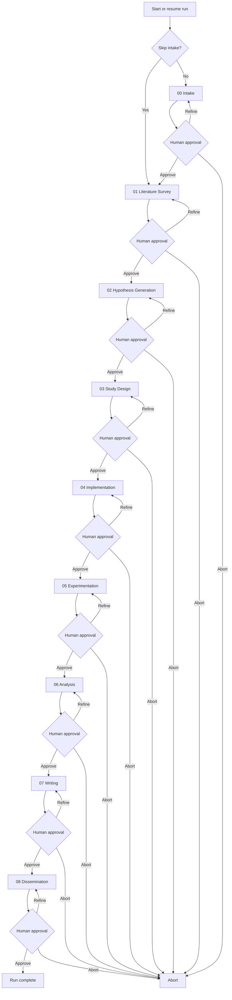
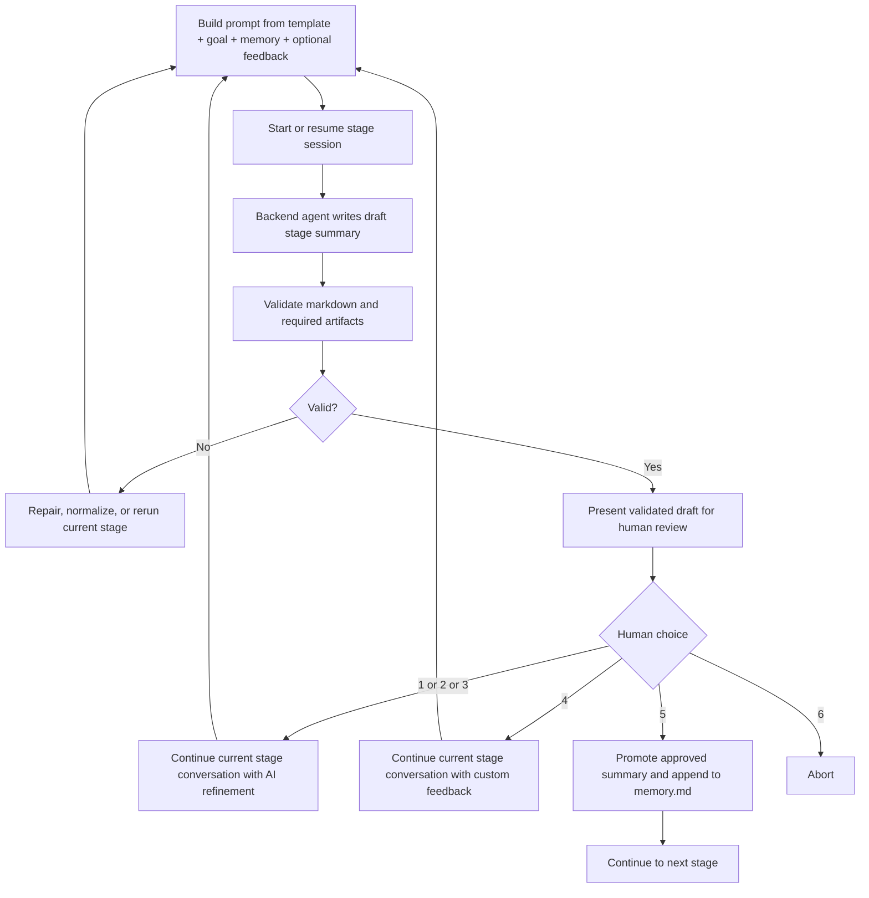
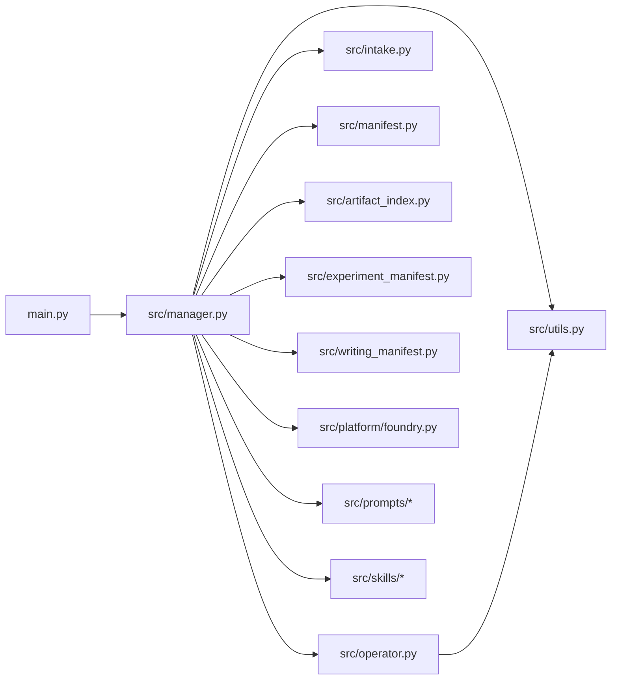
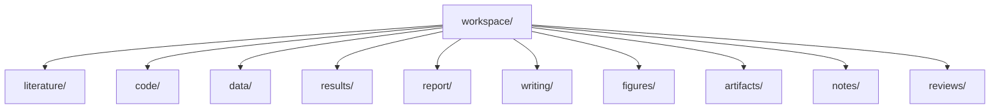

<h1 align="center">AutoR: A Human-Centered Research OS</h1>

<p align="center">
  <strong>AI handles execution. Humans own the direction.</strong>
</p>

<p align="center">
  A terminal-first research harness, with a local browser Studio, that turns long, messy research work into reproducible, artifact-backed runs.
</p>

<p align="center">
  
  
  
  
  
  
  <a href="LICENSE">
    
  </a>
  <a href="https://github.com/tangxiangru/AutoR">
    
  </a>
</p>

<p align="center">
  <a href="#-overview">Overview</a>
  ·
  <a href="#-news">News</a>
  ·
  <a href="#-showcase">Showcase</a>
  ·
  <a href="#-quick-start">Quick Start</a>
  ·
  <a href="#-how-it-works">How It Works</a>
  ·
  <a href="#-run-layout">Run Layout</a>
  ·
  <a href="#-architecture">Architecture</a>
  ·
  <a href="#-documentation">Documentation</a>
  ·
  <a href="#-roadmap">Roadmap</a>
  ·
  <a href="#-license">License</a>
</p>

<p align="center">
  <strong>Start Here:</strong>
  <a href="docs/tutorial_en.md">English Guide</a>
  ·
  <a href="docs/tutorial_zh.md">中文教程</a>
  ·
  <a href="docs/">Full Documentation</a>
</p>

<p align="center">
  
</p>

---

> AutoR is not a chat demo, not a generic agent framework, and not a markdown-only research toy.
>
> It is a structured research harness over a coding agent execution layer:
> **AI handles execution, humans own the direction, and every run becomes an inspectable research artifact on disk.**

> New users should start with the step-by-step guides:
> [English Guide](docs/tutorial_en.md) or [中文教程](docs/tutorial_zh.md).

## 📖 Overview

Most autoresearch systems optimize for autonomy.

AutoR takes a different position: research is too important to hand over as a blind end-to-end loop. The goal is not to remove humans from research. The goal is to give them a stronger execution system.

### ✨ At a Glance

| Dimension | AutoR |
| --- | --- |
| Execution model | A coding agent as the execution layer, AutoR as the research control loop |
| Control model | Human approval by default, with an optional strict reviewer-agent gate for unattended runs |
| Research unit | A reproducible run under `runs/<run_id>/` |
| Workflow shape | 9-stage workflow: optional intake plus eight formal research stages |
| Quality bar | Artifact-backed outputs, not markdown-only summaries |
| Recovery | Resume, redo-stage, rollback-stage, stage-local continuation |

### 🔦 Highlights

| Layer | Highlight | What AutoR actually does |
| --- | --- | --- |
| Big idea | **Human-centered research execution** | AutoR is not an autonomous scientist. AI handles execution; humans retain approval and direction at every stage boundary. |
| Big idea | **Research loop over agent loop** | The system manages stage progression, validation, repair, recovery, and human checkpoints above the lower-level agent execution loop. |
| Big idea | **Every run is a reproducible research artifact** | Each run leaves behind prompts, logs, approved summaries, code, data, figures, writing sources, and packaged outputs under `runs/<run_id>/`. |
| Big idea | **Verifiable outputs, not paper-shaped theater** | The workflow is judged by inspectable artifacts and human approval, not by whether a generated document merely looks polished. |
| Useful feature | **Structured literature organization** | Survey notes, bibliographies, related-work tables, and reading artifacts stay under `workspace/literature/` instead of disappearing into chat history. |
| Useful feature | **Automated experiment manifests** | Machine-readable experiment and result files make runs inspectable, comparable, and reusable downstream. |
| Useful feature | **Citation verification and writing checks** | Writing expects citation verification, figure-link checks, and self-review artifacts before Stage 07 is considered complete. |
| Useful feature | **Artifact indexing across stages** | `artifact_index.json` and related manifests help later stages find data, results, and figures without guessing from filenames. |
| Useful feature | **Cross-model review veto** | When the reviewer approves, a different model family audits that approval and can send the stage back. A veto, never an override, so it can only tighten the gate. |
| Useful feature | **Self-improving review policy** | Every correction the reviewer demands becomes a standing rule checked on all later stages, recorded in an auditable `review_policy.json` with the stage and attempt that produced it. |
| Useful feature | **Resume, redo, and rollback controls** | Long research runs can continue in place, retry a stage, or roll downstream state back without starting over. |
| Useful feature | **Deliberating review panel** | Instead of one reviewer agent at the approval gate, `--review-panel` seats a PI, domain expert, methodologist, reproducibility engineer and adversarial reviewer who review independently, cross-examine, then converge — and a blocking objection cannot be approved over. |
| Useful feature | **Two output formats** | Stage 07 writes a benchmark-ready markdown report (`report/report.md` + PNG figures) by default, or a venue-aware LaTeX paper package with a compiled PDF via `--output-format latex`. |

In practice, that means AutoR is useful not only because of the high-level framing, but also because it handles real research chores: literature organization, experiment manifests, citation verification, artifact indexing, manuscript packaging, and recoverable long-running workflows.

### ✅ What AutoR Guarantees

- By default, human approval is required before the workflow advances.
- An optional reviewer agent can simulate that gate for unattended runs, but the human-centered default remains manual review.
- Approved summaries become the only cross-stage memory.
- Every run is isolated, resumable, and auditable.
- Later stages must produce real artifacts, not only prose.
- A coding agent is the execution layer; AutoR is the research control loop above it.

### 🤔 Why AutoR?

Many systems aim to generate research outputs that *look* ready.

AutoR takes a harder path:

- it requires real experiments
- it enforces artifact validation
- it keeps humans in control

So the question is not:

> Does it look ready?

It is:

> Can you verify every part of it?

## 📰 News

Latest mainline updates:

- **2026-06-02**: Added a configurable Codex sandbox mode. Codex-backed runs still default to `workspace-write`, but users who intentionally need remote GPU or SSH execution can now opt into `--codex-sandbox danger-full-access`; the setting is persisted in `run_config.json` and preserved on resume.
- **2026-05-10**: Refined the terminal-first run experience. Stage 00 now uses a dedicated clarification flow: the first intake pass asks the user questions one by one with selectable options, custom answers, and skip; the revised intake brief then uses a compact refine / approve / abort menu instead of showing the normal suggestion template. The terminal UI also keeps colored frames on wrapped body rows, handles long lines and wide characters more reliably, and the Codex backend now uses the current `--sandbox workspace-write` execution flag instead of the deprecated Codex CLI `--full-auto` flag.
- **2026-04-20**: Added an optional `--full-auto` approval mode. The execution loop is unchanged, but the manual approval gate can now be replaced by a strict simulated reviewer agent backed by Claude or Codex, with reviewer settings persisted in `run_config.json`.
- **2026-04-19**: Merged **AutoR Studio** into main: a local browser workspace for the same run-based workflow, with live stage monitoring, human review, restart-safe recovery, paper preview, version history, and a Notebook view. The browser UI shares the same run directories and artifact model as the terminal workflow and is currently Claude-backed.
- **2026-04-18**: Fixed a stage-summary recovery bug so local normalization now restores the required `Decision Ledger` section and validates draft outputs against the correct `.tmp.md` path. Added stage recovery controls that let operators `/skip` the current stage, `/back <stage>` to an earlier stage, or choose skip / roll back directly after retry exhaustion.
- **2026-04-15**: Added minimal `--operator codex` support alongside Claude, persisted the selected execution backend in `run_config.json`, and improved terminal rendering for backend JSON streams.
- **2026-04-13**: Added literature evidence ledgers and citation verification outputs, introduced typed hypothesis manifests, hardened experiment manifest parsing, and added regression coverage for research diagram injection.
- **2026-04-10**: Added a decision ledger for human approvals and refined the public showcase gallery so research artifacts are presented more clearly.
- **2026-04-08**: Documented optional `--research-diagram` dependencies and tightened the README positioning around human-centered, artifact-backed research execution.

## 🌟 Showcase

AutoR already has a full example run used throughout the repository: `runs/20260330_101222`.

### 🧪 Example Run Snapshot

| What the run produced | What it demonstrates |
| --- | --- |
| [example_paper.pdf](assets/examples/example_paper.pdf) | A compiled manuscript artifact within a broader research package |
| Executable research code | The run is not just a writing pipeline |
| Machine-readable datasets and result files | Claims are backed by inspectable experiment outputs |
| Real figures used in the research package | The run produces publication-style visuals, not placeholders |
| Review and dissemination materials | The workflow continues past writing into release readiness |

Highlighted outcomes from that run:

- `AGSNv2` reached **36.21 ± 1.08** on Actor.
- The system produced a full research package with real figures, writing sources, and auditable artifacts.
- The final run preserved the full human-in-the-loop approval trail.

### 🖥️ Terminal Experience

AutoR is designed for terminal-first execution, but the interaction layer is not limited to raw logs and plain prompts. The current UI supports banner-style startup, colored stage panels, parsed backend event streams, display-width-aware markdown wrapping, keyboard-selectable menus, and a Stage 00 clarification flow suitable for demos and recordings.

<p align="center">
  
</p>

### 📈 Example Figures

<table>
  <tr>
    <td align="center" valign="top">
      <strong>Accuracy Comparison</strong><br />
      
    </td>
    <td align="center" valign="top">
      <strong>Ablation + Actor Results</strong><br />
      
    </td>
  </tr>
  <tr>
    <td align="center" valign="top" colspan="2">
      <strong>Two-Layer Narrative Figure</strong><br />
      
    </td>
  </tr>
</table>

### 🧾 Research Output Gallery

The manuscript pages below are only the visible surface of larger AutoR runs. To keep the showcase compact and comparable, this gallery uses a consistent 4 × 2 layout: four artifact-backed research outputs, two representative pages from each, and a short note on what each run is demonstrating.

<table>
  <tr>
    <td valign="top" width="23%">
      <strong>Output 1</strong><br />
      A complete end-to-end AutoR run. The pair below shows the opening manuscript page and a later evidence-heavy page where algorithm, tables, and quantitative results appear together.
    </td>
    <td align="center" valign="top">
      <br />
      <strong>Page 1</strong>
    </td>
    <td align="center" valign="top">
      <br />
      <strong>Evidence Page</strong>
    </td>
  </tr>
  <tr>
    <td valign="top" width="23%">
      <strong>Output 2</strong><br />
      <em>Do More Experts Help?</em> A parameter-matched MoE-LoRA study. The selected pages show the framing page and a chart-heavy evidence page.
    </td>
    <td align="center" valign="top">
      <br />
      <strong>Page 1</strong>
    </td>
    <td align="center" valign="top">
      <br />
      <strong>Evidence Page</strong>
    </td>
  </tr>
  <tr>
    <td valign="top" width="23%">
      <strong>Output 3</strong><br />
      <em>Attention Sink Onset in Tiny Transformers</em> A controlled factorial study. The chosen pages show the opening page and a later structured overview page with visual decomposition.
    </td>
    <td align="center" valign="top">
      <br />
      <strong>Page 1</strong>
    </td>
    <td align="center" valign="top">
      <br />
      <strong>Overview Page</strong>
    </td>
  </tr>
  <tr>
    <td valign="top" width="23%">
      <strong>Output 4</strong><br />
      <em>HSOD: Harmonic Spectral Operator Decomposition</em> A stability-focused time-series study. The pair below shows the framing page and a later page with dense training-dynamics plots.
    </td>
    <td align="center" valign="top">
      <br />
      <strong>Page 1</strong>
    </td>
    <td align="center" valign="top">
      <br />
      <strong>Analysis Page</strong>
    </td>
  </tr>
</table>

### 🧑‍🔬 Human-in-the-Loop in Practice

The example run is interesting not because the AI was left alone, but because the human intervened at critical moments:

- **Stage 02** narrowed the project to a single core claim.
- **Stage 04** pushed the system to download real datasets and run actual pre-checks.
- **Stage 05** forced experimentation to continue until real benchmark results were obtained.
- **Stage 06** redirected the story away from leaderboard-only framing toward mechanism-driven analysis.

That is the intended shape of AutoR:
AI handles execution load; humans steer the research when direction actually matters.

## 🚀 Quick Start

### 🧰 Prerequisites

- Python 3.10+
- Claude CLI or Codex CLI available on `PATH` for real runs
- Local TeX tools are only needed for `--output-format latex`; the default markdown output needs no TeX
- For `--research-diagram` (Gemini-generated method illustration inserted into the report):
  - `pip install google-genai` (the `google.genai` SDK is **not** a default dependency; if it is missing the diagram step prints `Diagram generation failed: No module named 'google'` and the rest of the run continues unaffected)
  - A Gemini API key exposed via `GOOGLE_API_KEY` or `GEMINI_API_KEY`, or a local `configs/diagram_config.yaml` (see `configs/diagram_config.template.yaml`)

### ⌨️ Common Commands

| Goal | Command |
| --- | --- |
| Start a new run | `python main.py` |
| Start with an explicit goal | `python main.py --goal "Your research goal here"` |
| Start with preloaded resources | `python main.py --goal "Your research goal here" --resources paper.pdf refs.bib data.csv` |
| Run a local smoke test without a real agent backend | `python main.py --fake-operator --goal "Smoke test"` |
| Run with the automated reviewer gate | `python main.py --full-auto --goal "Your research goal here"` |
| Replace the single reviewer with a deliberating panel | `python main.py --review-panel --goal "..."` |
| Give the panel a researcher persona to stand in for | `python main.py --review-panel --persona docs/persona-example.md --goal "..."` |
| Choose the execution backend | `python main.py --operator claude` or `python main.py --operator codex` |
| Choose the reviewer backend separately | `python main.py --full-auto --review-operator claude --review-model opus` |
| Choose a Claude model | `python main.py --operator claude --model sonnet` or `python main.py --operator claude --model opus` |
| Start with Codex | `python main.py --operator codex --model default --goal "Your research goal here"` |
| Allow Codex-backed SSH / remote GPU execution | `python main.py --operator codex --codex-sandbox danger-full-access --goal "Your research goal here"` |
| Produce a LaTeX paper package instead of a markdown report | `python main.py --output-format latex --goal "..."` |
| Stop once the report is written, skipping dissemination | `python main.py --final-stage 07_writing --goal "..."` |
| Choose a writing venue profile | `python main.py --venue neurips_2025` or `python main.py --venue nature` or `python main.py --venue jmlr` |
| Resume the latest run | `python main.py --resume-run latest` |
| Redo a stage inside the same run | `python main.py --resume-run 20260329_210252 --redo-stage 03` |
| Roll back to a stage inside the same run | `python main.py --resume-run 20260329_210252 --rollback-stage 03` |
| Re-enter an existing project instead of starting over | `python main.py --project-root ~/code/my-project --goal "..."` |
| Seed the run from your own prior papers | `python main.py --paper-corpus ~/papers --goal "..."` |
| Store runs on another disk | `python main.py --runs-dir /mnt/big-disk/runs --goal "..."` |
| Raise the per-attempt ceiling for long training runs | `python main.py --stage-timeout 43200 --goal "..."` |
| Give a stubborn stage more retries | `python main.py --max-attempts 10 --goal "..."` |
| Skip the intake stage | `python main.py --skip-intake --goal "..."` |
| Add a generated method diagram to the paper | `python main.py --research-diagram --goal "..."` |
| Search the web where the agent's own `WebSearch` is disabled | `python main.py --web-search gemini --goal "..."` |
| Benchmark AutoR on ResearchClawBench | `python rcb_agent.py --workspace <WORKSPACE> --prompt <PROMPT>` |

Every flag, its default, and what is preserved on resume: **[docs/cli-reference.md](docs/cli-reference.md)**.

If `--venue` is omitted, AutoR defaults to `neurips_2025`.

`--full-auto` does not change the stage pipeline. It only replaces the manual approval menu with a strict reviewer agent, and puts the run into unattended mode so it never blocks on terminal input. This is useful for unattended sweeps, overnight runs, and dry-run automation, but the default human-reviewed mode is still the recommended path for serious research work.

For Codex-backed runs, AutoR defaults to `--codex-sandbox workspace-write`. If a verified remote experiment needs SSH or external GPU access, use `--codex-sandbox danger-full-access` intentionally. This grants the Codex backend unrestricted local/remote execution ability, so it should not be the default for untrusted tasks.

Valid stage identifiers include `03`, `3`, and `03_study_design`.

### Studio (browser UI)

AutoR Studio is a local web UI that drives the same real Claude-backed pipeline through a browser instead of a terminal. Human-in-the-loop approval, feedback, stage re-runs, live session traces, and the compiled paper all live in one page.

```bash
# Start the Studio server (default: http://127.0.0.1:8000)
python studio.py

# Then open the UI in your browser:
#   http://127.0.0.1:8000/studio/
```

Options:

```bash
python studio.py --port 8765                    # custom port
python studio.py --host 0.0.0.0 --port 8000     # bind externally
python studio.py --runs-dir /path/to/runs       # override runs directory
```

What you can do in the Studio:

- **Create a project** from the hub — fill in the title + thesis, click **Create Project**, and a real Claude-backed run starts immediately
- **Watch stages run live** on the Overview page — stage strip, pulsing current stage, live session trace streaming real Claude tool calls from `logs_raw.jsonl`
- **Review & Approve** — the Review page shows a "You are reviewing" hero card with a TL;DR extracted from the stage markdown, a Files Produced pill list, and an `✅ Approve → Advance to <next stage>` button
- **Send Feedback & Re-run** — feedback is woven into the **first attempt's prompt** of the next run (not wasted on an intermediate Claude call). Works on `human_review` AND `failed` stages
- **Resume across restarts** — if you stop the server and come back, clicking Approve/Feedback lazy-resumes the existing on-disk run without re-running stages that already have a draft
- **Paper preview** — the Paper tab renders `report.md` for markdown runs, or the compiled PDF, LaTeX sources, and build log for LaTeX runs
- **Versions page** — the full checkpoint/attempt timeline for every stage

The Studio requires the **Claude CLI** (`claude` on `PATH`) since every run is a real Claude-driven pipeline. The check happens when you start a run, not at server startup: without `claude` the server still comes up and you can browse existing runs, read stage documents, and view papers, but starting a run fails with a clear error.

> The Studio API has **no authentication**. It binds to `127.0.0.1` by default; anything that can reach it can start runs, approve stages, and read every file under the runs directory. For remote access prefer an SSH tunnel over `--host 0.0.0.0`. See [SECURITY.md](SECURITY.md).

Full page-by-page walkthrough and the complete HTTP API: **[docs/studio.md](docs/studio.md)**.

## ⚙️ How It Works

AutoR uses a 9-stage research workflow: one optional intake stage plus eight formal research stages.

0. `00_intake` (optional)
1. `01_literature_survey`
2. `02_hypothesis_generation`
3. `03_study_design`
4. `04_implementation`
5. `05_experimentation`
6. `06_analysis`
7. `07_writing`
8. `08_dissemination`

### The 9 Stages

| Stage | Role | What the human should check |
| --- | --- | --- |
| `00_intake` | Align the research goal, resources, constraints, target venue, and success criteria before formal work begins. | Answer the clarification questions, add missing constraints, and make sure the project is narrow enough to execute. |
| `01_literature_survey` | Build the related-work base, collect evidence, organize papers, and identify the real gap. | Reject shallow paper lists; require task framing, benchmarks, baselines, differences, and structured literature files. |
| `02_hypothesis_generation` | Convert the broad direction into testable hypotheses and provisional paper claims. | Push for one main claim plus measurable secondary hypotheses instead of an unfocused idea list. |
| `03_study_design` | Turn the hypothesis into an executable experimental plan. | Check datasets, metrics, baselines, ablations, budgets, failure criteria, and machine-readable data artifacts. |
| `04_implementation` | Build the runnable code, configs, data preparation, and sanity checks. | Do not approve skeletons; require executable scripts, reproducible commands, and logs or checks showing the path runs. |
| `05_experimentation` | Run the planned experiments and write machine-readable results. | Distinguish smoke tests from real experiments; require baselines, repeats, result files, and failure records. |
| `06_analysis` | Interpret the results, create figures, analyze failures, and refine the evidence story. | Require real plots, ablations, error analysis, and explanations rather than metric narration. |
| `07_writing` | Produce the final deliverable: a markdown research report with embedded figures, or a venue-aware LaTeX package with a compiled PDF. | Verify that every major claim is backed by artifacts, experiments, or citations. |
| `08_dissemination` | Package the run for review, release, reproduction, or external presentation. | Confirm that readiness notes, review materials, manifests, and outward-facing deliverables exist. |



### Stage Attempt Loop



### Approval semantics

- Stage 00 has a dedicated manual intake flow. On the first pass, AutoR asks the clarification questions one by one with selectable options, custom answers, and skip. On the revised pass, the user sees a compact intake brief and chooses refine, approve, or abort.
- Stages 01-08 use the standard six-action review menu: `1 / 2 / 3` continue with an AI refinement suggestion, `4` continues with custom feedback, `5` approves, and `6` aborts.

The stage loop is controlled by AutoR, not by Claude.

### Cross-model review

The approval gate runs a coding agent with tools, so it can re-read a paper and re-execute
an analysis before judging. But it is the same model family as the executor — usually the
same model. Opus judging opus shares the blind spots that produced the work, which is
exactly what a review is supposed to catch.

So when the primary reviewer **approves**, a reviewer from a different model family reads
the same evidence and decides whether that approval is defensible. It is a **veto, never an
override**:

- It only audits approvals. A refusal already sends the stage back.
- It cannot approve anything the primary refused, so enabling it can only make the gate
  stricter — which is why `--cross-review auto` turns it on whenever a Gemini backend is
  configured.
- An auditor that errors or returns unparseable output is recorded as *unavailable*, not as
  agreement. Silence is never laundered into a passed audit.

A cross-model veto is recorded as a standing rule, so a blind spot caught once is checked
on every stage after it.

### Self-improving review

The approval gate does not just judge each stage — it **accumulates the corrections it
demands and applies them to every stage after**. A reviewer that once insisted on a stated
power analysis keeps insisting, so the same class of weakness cannot recur later in the run:

```
stage N review  ──demands a correction──▶  standing rule
                                              │
stage N+1 review  ◀──rule is now checked──────┘
```

Two properties keep this honest rather than decorative:

- **It is auditable.** The policy is a plain artifact at `runs/<run_id>/review_policy.json`,
  and every rule names the stage and attempt that produced it, so the claim can be checked
  against the record instead of believed.
- **It cannot inflate.** Rules are deduplicated on normalized text — casing, punctuation and
  stage numbers collapse — and the set is bounded, so a reviewer restating one complaint
  does not manufacture the appearance of learning.

A rollback is recorded at higher weight than a routine refinement, because it is the
strongest evidence a review can produce: an approval already given turned out to be wrong.
Approvals teach nothing and are not recorded.

### Unattended runs

`--full-auto` (or `--unattended`) removes the human entirely, which is what benchmark harnesses and overnight sweeps need:

- The reviewer agent decides every approval, including the Stage 00 intake flow.
- The resource prompt is skipped even on a TTY. Pass resources with `--resources` instead.
- A stage that exhausts its retry budget is auto-skipped rather than aborting the run, bounded by `--max-auto-skips` (default 3). The skip is promoted as an explicit skip summary so downstream stages know the work is missing.
- Any interactive prompt still reachable raises `UnattendedInputError` instead of waiting on stdin — a prompt added later fails on its first unattended run rather than silently hanging an overnight job.

`python rcb_agent.py` runs AutoR against a [ResearchClawBench](https://github.com/InternScience/ResearchClawBench) workspace on this basis and exports the benchmark's deliverables (`report/report.md`, `report/images/`, `code/`, `outputs/`). See [docs/researchclawbench.md](docs/researchclawbench.md).

## ✅ Validation Bar

AutoR does not consider a run successful just because it generated a plausible markdown summary.

| Stage | Required non-toy output |
| --- | --- |
| Stage 01 | A cross-referenced evidence ledger: `sources.json` and `claims.json`, where every cited `source_id` resolves |
| Stage 03+ | Machine-readable data under `workspace/data/` |
| Stage 05+ | Machine-readable results under `workspace/results/`, plus a valid `experiment_manifest.json` |
| Stage 06+ | Real figure files under `workspace/figures/` |
| Stage 07+ (markdown) | `report/report.md` with resolving figure references, at most 5 figures under `report/images/`, `citation_verification.json`, `self_review.json`, `report_review.json` |
| Stage 07+ (latex) | `main.tex` matching the venue, `sections/*.tex`, a bibliography, a compiled PDF, `build_log.txt`, `citation_verification.json`, `self_review.json`, `layout_review.json` |
| Stage 08+ | Review and readiness assets under `workspace/reviews/` |

Requirements are cumulative, and the stage that *produces* a class of artifact must produce it **during that stage's execution** — a re-run is not credited with the previous attempt's files.

The complete gate, including every JSON schema that is parsed rather than merely counted, is in **[docs/stage-contract.md](docs/stage-contract.md)**.

Required stage summary shape:

```md
# Stage X: <name>

## Objective
## Previously Approved Stage Summaries
## What I Did
## Key Results
## Files Produced
## Decision Ledger
## Suggestions for Refinement
## Your Options
```

Additional rules:

- exactly 3 numbered refinement suggestions
- the fixed 6 user options
- no `[In progress]`, `[Pending]`, `[TODO]`, `[TBD]`, or similar placeholders
- concrete file paths in `Files Produced`

If a run only leaves behind markdown notes, it has not met AutoR's quality bar.

## 📂 Run Layout

Every run lives entirely inside its own directory.

```text
runs/<run_id>/
├── user_input.txt
├── memory.md
├── run_config.json
├── run_manifest.json
├── artifact_index.json
├── intake_context.json
├── logs.txt
├── logs_raw.jsonl
├── prompt_cache/
├── operator_state/
├── handoff/
├── stages/
└── workspace/
    ├── literature/
    ├── code/
    ├── data/
    ├── results/
    ├── report/
    ├── writing/
    ├── figures/
    ├── artifacts/
    ├── notes/
    └── reviews/
```

### Workspace Directory Semantics

- `literature/`: reading notes, survey tables, benchmark notes
- `code/`: runnable code, scripts, configs, implementations
- `data/`: machine-readable data and manifests
- `results/`: machine-readable experiment outputs
- `report/`: the markdown deliverable, `report.md` plus `images/` (markdown mode)
- `writing/`: LaTeX sources, sections, bibliography, tables (latex mode)
- `figures/`: real plots and paper figures
- `artifacts/`: review JSON, build metadata, compiled PDFs, and packaged deliverables
- `notes/`: temporary or supporting research notes
- `reviews/`: readiness, critique, and dissemination materials

## 🧠 Execution Model

For each stage attempt, AutoR assembles a prompt from:

1. the stage template from [src/prompts/](src/prompts)
2. the required stage summary contract
3. execution-discipline constraints
4. `user_input.txt`
5. approved `memory.md`
6. `intake_context.json`, `artifact_index.json`, and, when available, `experiment_manifest.json`
7. optional refinement feedback
8. for continuation attempts, the current draft/final stage files and workspace context

The assembled prompt is written to `runs/<run_id>/prompt_cache/`, per-stage session IDs are stored in `runs/<run_id>/operator_state/`, and the selected CLI backend is invoked in live streaming mode.

From Stage 05 on the prompt also carries the **frozen preregistration**, worded as a constraint rather than as background — the hypotheses were fixed before any result existed and cannot be renegotiated to fit one.

That list is everything the agent is *given*. Alongside it, AutoR installs an agent skill pack from [src/skills/](src/skills) into `runs/<run_id>/.claude/skills/` — the operator's working directory — so the agent can *pull* long-form craft guidance when it needs it: writing principles, citation discipline, venue checklists, LaTeX repair, results tables, reproducibility review. A skill costs nothing in the prompts that do not use it, which is why guidance that matters to one stage in one situation lives there rather than in the templates.

<details>
<summary><strong>Exact Claude CLI pattern</strong></summary>

First attempt for a stage:

```bash
claude --model <model> \
  --permission-mode bypassPermissions \
  --dangerously-skip-permissions \
  --session-id <stage_session_id> \
  -p @runs/<run_id>/prompt_cache/<stage>_attempt_<nn>.prompt.md \
  --output-format stream-json \
  --verbose
```

Continuation attempt for the same stage:

```bash
claude --model <model> \
  --permission-mode bypassPermissions \
  --dangerously-skip-permissions \
  --resume <stage_session_id> \
  -p @runs/<run_id>/prompt_cache/<stage>_attempt_<nn>.prompt.md \
  --output-format stream-json \
  --verbose
```

</details>

Important behavior:

- refinement attempts reuse the same stage conversation whenever possible
- streamed agent output is shown live in the terminal
- raw stream-json output is captured in `logs_raw.jsonl`
- if resume fails, AutoR can fall back to a fresh session
- if stage markdown is incomplete, AutoR can repair or normalize it locally

## 🏗️ Architecture

The main code lives in:

- [main.py](main.py)
- [src/manager.py](src/manager.py)
- [src/operator.py](src/operator.py)
- [src/intake.py](src/intake.py)
- [src/manifest.py](src/manifest.py)
- [src/artifact_index.py](src/artifact_index.py)
- [src/experiment_manifest.py](src/experiment_manifest.py)
- [src/utils.py](src/utils.py)
- [src/writing_manifest.py](src/writing_manifest.py)
- [src/platform/foundry.py](src/platform/foundry.py)
- [src/prompts/](src/prompts)
- [src/skills/](src/skills)



File boundaries:

- [main.py](main.py): CLI entry point. Starts a new run, resumes an existing run, collects resources, and exposes redo/rollback controls.
- [src/manager.py](src/manager.py): Owns intake plus the 8-stage loop, approval flow, repair flow, resume/redo/rollback logic, and stage-level continuation policy.
- [src/operator.py](src/operator.py): The shared CLI operator flow used by Claude today and reused by Codex support for stage session state, live streaming, and resume fallback.
- [src/operator_codex.py](src/operator_codex.py): Codex CLI adapter over the same stage contract, including JSON event streaming and stage-local session continuation.
- [src/intake.py](src/intake.py): Resource ingestion, intake context persistence, and prompt formatting for preloaded materials.
- [src/manifest.py](src/manifest.py): Lightweight run lifecycle state, stage status tracking, and rollback/stale invalidation.
- [src/artifact_index.py](src/artifact_index.py): Run-wide artifact indexing over data, results, and figures.
- [src/experiment_manifest.py](src/experiment_manifest.py): Standardized experiment bundle summary used by later stages.
- [src/utils.py](src/utils.py): Stage metadata, prompt assembly, run paths, markdown validation, artifact validation, and handoff helpers.
- [src/evidence_ledger.py](src/evidence_ledger.py): Stage 01 literature evidence and Stage 07 citation verification.
- [src/hypothesis_manifest.py](src/hypothesis_manifest.py): Stage 02 typed propositions, hypotheses, and paper claims.
- [src/bootstrap.py](src/bootstrap.py) and [src/project_bootstrap.py](src/project_bootstrap.py): `--paper-corpus` and `--project-root` scanning.
- [src/approval_agent.py](src/approval_agent.py): The strict reviewer agent used by `--full-auto`.
- [src/backend/](src/backend) and [src/frontend/](src/frontend): AutoR Studio service, HTTP layer, and the browser UI.
- [src/validity_review.py](src/validity_review.py): The adversarial pass after Stages 05 and 06 — asks why the result is wrong, and requires the next stage to answer every objection.
- [src/preregistration.py](src/preregistration.py): Freezes the hypotheses before the experiments, adjudicates each one at Stage 06, and traces each manuscript claim back to a supported hypothesis at Stage 07.
- [src/prompts/](src/prompts): Per-stage prompt templates.
- [src/skills/](src/skills) and [src/run_skills.py](src/run_skills.py): Agent skills installed into each run's `.claude/skills/`, loaded on demand rather than concatenated into every prompt.

The full module map, the stage attempt loop, how prompts are assembled, and the extension points are in **[docs/architecture.md](docs/architecture.md)**.

## 🗂️ Run State

Each run contains `user_input.txt`, `memory.md`, `run_manifest.json`, `artifact_index.json`, `prompt_cache/`, `operator_state/`, `stages/`, `workspace/`, `.claude/skills/`, `logs.txt`, and `logs_raw.jsonl`. The substantive research payload lives in `workspace/`.



Workspace directories:

- `literature/`: papers, benchmark notes, survey tables, reading artifacts.
- `code/`: runnable pipeline code, scripts, configs, and method implementations.
- `data/`: machine-readable datasets, manifests, processed splits, caches, and loaders.
- `results/`: machine-readable metrics, predictions, ablations, tables, and evaluation outputs.
  AutoR also standardizes `results/experiment_manifest.json` as a machine-readable summary over result, code, and note artifacts for downstream analysis.
- `report/`: the markdown deliverable in markdown mode — `report.md` and the PNG figures it embeds under `images/`.
- `writing/`: manuscript sources, LaTeX, section drafts, tables, and bibliography in latex mode.
- `figures/`: plots, diagrams, charts, and paper figures.
- `artifacts/`: review JSON, build metadata, compiled PDFs, and packaged deliverables.
- `notes/`: temporary notes and setup material.
- `reviews/`: critique notes, threat-to-validity notes, and readiness reviews.

Other run state:

- `memory.md`: approved cross-stage memory only.
- `run_manifest.json`: machine-readable run and stage lifecycle state.
- `artifact_index.json`: machine-readable index over `workspace/data`, `workspace/results`, and `workspace/figures`.
- `prompt_cache/`: exact prompts used for stage attempts and repairs.
- `operator_state/`: per-stage backend session IDs.
- `stages/`: draft and promoted stage summaries.
- `logs.txt` and `logs_raw.jsonl`: workflow logs and raw backend stream output.

## ✅ Validation

AutoR validates both the stage markdown and the stage artifacts.

Required stage markdown shape:

```md
# Stage X: <name>

## Objective
## Previously Approved Stage Summaries
## What I Did
## Key Results
## Files Produced
## Decision Ledger
## Suggestions for Refinement
## Your Options
```

Additional markdown requirements:

- Exactly 3 numbered refinement suggestions.
- The fixed 6 user options.
- No unfinished placeholders such as `[In progress]`, `[Pending]`, `[TODO]`, or `[TBD]`.
- Concrete file paths in `Files Produced`.

Artifact requirements by stage:

- Stage 03+: machine-readable data under `workspace/data/`
- Stage 05+: machine-readable results under `workspace/results/`
- Stage 05+: `workspace/results/experiment_manifest.json` must exist and remain structurally valid
- Stage 06+: figure files under `workspace/figures/`
- Stage 07+: a markdown report at `workspace/report/report.md` whose figure references all resolve, or with `--output-format latex`, venue-aware LaTeX sources plus a compiled PDF under `workspace/writing/` or `workspace/artifacts/`
- Stage 08+: review and readiness artifacts under `workspace/reviews/`

A run with only markdown notes does not pass validation.

## 📌 Scope

### Included in the current mainline

- optional intake stage and resource ingestion
- 9-stage workflow: optional intake plus eight formal research stages
- mandatory human approval after every stage
- Claude Code or Codex as the execution layer
- Stage 00 clarification Q&A plus a compact intake approval flow
- stage-local continuation within the same backend session
- prompt caching via `@file`
- live streaming terminal output with keyboard-selectable menus
- repair passes and local fallback normalization
- run manifest, rollback, and stale tracking
- artifact index and experiment manifest
- stage handoff context
- manuscript/release package generation after approval
- artifact-aware validation
- resume, `--redo-stage`, and `--rollback-stage`
- lightweight venue profiles for Stage 07 writing

### Intentionally out of scope

- generic multi-agent orchestration
- database-backed runtime state
- concurrent stage execution
- heavyweight platform abstractions
- dashboard-first productization

## 📚 Documentation

The [docs/](docs/) directory is the reference documentation. This README is the overview; everything below is the detail behind it.

**Guides**

| | |
| --- | --- |
| [English Guide](docs/tutorial_en.md) · [中文教程](docs/tutorial_zh.md) | Install, run your first project end to end, review each stage, and write feedback that actually improves output. |

**Reference**

| | |
| --- | --- |
| [CLI Reference](docs/cli-reference.md) | Every flag on `main.py` and `studio.py`, defaults, what is preserved on resume, exit codes. |
| [Configuration](docs/configuration.md) | `run_config.json`, the venue registry, diagram setup, environment variables, hard-coded limits. |
| [Run Artifacts](docs/run-artifacts.md) | The run directory, file by file, and the schema of every machine-readable artifact. |
| [Stage Contract](docs/stage-contract.md) | Exactly what a stage must produce to be accepted, as the code enforces it. |
| [Studio Guide & API](docs/studio.md) | The browser workspace and its complete HTTP API. |
| [ResearchClawBench](docs/researchclawbench.md) | Running with no human in the loop: unattended execution, the benchmark adapter and its output contract, and Gemini-backed web search. |
| [ResearchClawBench Landscape](docs/researchclawbench-landscape.md) | How EvoScientist, ARIS Codex and MIRA actually score on the benchmark, which reported numbers reproduce, and the baseline any result must be quoted against. |

**Internals**

| | |
| --- | --- |
| [Architecture](docs/architecture.md) | Layers, module map, the stage attempt loop, prompt assembly, recovery, extension points. |
| [Development](docs/development.md) | Dev setup, tests, CI, conventions, and recipes for adding a stage, venue, or backend. |
| [Troubleshooting](docs/troubleshooting.md) | Symptom-to-fix for the errors AutoR actually raises. |

**Project**

| | |
| --- | --- |
| [Contributing](CONTRIBUTING.md) | How to propose and land a change, and what a reviewer looks for. |
| [Security](SECURITY.md) | The security model, the sandbox trade-offs, and how to report a vulnerability. |
| [Code of Conduct](CODE_OF_CONDUCT.md) | Community expectations. |

## 🛣️ Roadmap

The most valuable next steps are the ones that make AutoR more like a real research workflow, not more like a demo framework.

| Next step | Why it matters |
| --- | --- |
| **Deeper cross-stage rollback and invalidation** | Make downstream stale-state handling stronger and more explicit after earlier-stage changes. |
| **Stronger machine-readable run state** | Extend the current run manifest into a better source of truth for stage status, stale dependencies, and artifact pointers. |
| **Continuation handoff compression** | Make long stage refinement more stable without bloating context. |
| **Stronger automated tests** | Cover repair flow, resume fallback, artifact validation, and approval-loop correctness more deeply. |
| **Richer artifact indexing** | Extend metadata around `data/`, `results/`, `figures/`, and `writing/` without turning AutoR into a heavy platform. |
| **Frontend run browser** | Add a lightweight UI for browsing runs, stages, logs, and artifacts directly from the run directory. |

Implemented milestone:

- ~~Stage-local continuation sessions.~~ Keep one Claude conversation per stage, reuse it for `1/2/3/4` refinement, and fall back to a fresh session only when resume fails. This is now implemented in the operator and manager flow.
- ~~Artifact-level validation for non-toy outputs.~~ Enforce machine-readable data, result files, figures, LaTeX sources, PDF output, and review artifacts at the right stages. This is now part of the workflow validation path.

<details>
<summary><strong>Expanded roadmap notes</strong></summary>

- Cross-stage rollback and invalidation. When a later stage reveals that an earlier design decision is wrong, the workflow should be able to jump back to an earlier stage and mark downstream stages as stale. This is the biggest current control-flow gap.
- Machine-readable run manifest. Add a single source of truth such as `run_manifest.json` to track stage status, approval state, stale dependencies, session IDs, and key artifact pointers. This should make both automation and future UI work much cleaner.
- Continuation handoff compression. Add a short machine-generated stage handoff file that summarizes what is already correct, what is missing, and which files matter most. This should reduce context growth and make continuation more stable over long runs.
- ~~Result schema and artifact indexing.~~ Standardize `workspace/data/`, `workspace/results/`, and `workspace/figures/` around explicit schemas and generate an artifact index automatically. The workflow now writes `artifact_index.json`, carries basic inferred or declared schema metadata, and feeds the index into later-stage prompt context and the writing manifest.
- Writing pipeline hardening. Turn Stage 07 into a reliable manuscript production pipeline with stable conference and journal-style writing structures, bibliography handling, table and figure inclusion, and reproducible PDF compilation. The goal is a submission-grade research package, not just writing notes.
- Review and dissemination package. Expand Stage 08 so it produces readiness checklists, threats-to-validity notes, artifact manifests, release notes, and external-facing research bundles. The final stage should feel like packaging a verifiable research release, not just wrapping up text.
- Frontend run dashboard. Build a lightweight UI that can browse runs, stage status, summaries, logs, artifacts, and validation failures. It should read from the run directory and manifest rather than introducing a database first.
- README and presentation assets. Keep refining the README and add `assets/` images such as workflow diagrams, UI screenshots, and artifact examples. This is important for clarity, onboarding, and project presentation.

</details>

## 🤝 Contributing

Bug reports, feature requests, documentation fixes, and shared runs are all welcome. Setup is one clone and one command — AutoR has no third-party Python dependencies and no build step:

```bash
git clone https://github.com/tangxiangru/AutoR.git
cd AutoR
python -m unittest discover -s tests -p "test_*.py"
```

Read [CONTRIBUTING.md](CONTRIBUTING.md) before opening a pull request, and [docs/development.md](docs/development.md) before changing code. Security issues go through [SECURITY.md](SECURITY.md), not a public issue.


Note that contributions are assigned to the copyright holder under Section 6 of the [LICENSE](LICENSE), and that running AutoR requires written permission — see below.

## 📜 License

**AutoR is proprietary software. It is not open source.**

Copyright © 2026 **Xiangru Tang**. All rights reserved. See [LICENSE](LICENSE) for the full terms and [NOTICE](NOTICE) for the summary.

This repository is public so that AutoR's design and behaviour can be examined, cited, and discussed. **Publication is not a license.** No right to use, run, copy, modify, fork, or redistribute the Software is granted by its availability here.

| | |
| --- | --- |
| **Permitted** | Viewing this repository. Quoting short excerpts for academic citation, commentary, review, teaching, or news reporting, with attribution. |
| **Requires written permission** | Any use at all — running AutoR, deploying it, modifying it, forking it, redistributing it, or using it to train or evaluate a model. |
| **Not granted** | Any patent license. Any trademark license to the AutoR name or marks. |
| **Contributions** | Assigned to the copyright holder with a relicensable right (LICENSE §6). |

To request permission, open an issue or contact the copyright holder directly. Permission applies only to the specific use, party, and period stated in writing.
