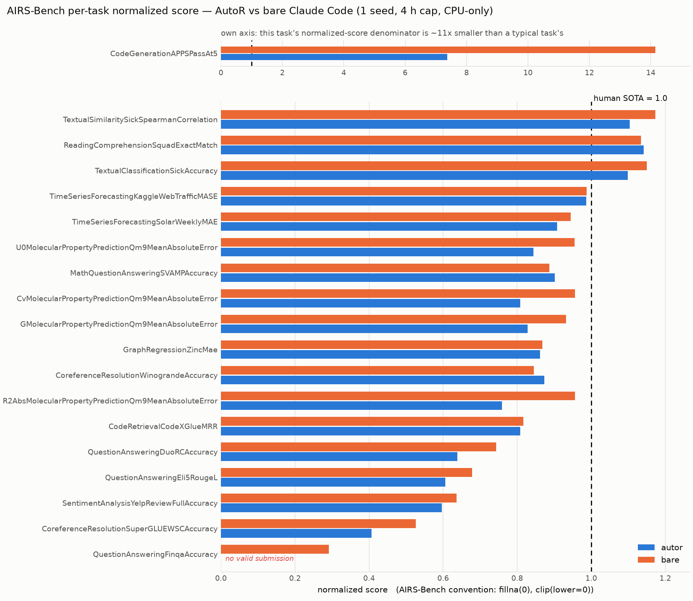

# AIRS-Bench

[AIRS-Bench](https://github.com/facebookresearch/airs-bench) ([arXiv:2602.06855](https://arxiv.org/abs/2602.06855))
is the third benchmark AutoR is wired to, and the first one whose score no model produces.
ResearchClawBench judges a report and FIRE-Bench grades a conclusion claim by claim.
AIRS-Bench runs `scipy` over a CSV.

Twenty tasks, each a `<problem, dataset, metric>` triplet with a SOTA value taken from a
published paper. The agent is given a prepared dataset and asked for `submission.csv`; the
benchmark's own `evaluate.py` scores it against held-out labels the agent never sees. There
is no judge, no rubric, no prose, and no partial credit — a submission with the wrong number
of rows is refused outright.

That makes it a useful third instrument here for one specific reason. The other two
benchmarks measure AutoR through a model's reading of what AutoR wrote, and a
[judge choice is worth more than most of the effects being discussed](researchclawbench.md).
This one has no reading step at all: the same submission scores the same number every time.
A change that moves this needle moved something real.

## Contents

[What the adapter is](#what-the-adapter-is) · [Quick start](#quick-start) ·
[The output contract](#the-output-contract) · [The normalized score](#the-normalized-score) ·
[Running an arm, and its control](#running-an-arm-and-its-control) ·
[What running it found in the benchmark](#what-running-it-found-in-the-benchmark) ·
[Results](#results) · [What is not measured](#what-is-not-measured) ·
[Run log](airsbench-run-log.md)

## What the adapter is

Five files, and one of them is the one that matters.

| File | What it owns |
| --- | --- |
| [src/airsbench.py](../src/airsbench.py) | The adapter core: reading a task specification, composing the brief, exporting and checking the submission, and the benchmark's normalized score |
| [airs_agent.py](../airs_agent.py) | Run AutoR unattended against one task |
| [tools/airs_setup.py](../tools/airs_setup.py) | Stage the raw dataset and build the workspace with the benchmark's own `prepare.py` |
| [tools/score_airs_run.py](../tools/score_airs_run.py) | Score a finished workspace with the benchmark's own `evaluate.py` |
| [tools/airs_arm.py](../tools/airs_arm.py) | Run one arm of a comparison over several tasks, and compare two arms |
| [tools/airs_report.py](../tools/airs_report.py) | Report finished arms in the benchmark's own three metrics, and draw the per-task figure |

**AutoR reimplements none of the benchmark.** `prepare.py`, `evaluate_prepare.py` and
`evaluate.py` are the task's own files and are invoked as subprocesses, unmodified. A
harness that reimplements a scorer is measuring its reimplementation, and the two agree
only until one of them is edited.

## Quick start

AIRS-Bench ships the task specifications and not the data, and it needs two Python
environments — the download and the tasks need different major versions of `datasets`, and
there is no version that does both:

```bash
git clone https://github.com/facebookresearch/airs-bench.git ~/airs-bench

# The task environment: what prepare.py, evaluate.py and the agent's own code run under.
python3.12 -m venv ~/airs-env && ~/airs-env/bin/pip install \
    'datasets==4.0.0' pandas numpy scipy scikit-learn torch transformers

# The download environment. Nine of the sixteen datasets are script-based on the hub and
# datasets>=4 refuses to load a script at all: "Dataset scripts are no longer supported".
python3 -m venv ~/airs-dl && ~/airs-dl/bin/pip install 'datasets==3.6.0'
```

Then stage a task and run it:

```bash
python tools/airs_setup.py --list --repo ~/airs-bench

python tools/airs_setup.py --repo ~/airs-bench --raw-dir /data/airs-raw \
    --task TextualSimilaritySickSpearmanCorrelation \
    --workspace /runs/sick --python ~/airs-env/bin/python \
    --download-python ~/airs-dl/bin/python

python airs_agent.py --repo ~/airs-bench --raw-dir /data/airs-raw \
    --task TextualSimilaritySickSpearmanCorrelation \
    --workspace /runs/sick --task-python ~/airs-env/bin/python --model opus
```

`airs_agent.py` prepares the workspace itself if it has not been staged, so the middle step
is only needed when several workspaces share one download. Scoring runs at the end by
default — it is deterministic and costs seconds — and writes `score.json` into the
workspace. `--no-score` turns it off; `tools/score_airs_run.py` does it separately.

**Where the labels go.** `evaluate_prepare.py` writes the test split *with its labels* into
whatever directory it is handed. The adapter hands it a scratch directory that is deleted
afterwards, never the workspace: a resumed run can still read the workspace, and putting
the answers next to the question would make every later score meaningless.

## The output contract

`<workspace>/submission.csv` is the entire deliverable. The workspace also has `data/`
(read-only, staged by `prepare.py`), `code/` and `outputs/`, and the goal contract tells
every stage to keep them current — but nothing except the submission reaches the score.

Three consequences, all of them stated to the agent in the brief:

1. **A missing or malformed submission scores nothing at all** — not a low score, no
   score. So the brief asks for a valid submission from a simple baseline early, improved
   in place. A sophisticated method still training when the run ends is worth less than a
   mean predictor that finished.
2. **The row count must match the prepared test split**, in its order. `evaluate.py` reads
   the file with `pd.read_csv(path, header=0)` and refuses a count that does not match.
3. **The report, the figures and the prose score zero.** AutoR's stage gates still ask for
   them, and `AUTOR_STAGE_NOTE` — the one paragraph the bare control arm does not get —
   says so explicitly: produce them honestly, and where a stage must choose between a
   better model and a better write-up of the model it already has, choose the model.

**The export never writes a submission.** This is the single most important line in the
adapter, and it is the opposite of what `src/rcb.py` does. That adapter has four report
sources ending in a deterministic fallback, because a partial report scores better than no
report. Here the equivalent move — writing a mean predictor when the run produced nothing —
converts a failed run into a measured one, and a mean predictor is a perfectly respectable
score on several of these tasks. `export_submission` copies and checks; the only file it
can produce is one the run produced. `ExportNeverWritesASubmissionTest` holds that property
across every path through it, including the one where there is no run tree at all.

The walk stops at **Stage 06** by default (`--final-stage`). Stage 07 writes a report the
benchmark never opens and Stage 08 packages it; both are real AutoR stages and both are
wall clock spent on nothing the score can see. `--final-stage 07_writing` runs the writing
stage anyway, which is a legitimate thing to want and is not what is being measured.

## The normalized score

Reproduced from the benchmark's README rather than approximated:

$$
\text{NS}_t^a = \frac{\phi_t(s_t^a) - \phi_t(s_t^{\min})}{\phi_t(s_t^{\text{sota}}) - \phi_t(s_t^{\min})},
\qquad \phi_t(s) = -\log_{10}(|s - s_t^{\text{opt}}|)
$$

`metadata.yaml` carries all three reference points per task — `sota_score`,
`estimated_worst_score` and `optimal_score` — so the transform is exact rather than fitted.
SOTA normalizes to 1.0 and the estimated worst to 0.0, both to twelve places.

Two decisions worth stating:

- **Not clipped to `[0, 1]`.** The published figure explicitly calls out tasks where agents
  routinely pass human SOTA, so clipping would delete the one outcome the benchmark says is
  interesting. A score below the estimated worst is likewise real information about a run.
- **A missing submission is not a zero.** `TaskScore.value` is `None` and
  `valid_submission` is `False`, and both are reported separately from the metric. Several
  of these metrics take 0.0 as a genuine value — accuracy on a task the agent got wrong is
  0.0 — so "no result" and "zero" have to stay different objects the whole way through.
  AIRS-Bench reports *valid submission rate* as its own headline for exactly this reason.

**What the agent is not told.** `metadata.yaml` has the SOTA score;
`project_description.md`, which is what the benchmark hands its own agents, does not.
`build_task_brief` composes the brief out of the description and the workspace contract
only, and the test suite asserts that none of the three reference numbers appears in it —
on the fixture, and on all twenty shipped tasks when `AIRS_BENCH_REPO` names a checkout.
An adapter that handed the agent its own target would produce a number that means nothing
beside the published leaderboard.

## Running an arm, and its control

`tools/airs_arm.py` runs a list of tasks under one arm and writes `arm_manifest.json`.
There are two arms and the point of the file is that they differ in exactly one thing:

| | `--arm autor` | `--arm bare` |
| --- | --- | --- |
| Brief | `build_task_brief(...)` | `build_task_brief(...)`, byte for byte |
| Plus | `AUTOR_STAGE_NOTE`, one paragraph | — |
| Scaffold | the eight-stage walk, reviewer gate, validity chain | one `claude -p` session |
| CLI, model, permission mode, denied tools | same | same |
| Workspace, prepared by the same `prepare.py` | same | same |
| Wall-clock cap, and whether it was hit | same, recorded | same, recorded |

```bash
python tools/airs_arm.py --arm autor --tasks TASK_A TASK_B --root /runs/airs \
    --repo ~/airs-bench --raw-dir /data/airs-raw --task-python ~/airs-env/bin/python \
    --model opus --wall-clock 14400 --concurrency 5
python tools/airs_arm.py --arm bare  --tasks TASK_A TASK_B --root /runs/airs ...   # identical
python tools/airs_arm.py --compare /runs/airs/autor/arm_manifest.json \
                                   /runs/airs/bare/arm_manifest.json
```

**On a cluster**, run one `(arm, task)` per array element into its own shard root and merge
the per-task manifests afterwards. `--merge` is not concatenation: it re-checks every shard
against every other on `COMPARABLE_FIELDS` and refuses rather than averaging across a
disagreement, because independently submitted array elements are exactly where "the same
configuration" stops being true.

```bash
sbatch --array=0-37 airs_array.sbatch          # element i -> (arm, task)
python tools/airs_arm.py --merge /runs/airs/shards/autor__*/autor/arm_manifest.json \
    --merge-out /runs/airs/autor/arm_manifest.json
```

A task that cannot be staged is recorded as *not attempted* and the other eighteen keep
going. That is not politeness: an arm is hours of wall clock, and the first version of this
loop threw away eighteen runs to report one `FileNotFoundError`.

`--compare` prints a paired difference and refuses to let it stand alone: if the two
manifests disagree on the model, the CLI, the wall-clock cap, the denied tools, the task
python, the task list or the checkout, it prints **THESE ARMS ARE NOT COMPARABLE** and
names the fields. That check exists because of what happened the last time this repository
published an AutoR-versus-bare margin: the two arms had been given different per-stage
budgets, 28 of 40 AutoR runs hit theirs, and the headline
[−5.67 became unquotable](../README.md#the-re-run-and-the-control-that-matters-more).
It also refuses to be read as significant below six paired tasks, and says so in the output.

**Three environment facts that would otherwise silently break the comparison**, each
handled in one function so the arms cannot drift:

- `--web-search off` removes only the CLI's *built-in* `WebSearch` and `WebFetch`. AutoR
  does not pass `--strict-mcp-config`, deliberately, so an MCP server configured on the
  machine is still connected and still reaches the internet — the first smoke run of the
  arm runner came back under `off` with `mcp__…__web_search` in its tool list. An arm that
  means no search has to name that server with `--deny-tool`, and the manifest records what
  was denied.
- The Claude CLI kills a stream that has been silent for ~300 s, and for a research agent
  silence is thinking, so the default removes the hard tasks rather than the slow ones.
  `arm_environment` raises `CLAUDE_STREAM_IDLE_TIMEOUT_MS` for both arms.
- `subprocess.run(timeout=...)` kills the direct child and nothing below it, and every
  command an arm launches is a CLI that launches more processes. Under that call the arm
  exports and scores `submission.csv` while the agent it believes it stopped is still
  writing it — a race that corrupts a result rather than losing one. `run_until` gives the
  child its own process group and signals the group, `SIGTERM` then `SIGKILL`, and returns
  a `None` exit code because an exit code from a process we killed says nothing about the
  run.

**The cheating audit.** AIRS-Bench's own agents run in a container with no network, so
"the agent did not fetch the held-out labels" is enforced for them by the environment. Here
it is not: the datasets are public and the labels are one `load_dataset` call away. So the
brief states the rule — use only `<workspace>/data/`, do not download the dataset, do not
go looking for the labels — and every arm's stream log is counted afterwards for the
private paths and the hub download entry points. The counts go in the manifest. It is a
count and not a verdict: `load_dataset` appears in the task's own description and the agent
will quote it back, so a non-zero count means there is a line to go and read.

## What running it found in the benchmark

Three things, all of which change what a score means and none of which is AutoR's:

**1. One task's specification scores zero if you follow it.**
`CoreferenceResolutionWinograndeAccuracy` tells the agent *"it should be of shape
(1531, 1)"* and its `metadata.yaml` says `shape: [1531]`. Its `prepare.py` hands over
`winogrande_xl`'s **validation** split, which has **1,267** rows, and its `evaluate.py`
scores against exactly that — refusing any other count. An agent that believes the
description produces 1,531 rows and scores nothing. The adapter therefore measures the
prepared split (`len(load_from_disk('./data/test'))`, one line inside the workspace the
agent was given) and states both numbers in the brief. Believing the declaration would make
this adapter refuse a correct submission and accept a wrong one, in that order.

**2. The documented download does not run as written, and no single `datasets` version
runs it.** The README's `./datasets/download_hf_datasets_text.sh` is named
`download_hf_datasets.sh` in the tree. It pins `datasets==3.6.0` while every task pins
`datasets==4.0.0`, and that split is not an oversight: nine of the sixteen datasets are
script-based on the hub, which `datasets` 4 refuses outright, while `rajpurkar/squad`
declares a `List` feature type that `datasets` 3 has never heard of. Neither version reads
all sixteen. `tools/airs_setup.py` therefore tries both interpreters per dataset and both
read the same saved Arrow directory afterwards.

**3. One task's evaluator cannot run on the Python the repository requires.**
`CodeGenerationAPPSPassAt5`'s `evaluate.py` imports `pyext`, which the task itself lists in
`evaluate_container_python_requirements`. `pyext` calls `inspect.getargspec` and does not
build on 3.11 or later, while `airs-bench`'s own `pyproject.toml` declares
`requires-python = ">=3.12"`. On 3.10 it installs — and then the evaluator's
`multiprocessing` pool dies on `RuntimeError: os.fork is unsafe while filelock is changing
descriptor ownership`, which needs `filelock<3.19` as well. A 3.10 interpreter with
`filelock==3.18` scores the task in about six minutes; nothing that satisfies the
repository's own `requires-python` scores it at all.

**4. The APPS evaluator dies on a submission whose attempts all run to completion.**
`solves_testcases` creates a **new `multiprocessing.Manager()`** — a whole server process —
for every `(problem, attempt)` pair, inside a `ThreadPoolExecutor` left at its default
worker count. That is up to 25,000 manager processes per evaluation. Attempts that fail
fast keep the live count low, which is why real submissions score; a submission of
`print(0)` for all 5,000 problems runs every attempt to completion and the evaluation dies
at `m.start()` with `EOFError`, reproducibly, having scored nothing at all. So an APPS
score can be lost for reasons unrelated to the submission — which is the case for recording
a failed evaluation as `value: None` rather than `0.0`, since `0.0` is what a genuinely
worthless submission gets and the two must not be the same object.

**5. One task cannot be staged at all.** `Monash-University/monash_tsf`'s `rideshare`
config raises `DatasetGenerationError` under `datasets` 3 (its loading script) and is
unavailable under `datasets` 4 (there is no script), so
`TimeSeriesForecastingRideshareMAE` has no data by any route available here. Nineteen of
the twenty stage cleanly.

A fourth, worth knowing rather than fixing: `MathQuestionAnsweringSVAMPAccuracy` ships
`gold_submission.csv` and two permuted copies inside its own task directory. They are not
staged into the workspace, so no agent sees them, but a harness that mounted the task
directory would hand that task away.

**And one that was not the benchmark's.** An earlier version of this document reported that
two tasks' `metadata.yaml` disagreed with their own `prepare.py` about where the data
lives. It did not. `raw_relpath_for` was reading the *first* argument of
`os.path.join(shared, 'Yelp/yelp_review_full', 'yelp_review_full')` and dropping the third,
so it staged the data one directory from where the script looks — and the resulting
`FileNotFoundError` read like an upstream inconsistency. All twenty scripts agree with
their metadata exactly. The path is still read from the script rather than composed from
the two fields, because the script is what has to find the data; the fields are a
description of it.

## Results

<!-- results:begin -->
### Nineteen tasks, on a CPU-only cluster

**Nineteen tasks** (the twentieth cannot be staged), one seed, `claude-opus-5` executing in
both arms, **4 h of wall clock each**, no web search, one `(arm, task)` per slurm array
element on CPU-only nodes with 6 cores and 48 GB.

Reported in the three units of the benchmark's own Figure 4, computed by
`tools/airs_report.py` from the rules in `create_summary_plots.ipynb` rather than from the
paper's prose. The rule that matters most is only in the code: **a run with no scoreable
submission is `fillna(0)` — a zero in the mean, with its task still in the denominator.**
An earlier version of this document scored "the tasks both arms managed", which removed
AutoR's one failure from AutoR's own average and understated the gap by 0.013.

| arm | valid submission | mean | median | IQM | Elo\*\* |
|:---|---:|---:|---:|---:|---:|
| bare Claude Code | **100.0 %** | **1.560** | **0.932** | **0.899** | 951 |
| AutoR | 94.7 % | 1.134 | 0.844 | 0.838 | 895 |
| *SOTA* | *—* | *1.000* | *1.000* | *1.000* | *1154* |

Paired: **+0.426 mean, +0.069 median** to the bare CLI, winning **16 of 19**. Excluding
APPS, the same runs read **0.860 against 0.787, +0.073 paired, 15 of 18**.



| task | AutoR | bare | Δ | AutoR reached |
|:---|---:|---:|---:|:---:|
| `CodeGenerationAPPSPassAt5` \* | 7.371 | 14.153 | +6.781 | 03 |
| `CodeRetrievalCodeXGlueMRR` | 0.808 | 0.817 | +0.009 | 04 |
| `CoreferenceResolutionSuperGLUEWSCAccuracy` | 0.407 | 0.526 | +0.120 | 06 |
| `CoreferenceResolutionWinograndeAccuracy` | 0.873 | 0.845 | -0.028 | 03 |
| `CvMolecularPropertyPredictionQm9MeanAbsoluteError` | 0.808 | 0.956 | +0.148 | 01 |
| `GMolecularPropertyPredictionQm9MeanAbsoluteError` | 0.828 | 0.932 | +0.104 | 01 |
| `GraphRegressionZincMae` | 0.861 | 0.868 | +0.007 | 04 |
| `MathQuestionAnsweringSVAMPAccuracy` | 0.902 | 0.887 | -0.015 | 03 |
| `QuestionAnsweringDuoRCAccuracy` | 0.639 | 0.743 | +0.105 | 02 |
| `QuestionAnsweringEli5RougeL` | 0.606 | 0.678 | +0.072 | 01 |
| `QuestionAnsweringFinqaAccuracy` | 0.000 *(no valid submission)* | 0.291 | +0.291 | 01 |
| `R2AbsMolecularPropertyPredictionQm9MeanAbsoluteError` | 0.759 | 0.956 | +0.197 | 04 |
| `ReadingComprehensionSquadExactMatch` | 1.141 | 1.134 | -0.007 | 01 |
| `SentimentAnalysisYelpReviewFullAccuracy` | 0.597 | 0.636 | +0.039 | 01 |
| `TextualClassificationSickAccuracy` | 1.099 | 1.150 | +0.051 | 03 |
| `TextualSimilaritySickSpearmanCorrelation` | 1.104 | 1.173 | +0.069 | 04 |
| `TimeSeriesForecastingKaggleWebTrafficMASE` | 0.986 | 0.988 | +0.001 | 03 |
| `TimeSeriesForecastingSolarWeeklyMAE` | 0.908 | 0.945 | +0.037 | 02 |
| `U0MolecularPropertyPredictionQm9MeanAbsoluteError` | 0.844 | 0.955 | +0.111 | 02 |

**\* Why APPS is broken out of the figure and quoted separately.** Its normalized score is
`(φ(s) − φ(0)) / (φ(0.187) − φ(0))`, and that denominator is **0.090** — eleven times
smaller than a typical task's. Pass@5 of 0.783 and 0.947 therefore land at 7.37 and 14.15,
which is why the mean and the median disagree by a factor of six. Nothing is excluded from
the headline table; the median and the IQM are printed beside the mean because the notebook
computes all three and only one of them survives a task like this.

Those Pass@5 figures were checked against a measured floor: `pass` for all 5,000 problems ×
5 slots scores **0.0008** and a program that does not compile scores **0.0000**, so the
metric discriminates. (`print(0)` crashes the evaluator — see below.)

**\*\* Elo is computed and then hedged.** The construction is theirs — SOTA injected as an
agent, one battle per (task, pair, seed × seed), an invalid submission losing to a valid
one, Bradley-Terry at `SCALE=400`, `INIT_RATING=1000`. But Elo is only meaningful within a
pool, and three entities is not the fifteen the published ratings come from; with two agents
it re-expresses the head-to-head count. **No error bars**: the published intervals bootstrap
10–20 seeds per task and these arms have one seed each, so an interval over *tasks* would be
a different quantity wearing the same mark.

**One deviation from the notebook, and it is forced.** It derives each task's `worst_score`
from the runs in the analysis (`scores.min()` across every agent). Two arms are not a pool:
on a task where both beat SOTA the observed worst is *better* than SOTA, `φ(sota) − φ(worst)`
goes negative, and both arms score 0 on a task they both won. The published
`estimated_worst_score` is used instead — the fixed anchor from the fourteen-agent run the
leaderboard was built on. `tools/airs_report.py --observed-worst` runs it the notebook's way
and reports how many tasks it degenerates on.

**What AutoR spent the four hours on.** Every one of the nineteen runs hit the cap and **not
one finished the walk**. Final stage reached: **six runs never left Stage 01**, three reached
02, five reached 03, four reached 04, one reached 06. Four of the six stuck at Stage 01 spent
13–22 attempts on the literature survey. The bare arm hit the cap zero times, at a median of
3 h 14 m.

**AutoR's one invalid submission is the failure the brief warns about.** On
`QuestionAnsweringFinqaAccuracy` it wrote **1,137 rows where the test split has 1,147** and
the evaluator refuses the file — a whole task lost to ten rows, with a valid submission that
had existed earlier in the run. Under the benchmark's convention that is a 0 in its mean and
a point off its valid-submission rate, which is exactly what those two metrics are for.

**Only the bare arm downloaded a model.** Seven of its nineteen runs called
`snapshot_download` — `Qwen2.5-7B`, `Qwen2.5-Math-1.5B-Instruct`, `Qwen3-1.7B`, all small
because the nodes have no GPU. Zero AutoR runs did. Not a difference in access, which was
identical; a difference in what the scaffold spent its budget on.

**Neither arm reached for the labels.** Tool-call audit hits on the private raw-data
directory, the benchmark checkout and `test_with_labels`: **zero, across all 38 runs.**

The full experimental record — provenance, the exact commands, every task's value and
wall clock, the six things that went wrong while it ran, and the integrity audit — is in
**[airsbench-run-log.md](airsbench-run-log.md)**.

### Five tasks, on a GPU node


The first arm, run before the cluster campaign, on one node with eight shared H100s and a
5-task subset. Same protocol otherwise.

**Five tasks, one seed, `claude-opus-5` executing in both arms, 4 h of wall clock each, no
web search, on one GPU node.** The AutoR arm reviewed with the backend's default reviewer
model (`sonnet`); the bare arm is a single `claude -p` session with the same brief. Scores
are AIRS-Bench's own normalized score, where **1.000 is human SOTA**.

| task | metric | AutoR | AutoR NS | bare | bare NS | Δ | AutoR reached |
|:---|:---|---:|---:|---:|---:|---:|:---:|
| `TextualSimilaritySickSpearmanCorrelation` | SpearmanCorrelation | 0.8986 | **1.153** | 0.9058 | **1.183** | +0.031 | 01 |
| `TextualClassificationSickAccuracy` | Accuracy | 0.9219 | **1.089** | 0.9305 | **1.142** | +0.053 | 01 |
| `MathQuestionAnsweringSVAMPAccuracy` | Accuracy | 0.9367 | **0.969** | 0.95 | **1.052** | +0.083 | 06 |
| `TimeSeriesForecastingSolarWeeklyMAE` | MAE | 920.9 | **0.886** | 668.3 | **0.964** | +0.078 | 01 |
| `CoreferenceResolutionWinograndeAccuracy` | Accuracy | 0.8185 | **0.832** | 0.9187 | **1.452** | +0.620 | 04 |
| **mean** | | | **0.986** | | **1.159** | **+0.173** | |

Both arms produced a valid submission on all five tasks. **The bare CLI won all five**, by
a paired mean of **+0.173** normalized points. Five paired tasks is five paired tasks and
the tool says so in its own output; what makes this more than a coin flip is that the
mechanism is legible in the run trees:

**All five AutoR runs hit the 4-hour cap. None of the five bare runs did** — the longest
took 3 h 20 m and the shortest 23 minutes. And of the five AutoR runs, **three never left
Stage 01**: the literature survey took 13, 18 and 20 attempts respectively and was still
being refined when the clock ran out. One reached Stage 04, one reached Stage 06. So on
three of five tasks the submission that was scored is whatever the agent produced *while
surveying the literature* for a task whose entire specification is "predict this column",
and the scaffold's remaining five stages never ran.

That is not a tuning problem with `--stage-timeout`; the stage was not timing out, it was
being iterated. It is the same finding ResearchClawBench produced — [§6.8, the scaffold is
currently worth less than no scaffold](framework.md#68-the-scaffold-is-currently-worth-less-than-no-scaffold)
— arriving through an instrument with no judge in it, which is the one thing that reading
could not previously be blamed on.

**Neither arm reached for the labels.** Every stream log was counted for the private
raw-data directory, the benchmark checkout, the hub download entry points and
`test_with_labels`, in the text and separately inside the agents' own tool calls. Tool-call
hits: **zero, in all ten runs**. The text hits resolve on reading: the bare arm's four
mentions of the vault are `ps` output it read while looking for its own stale jobs, its
`snapshot_download` calls are all pretrained *models* (`Qwen3-8B`, `Qwen3-14B`,
`Qwen2.5-Math-7B-Instruct`), and the AutoR arm's five mentions of `test_with_labels` are
one stage summary saying *"No held-out label was read to obtain any of this:
`data/test_with_labels` does not exist in the workspace."*

**A caveat that is larger than the effect, and it is not about AutoR.** Both arms scored
above human SOTA on three tasks and the bare arm's mean is 1.16. That is not five research
breakthroughs: it is what happens when an agent with a shell and a network can
`snapshot_download('Qwen/Qwen3-14B')` and run inference. AIRS-Bench's own reference agents
run in a container with **no network**, so this route is closed to every agent in the
published table and these numbers are not comparable with it in that direction either.
What the arms are comparable with is each other — same machine, same access, same brief,
same cap.

<!-- results:end -->

## Why the scaffold loses here, and the seven skills written from it

The result is that the bare CLI wins 16 of 19. The question worth answering is *how*, since
AutoR is the same model with more machinery. Four measurements over the nineteen AutoR run
trees answer it, and none of them is "the agent was worse at machine learning".

**1. It does more work, not less.** AutoR made a median of **313 tool calls** per task
against the bare arm's **86**, and **63** of them touched `submission.csv` against the bare
arm's **8**. Whatever is going wrong, it is not idleness or timidity.

**2. Nearly half of that work lands after the deliverable stops changing.** Median **43%**
of AutoR's tool calls came after the last write to `submission.csv`; on seven of nineteen
tasks it was over half, and on the worst — `R2Abs…Qm9` — it was **294 of 427**. The median
gap between the last write and the end of the run was **93 minutes of a 240-minute budget**.
The bare arm's median gap was **2 minutes**. Read the calls in that window and they are
recognisable: resolving DOIs for two architectures the run had decided not to build,
rewiring claims to sources, "an independent verifier for every stage number", "a full
integrity sweep of all artifacts", four calls removing a parenthesised backtick from a notes
file. Competent work, on a benchmark that reads one CSV.

**3. Every run hit the cap and none finished the walk.** Six of nineteen never left Stage
01; four of those spent 13–22 attempts on it. So the pipeline's later stages — the ones
designed to run the experiments and improve the result — mostly never executed, and the
scored file is whatever an early stage produced in passing.

**4. The survey found the answer and the implementation did not hear it.** On
`Cv…Qm9` the Stage 01 survey recorded the published ladder for that target and metric —
**0.021 to 0.029** — and the run shipped **0.11**, five times off a number in its own notes.
On `R2Abs…Qm9` it resolved the DOIs of two graph-network architectures, cited them
correctly, and shipped a gradient-boosted tree on hand-built features, beside scripts named
`audit_train_test_alignment.py`, `audit_units_and_temperature.py` and
`emit_demand_coverage.py`. The bare arm, which did no survey at all, wrote `schnet.py`,
`graphs.py` and `finetune.py`, and won all three QM9 tasks by 0.11 to 0.20.

Taken together the failure is not one of capability but of **allocation and closure**: the
scaffold's gates are the loudest signal in the run, so effort flows to them; and the
findings that would redirect the modelling arrive as documents rather than as instructions.

### The skills

Seven skills are written from those four measurements, each scoped by `applies_when:
predictions will be scored` — a claim about task shape that selects **19 of the 20
AIRS-Bench briefs and 0 of the 40 ResearchClawBench ones** — and pinned to all twenty task
identifiers in [configs/task_skill_pins.json](../configs/task_skill_pins.json).

| skill | the measurement behind it | stages |
|:---|:---|:---|
| [`a-scoreable-file-in-the-first-hour`](../src/skills/a-scoreable-file-in-the-first-hour/SKILL.md) | 19/19 hit the cap; one shipped no valid file at all | 01–04 |
| [`the-row-count-comes-from-the-split-not-the-brief`](../src/skills/the-row-count-comes-from-the-split-not-the-brief/SKILL.md) | 1,137 rows where the split has 1,147; and a task whose own brief states the wrong shape | 03–05 |
| [`assume-this-stage-is-the-last-one-you-get`](../src/skills/assume-this-stage-is-the-last-one-you-get/SKILL.md) | six of nineteen never left Stage 01; none finished the walk | 01–04 |
| [`the-submission-is-the-only-artifact-that-scores`](../src/skills/the-submission-is-the-only-artifact-that-scores/SKILL.md) | 43% of calls, 93 minutes, after the file stopped changing | 01–06 |
| [`your-survey-already-named-the-method-that-hits-the-number`](../src/skills/your-survey-already-named-the-method-that-hits-the-number/SKILL.md) | ladder recorded at 0.021–0.029, shipped 0.11 | 01–04 |
| [`a-model-you-can-audit-is-not-a-model-that-scores`](../src/skills/a-model-you-can-audit-is-not-a-model-that-scores/SKILL.md) | gradient-boosted tree against the control's graph network | 03–05 |
| [`the-audit-trail-is-not-the-deliverable-here`](../src/skills/the-audit-trail-is-not-the-deliverable-here/SKILL.md) | 294 of 427 calls on the record, on the worst-affected task | 01–06 |

**They are weighted at the early stages on purpose.** A skill named only at Stage 05 would
be unreachable on this benchmark: over a forty-task arm, stages 05, 06 and 07 accounted for
five `Skill` launches between them, and here most runs never reach 05 at all.

**Pinned, not merely installed, for the same reason.** Measured over that arm, a skill a
prompt names imperatively fired in 31 of 40 runs; a skill that was only installed fired in
almost none, with the pack drawing 78 launches in 789 hours of agent time. A skill nobody
opens is indistinguishable from a skill nobody wrote.

**None of this is measured yet.** The seven are a hypothesis about a measured failure, not a
result: no arm has been run with them. The honest test is a re-run of the same nineteen
tasks under the same cap with the pins on, against these numbers as the control — and until
that exists, this section describes a diagnosis and a prescription, not an improvement.

## What is not measured

- **This is not a leaderboard number and cannot be placed beside one.** The published table
  is a mean over all twenty tasks at ten or twenty seeds per agent. Anything less is a
  description of the runs it came from. `tools/score_airs_run.py` prints that sentence with
  every score, deliberately.
- **The arms are not containerised.** AIRS-Bench's reference agents run with no network at
  all; these run on a machine that has one, with a stated rule and a post-hoc audit in
  place of an enforced boundary.
- **One seed per arm per task.** The benchmark's own metric is deterministic given a
  submission, but the *agent* is not deterministic, and nothing here estimates that
  variance. Two arms at one seed each is two observations, not an effect.
