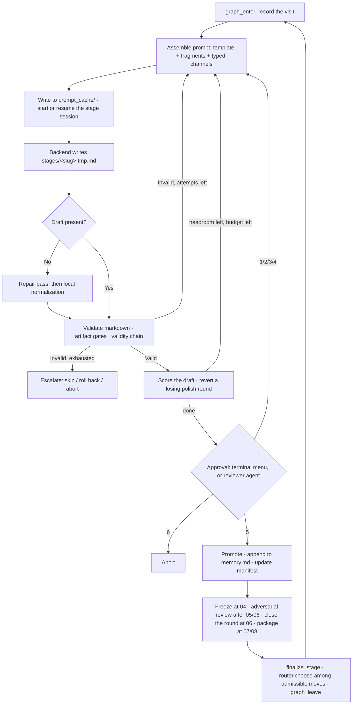

# Architecture

AutoR is a **research control loop layered over a coding-agent execution
loop**. The agent CLI does the work; AutoR decides which work is admissible,
checks what came back, attacks the result, measures the draft, and stops for a
human at every stage boundary.

This page describes how that is put together. For what a run *produces*, see
[Run Artifacts](run-artifacts.md); for what a stage must satisfy, see the
[Stage Contract](stage-contract.md); for the loops themselves, see
[Recursive Self-Improvement](self-improvement.md).

---

## Design commitments

Five constraints shape almost every decision in the codebase.

**The filesystem is the database.** A run is a directory. There is no
persistent process, no schema migration, no server that must be up. Run state
survives a crash because it was never anywhere else.

**No conversation crosses a stage boundary.** Stage 05 cannot see Stage 03's
session. What crosses is `memory.md` — the approved stage summaries — plus
`handoff/<slug>.md`, the same summaries cut down to Objective / Key Results /
Files Produced (`write_stage_handoff`), plus **sixteen** typed channels in
[`src/information_flow.py`](../src/information_flow.py), each of which declares
which stages read it. Memory and the handoff are the free text;
everything else that crosses a boundary is a typed channel or a JSON artifact.
Approval stays load-bearing because it is what puts a summary into memory and
what triggers the preregistration freeze; a refused stage propagates neither.

**Two different kinds of check, deliberately separated.**
`validate_stage_artifacts` ([`src/utils.py`](../src/utils.py)) runs artifact
gates — this file exists, is parseable, is fresh, cross-references correctly —
and then runs the validators that ask whether a *claim* is warranted:
`validate_preregistration`, `validate_experimental_protocol`,
`validate_hypothesis_outcomes`, `validate_outcome_statistics`,
`validate_claim_provenance`, `validate_validity_response`,
`validate_round_decision`, plus the three report-plan validators
(`validate_report_plan`, `validate_report_plan_sources`,
`validate_report_plan_coverage`) and the task-deliverables gate
(`validate_deliverables_coverage`). Seventeen `validate_*` functions are
reachable from it in total; the full table is in the
[README](../README.md#the-stage-contract-and-what-gets-validated). The code
labels the split itself: *"the scientific-validity chain, distinct from the
artifact gates around it"*. A run can fail because a claim is unwarranted, not
only because a file is absent.

**Nothing that measures may also approve.** The rubric scores, the evolution
controller reverts, the adversarial reviewer objects, the archive reorders
preferences — and none of them can pass a stage. Approval comes from the
terminal, or from the reviewer agent that stands in for it.

**One conversation per stage.** Refinement continues the same backend session
rather than restarting it, so iterating on a stage does not discard everything
the agent learned in it.

---

## Layers

```
┌───────────────────────────────────────────────────────────────────┐
│  Interfaces    main.py (terminal)  studio.py (browser)            │
│                rcb_agent.py (benchmark adapter)                   │
├───────────────────────────────────────────────────────────────────┤
│  Policy        rigor · effort                                     │
│                which optional machinery this run uses at all      │
├───────────────────────────────────────────────────────────────────┤
│  Walk          ResearchManager · stage_graph · router             │
│                which moves are admissible · which one is taken    │
├───────────────────────────────────────────────────────────────────┤
│  Gates         utils.validate_stage_markdown / _stage_artifacts   │
│                artifact gates ┊ preregistration ·                 │
│                               ┊ experimental_protocol ·           │
│                               ┊ report_plan · deliverables ·      │
│                               ┊ validity_review · research_rounds │
├───────────────────────────────────────────────────────────────────┤
│  Improvement   rubric → evolution → pareto                        │
│                measures a draft; cannot approve one               │
├───────────────────────────────────────────────────────────────────┤
│  Review        approval_agent · review_panel · cross_reviewer     │
│                validity_review · deliberation · stage_comments    │
│                review_policy · obligations                        │
├───────────────────────────────────────────────────────────────────┤
│  Self-measure  scorecard · archive · decisions · trials·inference │
│                did any of the above earn its cost?                │
├───────────────────────────────────────────────────────────────────┤
│  Contract      utils · manifest · information_flow ·              │
│                prompt_fragments · artifact_index ·                │
│                experiment_manifest · evidence_ledger ·            │
│                hypothesis_manifest · writing_manifest             │
├───────────────────────────────────────────────────────────────────┤
│  Execution     OperatorProtocol → ClaudeOperator · CodexOperator  │
│                web_search · mcp_web_search · backend_health       │
├───────────────────────────────────────────────────────────────────┤
│  Backend CLI   claude                        codex                │
└───────────────────────────────────────────────────────────────────┘
                                ↕
                     runs/<run_id>/  (the only state)
```

`ResearchManager` is the only module that reaches across layers. The operators
never decide what stage runs next; nothing in the gate, improvement or review
layers writes a prompt; and the improvement layer never approves.

---

## Module map

Line counts are the shape of the system: `manager.py` (3772) and `utils.py`
(2386) are the two largest files in the repo, and after them come `operator.py`
(1630), `review_panel.py` (1277), `main.py` (1194), `report_plan.py` (1103),
`rcb.py` (1037) and `stage_graph.py` (1000). 150 modules, ~62 k lines, 1820
tests. For the design argument behind this layering — why a gate reads the
filesystem rather than the transcript, and why the improvement layer is
forbidden from touching a verdict — see **[framework.md](framework.md)**.

### Entry points

| Module | Responsibility |
| --- | --- |
| [`main.py`](../main.py) | CLI parsing, backend and reviewer construction, archive wiring, new-run vs resume dispatch. Contains no workflow logic. |
| [`studio.py`](../studio.py) | Three-line shim over `src/backend/studio_http.main`. |
| [`rcb_agent.py`](../rcb_agent.py) | The ResearchClawBench adapter entry point: 37 flags, its own unattended defaults, `BENCHMARK_MIN_REPORT_FIGURES = 3`, and the only production caller of `resolve_cross_reviewer`. |
| [`tools/score_rcb_run.py`](../tools/score_rcb_run.py) | Scores a finished benchmark run. `--judge reference` (the default) is gpt-5.1, which is what ResearchClawBench itself scores with; `--judge vertex` is the Anthropic fallback. |
| [`tools/archive_sample_complexity.py`](../tools/archive_sample_complexity.py) | Prints how many runs the archive needs before an edge becomes believable, then exits. |

### Policy

| Module | Lines | Responsibility |
| --- | --- | --- |
| [`src/rigor.py`](../src/rigor.py) | 122 | The one dial. `LEVELS = (fast, standard, thorough, max)`, `DEFAULT_LEVEL = standard`, and `_LEVEL_FEATURES` mapping each level to the optional features it enables — `effort_tiers`, `deliberation`, `ideation_panel`, `review_panel`. `resolve()` writes the decision onto the parsed args before anything reads them; an explicit `--flag`/`--no-flag` always wins, which is why those switches use `BooleanOptionalAction` with `default=None`. |
| [`src/effort.py`](../src/effort.py) | 349 | `EffortPlan`, `TierDecision`, `Concentration`. Each stage runs as `routine` or `deliberative`; `DEFAULT_TIERS` marks 04, 05 and 08 routine. A routine stage gets a lean prompt, `manager.solo_reviewer` instead of the panel, and no polish rounds. Each stage declares the next one's tier; a routine stage that fails twice is promoted. Both directions of mis-spending are recorded in `workspace/reviews/effort.json`. |

### The walk

| Module | Lines | Responsibility |
| --- | --- | --- |
| [`src/manager.py`](../src/manager.py) | 3772 | `ResearchManager` — "walk the stage graph until it reaches `finish` or nothing is open" (`:412`). Owns intake, the attempt loop, prompt assembly, validation dispatch, the approval menu, the evolution controller, the freeze/amend seam, the validity review, the round close, the obligation ledger, the cross-review veto, the inbound-channel record, repair, resume, redo and rollback. |
| [`src/stage_graph.py`](../src/stage_graph.py) | 1000 | Eight stages plus `FINISH` as a directed graph. Six of the eight forward edges carry a guard (`_ADVANCE_GUARDS`) evaluated against artifacts on disk; `REVISIT_EDGES` adds thirteen backward moves and `TERMINAL_EDGES` one conditional finish, for twenty-two edges in the default `adaptive` topology against nine in `linear`; `DEFAULT_MAX_VISITS = 3` is a per-node budget and `DEFAULT_MAX_STEPS = 20` bounds the walk. `moves()` returns blocked edges *with* the reason they are blocked, and `repeats_a_previous_reason()` refuses a revisit already justified on the same grounds. |
| [`src/router.py`](../src/router.py) | 536 | Picks among admissible moves and records why. `--routing auto` asks only where more than one move is live. A choice outside the menu is refused, appended to `evolution/routing_refusals.jsonl` (`:186`), and replaced by the forward edge. |
| [`src/research_rounds.py`](../src/research_rounds.py) | 411 | Stages 03-06 as a repeatable round. Stage 06 records `converged`, `refine_design`, `new_hypothesis` or `abandon`; `converged` with nothing supported is refused unless the round declares `negative_result` (`:161`). Bounded by `--max-rounds`, which defaults to 1. |
| [`src/terminal_ui.py`](../src/terminal_ui.py) | | All terminal rendering: banners, stage panels, backend event streams, display-width-aware markdown wrapping, keyboard-selectable menus. The manager never writes to stdout directly. |

### Gates

| Module | Lines | Responsibility |
| --- | --- | --- |
| [`src/utils.py`](../src/utils.py) | 2386 | The contract layer. `STAGES`, `RunPaths`/`build_run_paths`, `REQUIRED_STAGE_HEADINGS`, `FIXED_STAGE_OPTIONS`, prompt assembly, `validate_stage_markdown`, `validate_stage_artifacts`, memory rendering, handoff read/write, venue resolution, `run_config.json` I/O, and every default the CLI overrides. |
| [`src/preregistration.py`](../src/preregistration.py) | 579 | Freezes and hashes the hypothesis set before results exist, adjudicates every frozen hypothesis at Stage 06 against a named result artifact, and traces every manuscript claim back to a supported hypothesis at Stage 07. A post-freeze change is legal only as an `amend_preregistration` (`:234`) amendment carrying the previous digest. |
| [`src/experimental_protocol.py`](../src/experimental_protocol.py) | 234 | Declares the primary metric, the seed count and each baseline's `why_competent` and `tuning_budget` before the experiments run. `MIN_SEEDS_FOR_A_VERDICT = 2` (`:37`) refuses a supported/refuted verdict resting on one run unless the run says why one run settles it. |
| [`src/validity_review.py`](../src/validity_review.py) | 510 | The adversarial pass after Stages 05 and 06 (`REVIEWED_STAGE_NUMBERS`, `:42`). Asks why the result is wrong across ten named failure modes rather than whether the stage is complete, and requires the next stage to answer every finding. Has no authority to approve or reject. |
| [`src/manifest.py`](../src/manifest.py) | | `run_manifest.json`: stage lifecycle, status transitions, rollback and stale marking, memory rebuild from approved entries. |
| [`src/artifact_index.py`](../src/artifact_index.py) | | Scans `data/`, `results/`, `figures/`; infers or reads declared schemas; writes `artifact_index.json`. |
| [`src/experiment_manifest.py`](../src/experiment_manifest.py) | | Builds and validates `results/experiment_manifest.json` as a view over the artifact index. |
| [`src/evidence_ledger.py`](../src/evidence_ledger.py) | | Validates the Stage 01 `sources.json`/`claims.json` pair and the Stage 07 `citation_verification.json`. |
| [`src/hypothesis_manifest.py`](../src/hypothesis_manifest.py) | | Parses Stage 02's typed `T*`/`H*`/`C*` identifiers into `hypothesis_manifest.json` — the input the `has_hypotheses` guard reads. |
| [`src/writing_manifest.py`](../src/writing_manifest.py) | | Stage 07 support: writing manifest, figure/result scanning, layout review generation and validation. |
| [`src/report_plan.py`](../src/report_plan.py) | 1103 | The report contract. `PlannedFigure`, `HeadlineNumber`, `TaskOutput`, `ReportPlan`. The run commits at Stage 03 to which figures the report will carry and which claim each supports; `stamp_report_plan` writes `declared_at` and a digest to `runs/<id>/report_plan_stamp.json` — outside `workspace/`, so the agent cannot backdate its own declaration. Three validators hang off it, at Stage 03 (shape), 06 (every `source_artifact` resolves and is non-empty) and 07 markdown (every non-dropped slot published *and* referenced). |
| [`src/deliverables.py`](../src/deliverables.py) | 221 | The task-deliverables contract — the only gate that asks whether the run answered *what it was asked*. `demanding_sentences()` parses the user's own task statement for 34 demand verbs; `validate_deliverables_coverage` requires every `task_quote` to be a verbatim span of `user_input.txt`, every addressed entry to name a `where` that appears in `report.md`, and every demanding sentence to be covered at >= 34% content-word overlap. `format_deliverables_for_prompt` injects a `# What the Task Asks For` block into every stage prompt. |

### Improvement

| Module | Lines | Responsibility |
| --- | --- | --- |
| [`src/rubric.py`](../src/rubric.py) | 936 | Eight weighted criteria read off disk with no backend call (`CRITERIA`, `:135-143`), including `reproducibility` (3.0), which walks the same validity chain the gate walks, and `commitment` (1.5), which counts hedge patterns. Verdicts are read only through `_verdict_blind_outcomes` (`:260`), so the score carries no gradient toward changing an answer. |
| [`src/evolution.py`](../src/evolution.py) | 727 | The champion ratchet. `consider()` (`:248`) scores each valid draft; `_revert()` (`:383`) copies the champion back over a losing polish round before the reviewer sees it; a round whose `verdict_digest` moved is rejected whatever it scored (`:306-327`); a human-directed revision is exempt (`:288-304`). `measure=True`, `rounds=2` by default (`:97`, `:102`). |
| [`src/pareto.py`](../src/pareto.py) | 212 | Keeps drafts that are non-dominated on the criterion vector even when they lose on the weighted total (`frontier`, `:74`). `complementary_pair` (`:153`) names the two whose merge has the most headroom — the only place two drafts are combined rather than ranked. |
| [`src/archive.py`](../src/archive.py) | 974 | Cross-run record under `~/.autor/archive`. `record_run` (`:426`) stores route, edges and per-stage fitness; `edge_payoffs` compares runs that took an edge against runs that reached the same node and did not; `propose_variant` (`:512`) reorders priorities and can never open, add or remove a guard. Promotion requires a win within every `comparability_basis` (`:91`), so halting early cannot raise mean fitness. |

### Self-measurement

Every optional mechanism in AutoR runs its own control arm and writes a ledger. This layer reads
them. See [framework.md](framework.md#53-machinery-that-reports-on-itself-in-the-unflattering-direction)
for why.

| Module | Lines | Responsibility |
| --- | --- | --- |
| [`src/scorecard.py`](../src/scorecard.py) | 319 | `FEATURES` maps five ledgers — `panel_effect.json`, `idea_pool.json`, `comment_ledger.json`, `deliberations.json`, `effort.json` — to assessor functions. `write_scorecard` runs from `ResearchManager._report_optional_machinery` at the end of every run and writes `workspace/reviews/scorecard.md`, keeping "could not be measured" strictly apart from "changed nothing". |
| [`src/decisions.py`](../src/decisions.py) | 269 | `Decision`, `decisions_from`, `offered_payoffs`, `believable_evidence`. Replaces the run-level control arm ("reached the node and did not take the edge") with the decision-level one ("was *offered* the edge and declined"), and feeds the archive's numbers into the routing prompt. |
| [`src/trials.py`](../src/trials.py) | 384 | Paired A/B trials over archived runs tagged with `--trial`/`--capability`/`--arm`. `collect_pairs` excludes fake-provenance and stale-rubric arms; `sign_flip_p` is an exact two-sided paired permutation test; `min_attainable_p` prints the floor beside it; `MIN_PAIRS_FOR_SIGNIFICANCE = 6` labels anything smaller `underpowered`. Reachable only from `main.py --trial-report`; **no trial has been run**. |
| [`src/inference.py`](../src/inference.py) | 167 | `unpaired_floor`, `paired_floor`, `minimum_arms_for`, `unpaired_permutation`. Derives `DEFAULT_MIN_OBSERVATIONS` in `archive.py` from the size of the edge family rather than asserting a threshold. |
| [`tools/archive_sample_complexity.py`](../tools/archive_sample_complexity.py) | 259 | Simulates how many runs the archive needs before an edge becomes believable, per edge and under an exploration policy. Prints, exits. |

### Review

| Module | Lines | Responsibility |
| --- | --- | --- |
| [`src/approval_agent.py`](../src/approval_agent.py) | | `AutomatedReviewer` — the strict reviewer agent that stands in for the human gate under `--full-auto`. Returns a `ReviewDecision`, and renders the standing rules and open obligations into its own prompt. |
| [`src/review_panel.py`](../src/review_panel.py) | 1277 | Five seats. Round 1 is independent; a cross-examination round runs only if that round was not unanimous, up to `--panel-rounds` (default 2, `:513`); then the chair synthesizes one decision. The Adversarial Reviewer's exposure is `"none"` (`:256`); peers are anonymised in round 2 (`:893`); abstention is a first-class verdict (`:325`); an unreachable member breaks unanimity rather than counting as agreement (`_is_unanimous`, `:723`); `_enforce_blocking_objections` (`:783`) converts a chair's approval into a refusal in code. `record_panel_effect` (`:1143`) accumulates the chair's round-1 solo verdict as the panel's own control arm. |
| [`src/cross_reviewer.py`](../src/cross_reviewer.py) | 239 | A second opinion from a different model family, applied only to approvals. A veto, never an override; an auditor that errors or returns unparseable output is recorded `unavailable` (`:60`, `:111-134`), never as agreement. |
| [`src/review_policy.py`](../src/review_policy.py) | 212 | Corrections the reviewer demanded become standing rules in `runs/<id>/review_policy.json` (`policy_path`, `:103`) and are rendered into every later review prompt. Per-run: nothing carries a rule into the next run. |
| [`src/obligations.py`](../src/obligations.py) | 306 | What an approving reviewer says a later stage still owes. Written to `runs/<id>/obligations.json` (`:160`), injected into that stage's prompt *and* its review, discharged only by a reviewer (`discharge_obligations`, `:226`), with deferrals counted rather than silent (`note_deferrals`, `:249`). |
| [`src/ideation_panel.py`](../src/ideation_panel.py) | 735 | Stage 02 divergence: five proposer lenses, Jaccard deduplication, scoring into a candidate pool the stage chooses from. Decides nothing. `measure_adoption` (`:604`) marks afterwards which pooled candidates the approved stage actually built on. |
| [`src/deliberation.py`](../src/deliberation.py) | 751 | The crux panel — not a reviewer of a stage. The executing agent writes a question to `workspace/notes/deliberation_request.json`; four voices (theorist, empiricist, critic, pragmatist) each commit to an answer and then argue against themselves; a resolver produces an answer that must name its own falsifier. Budgeted by `--max-deliberations` (3); a crux similar (>= 0.6) to one already answered reuses the stored answer. |
| [`src/stage_comments.py`](../src/stage_comments.py) | 375 | Anchored comments. A comment must quote >= 12 characters findable in the draft; an unfindable quote is recorded `unanchored` and dropped. The revision is told to change only those spans, and the next draft is diffed to count anchored against collateral line changes into `workspace/reviews/comment_ledger.json`. |

### Context and inputs

| Module | Lines | Responsibility |
| --- | --- | --- |
| [`src/information_flow.py`](../src/information_flow.py) | 553 | Sixteen typed channels (`CHANNELS`). Each declares `produced_by`, a `consumed_by` set of real stage slugs, and a rationale for every narrowing. `render_inbound()` composes a stage's context per consumer; `dependency_edges()` prints the producer→consumer topology. |
| [`src/prompt_fragments.py`](../src/prompt_fragments.py) | 104 | The rules every stage prompt shares, held once. `compose_stage_template` (`:97`) orders them: the stage's own instructions, then the output-format rules that constrain them, then `RUN_SAFETY`. |
| [`src/intake.py`](../src/intake.py) | | Stage 00: clarification-question parsing, resource classification and ingestion, `intake_context.json`. Runs before the graph walk begins. |
| [`src/bootstrap.py`](../src/bootstrap.py) | | `--paper-corpus`: scans your prior papers (PDF/LaTeX/BibTeX) into a researcher profile, citation neighborhood, and style profile. |
| [`src/project_bootstrap.py`](../src/project_bootstrap.py) | | `--project-root`: scans an existing repository, assesses per-stage completion, recommends a re-entry stage. |
| [`src/prompts/`](../src/prompts) | | One markdown template per stage, plus intake and bootstrap templates. Editing these changes agent behaviour with no code change. |
| [`src/skills/`](../src/skills) | | Agent skills, installed into each run's `.claude/skills/` by [`src/run_skills.py`](../src/run_skills.py). Pull-based counterpart to the templates: loaded only when the model judges one relevant. The install path is load-bearing — the operator runs with `cwd=run_root`, so skills left in the AutoR checkout are never discovered. |

### Execution

| Module | Responsibility |
| --- | --- |
| [`src/operator_protocol.py`](../src/operator_protocol.py) | `OperatorProtocol` — the interface the manager depends on. Implement this to add a backend. |
| [`src/operator.py`](../src/operator.py) | `ClaudeOperator` — session management, prompt-file invocation, live `stream-json` parsing, resume-failure detection and fallback, the repair pass, per-attempt state records. Also the shared base for other CLI backends. |
| [`src/operator_codex.py`](../src/operator_codex.py) | `CodexOperator` — subclass of `ClaudeOperator` overriding invocation. Runs `codex exec --json`, applies the sandbox mode, and works through a stable temp-directory symlink to the run root. |
| [`src/web_search.py`](../src/web_search.py) | Gemini-backed search for deployments where the coding agent's own `WebSearch` tool is disabled. `SearchReadiness`/`assess_search_readiness()` report a hard blocker (no key, no SDK) *before* the run starts rather than at Stage 01, and `build_mcp_config()` writes the config the CLI is handed. |
| [`src/mcp_web_search.py`](../src/mcp_web_search.py) | A stdlib JSON-RPC 2.0 MCP server over stdio exposing one tool, `mcp__autor-search__web_search`. No SDK. A notification (absent `id`) is answered with silence, as the spec requires. |
| [`src/backend_health.py`](../src/backend_health.py) | `classify`, `describe`, `BackendUnavailable`. Raised out of the stage loop and turned into a `run.backend_unavailable` manifest state, so "the model was unreachable" never reads as "the research failed". |

### Output

| Module | Responsibility |
| --- | --- |
| [`src/platform/foundry.py`](../src/platform/foundry.py) | Post-approval packaging: paper package and release package. |
| [`src/diagram_gen.py`](../src/diagram_gen.py) | Optional Gemini method-diagram generation, injected into `report.md` or `method.tex` depending on the run's output format. |
| [`src/rcb.py`](../src/rcb.py) | The ResearchClawBench export contract: `ensure_workspace_layout`, `build_benchmark_goal`, `collect_reference_resources`, `ReportSynthesizer`, `build_fallback_report`, and `export_run`, which mirrors `code/` and `results/` into the benchmark workspace, picks the report from four ranked sources, and publishes at most `MAX_REPORT_FIGURES` figures into `report/images/`. |

### Studio

| Module | Responsibility |
| --- | --- |
| [`src/backend/studio_http.py`](../src/backend/studio_http.py) | `ThreadingHTTPServer` request router, static asset serving, SSE for the Notebook. Stdlib `http.server` only. |
| [`src/backend/studio_service.py`](../src/backend/studio_service.py) | The service layer: project index, run summaries, stage documents, file tree, paper preview, version history, iteration planning. |
| [`src/backend/studio_runner.py`](../src/backend/studio_runner.py) | Drives real `ResearchManager` runs in a background thread under the Studio's approval gate. Its lazy-resume approve path picks the next stage by stage number (`:361-364`) rather than asking the router, so graph routing is a CLI capability today. |
| [`src/backend/sessions.py`](../src/backend/sessions.py) | Per-stage trace events for the live view; parses `logs_raw.jsonl` into renderable events. |
| [`src/backend/notebook.py`](../src/backend/notebook.py) | The Notebook view's Claude conversation over a run. |
| [`src/frontend/static/`](../src/frontend/static) | The single-page UI: `index.html`, `app.js`, `notebook.js`, `styles.css`. No build step, no framework. |

`src/studio_http.py` and `src/studio_service.py` are backwards-compatible
shims that re-export from `src/backend/`. New code should import from
`src.backend.*`.

---

## The walk

Stage 00 intake runs before the walk. `_graph_entry_stage` →
`_select_stages_for_run` (`src/manager.py:693-715`) yields only `STAGES`, so
the graph has eight nodes plus `FINISH`, not nine.



Three things bypass the router at the jump seam (`src/manager.py:440-465`):
`/back <stage>`, a rollback after retry exhaustion, and a round that decided to
refine its design or change its hypothesis. All are already-made moves by the
time the walk sees them, and all are recorded on the route as revisits.

### Prompt assembly

Context is composed **per consumer, not per availability**.
`ResearchManager._build_stage_prompt` does, in order:

1. `compose_stage_template` — the stage template from `src/prompts/<slug>.md`,
   the shared output-format fragments, and `RUN_SAFETY`.
2. `render_inbound(ChannelContext(...), CHANNELS)` (`src/manager.py:2033-2039`)
   — the typed channels whose `consumed_by` includes this stage. The delivered
   keys are written to the run log by `_record_inbound_channels` (`:2900`).
3. The stage-summary contract — the required heading order, the six fixed
   options, three refinement suggestions — and the execution-discipline rules.
4. `user_input.txt`.
5. `# Obligations Carried Forward` when the stage owes one, the web-search
   capability block, and `intake_context.json`, each only when it has content.
6. `memory.md`, filtered to the stages before this one on a redo — then the
   handoff, but only if memory came back empty.
7. Refinement feedback, or — on a continuation attempt — the current draft, the
   workspace, and, from attempt 3 on, the previous validation errors.

Steps 3-7 are `build_prompt` (`src/utils.py:753`); a continuation attempt takes
`build_continuation_prompt` (`:820`) instead, which always sends the handoff
because it sends no memory at all.

Three channel narrowings worth knowing, because they are what "typed" buys:
the artifact index skips Stages 00-02, which produce none; the writing manifest
reaches Stage 07 alone; and the mutable Stage 02 hypotheses stop at
`04_implementation`, where the freeze supersedes them.

Five blocks are still passed as arguments rather than declared as channels:
`obligations_context`, `intake_context_text`, `web_search_context`,
`approved_memory` and `handoff_context` (`src/manager.py:2041-2069`). Their
delivery rules therefore sit inside `build_prompt` instead of next to a
`consumed_by` set — which is where the one rule that matters lives:
`build_prompt` withholds the handoff when memory is non-empty
(`src/utils.py:807`), because the handoff is a strict subset of memory and
sending both put ~350 words of verbatim duplicate into every prompt from Stage
04 on.

The result is written to `prompt_cache/<slug>_attempt_NN.prompt.md` and passed
to the CLI **by reference** (`-p @<path>`). Two consequences worth knowing:
the prompt cache is load-bearing during a run rather than a log, and every
prompt that ever ran is auditable afterwards.

### Backend invocation

**Claude**, first attempt for a stage:

```bash
claude --model <model> \
  --permission-mode bypassPermissions \
  --dangerously-skip-permissions \
  --session-id <stage_session_id> \
  -p @runs/<run_id>/prompt_cache/<stage>_attempt_01.prompt.md \
  --output-format stream-json --verbose
```

Continuation within the same stage swaps `--session-id` for `--resume`.

**Codex:**

```bash
codex -C <workspace-symlink> exec --json \
  --sandbox <workspace-write|read-only|danger-full-access> \
  --skip-git-repo-check [-m <model>] [resume <session_id>] -
```

Codex reads the prompt from stdin and runs through a stable symlink under the
system temp directory, so its working directory stays constant across
attempts.

Both backends run with permission prompts disabled — that is what makes an
unattended research run possible, and it is the main reason to care about what
goes into a goal. See [SECURITY.md](../SECURITY.md).

### Three levels of recovery

Failures are handled at escalating cost, and only the cheapest one that works
is used:

1. **Repair pass** — the draft is missing or malformed. A narrowly scoped
   prompt asks the backend to rewrite *only* the stage summary file, with web
   access forbidden and no instruction to continue the research. Written to
   `<slug>_attempt_NN_repair.prompt.md`.
2. **Local normalization** — repair also failed. AutoR synthesizes a
   contract-shaped draft locally from whatever the attempt produced, with no
   backend call at all.
3. **Re-run** — the draft is present but validation failed. The next attempt
   receives the validation errors and tries again.

A separate mechanism handles a **resume failure**: if the backend reports that
a session ID no longer exists, the operator detects it from the error text and
falls back to a fresh session rather than failing the stage.

After `MAX_STAGE_ATTEMPTS` (5, `src/utils.py:13`) AutoR stops and offers you
skip, roll back, or abort. Under `--full-auto` the stage is auto-skipped
instead, bounded by `--max-auto-skips`. It never silently gives up and it never
silently continues.

---

## Rollback and staleness

`--redo-stage` and `--rollback-stage` differ in blast radius:

**Redo** re-runs one stage. Downstream stages are untouched. Use it when the
output was weak but the direction was right.

**Rollback** returns to a stage and marks every downstream stage `stale` in
`run_manifest.json`, recording `invalidated_reason` and `invalidated_by_stage`
on each. `memory.md` is rebuilt from the approved entries that survive.

Staleness is recorded rather than enforced: a stale stage is visibly marked,
and re-running it clears the mark. Rollback is also the mechanism the run uses
on itself — `_rollback_and_jump` (`src/manager.py:2585`) is how a research
round that decided `refine_design` gets back to Stage 03, and how a cross-model
veto reopens a stage that was already approved.

---

## Two interfaces, one model

The Studio is not a second system. It drives the same `ResearchManager` over
the same run directories, writing the same files.

| | Terminal | Studio |
| --- | --- | --- |
| Backends | Claude, Codex | Claude only |
| Approval | six-option menu | Approve button / feedback box |
| Live output | streamed to the terminal | session trace from `logs_raw.jsonl` |
| Restart safety | resume by `run_id` | lazy-resume on the next approve/feedback |
| Next stage | `router.choose` among admissible moves | next stage number (`studio_runner.py:361-364`) |
| Extra state | none | `.autor/projects.json`, `<run>/sessions/`, `<run>/notebook/` |

You can start a run in the terminal and inspect it in the Studio, or the
reverse. The run directory is the contract between them.

---

## Extension points

Ordered by how much of the system you have to understand first.

| To change… | Edit | Code change needed |
| --- | --- | --- |
| What a stage asks the agent to do | `src/prompts/<slug>.md` | none |
| A rule every stage prompt shares | `src/prompt_fragments.py` | none |
| Craft guidance an agent can pull mid-stage | a new `src/skills/<name>/SKILL.md` | none |
| The set of target venues | `templates/registry.yaml` | none |
| What a hostile reviewer would object to | `VALIDITY_CATEGORIES` in `src/validity_review.py` | none |
| Which stages read which information | `CHANNELS` in `src/information_flow.py` | small |
| What a stage must produce | `validate_stage_artifacts` in `src/utils.py` | small |
| What counts as a warranted claim | `src/preregistration.py` | small |
| What counts as adequate evidence | `src/experimental_protocol.py` | small |
| How a round may conclude | `DECISIONS` in `src/research_rounds.py` | small |
| What a good draft scores | `CRITERIA` in `src/rubric.py` | small |
| The summary contract | `REQUIRED_STAGE_HEADINGS` + `validate_stage_markdown` | small |
| Which moves exist and what guards them | `_ADVANCE_GUARDS`, `REVISIT_EDGES`, `GUARDS` in `src/stage_graph.py` | moderate |
| The stage list | `STAGES` in `src/utils.py`, plus a new prompt template | moderate |
| The execution backend | implement `OperatorProtocol`, or subclass `ClaudeOperator` | moderate |
| The approval policy | `AutomatedReviewer` in `src/approval_agent.py`, or the seats in `src/review_panel.py` | moderate |

Step-by-step recipes are in [Development](development.md#extending-autor).

A note on adding a guard: a guard is a routing preference, not a gate. If the
guard closes the only forward edge, the run still advances and the stage's own
validation refuses it there. Anything that must be impossible belongs in
`validate_stage_artifacts`, not only in `GUARDS`.

---

## What AutoR deliberately is not

- **Not a multi-agent framework.** One agent executes. The panels are review
  and ideation seats at two specific gates, not an orchestration layer.
- **Not concurrent.** Stages run one at a time. Ordering is the point.
- **Not database-backed.** Files, and nothing else.
- **Not a dashboard product.** The Studio is a view over run directories.
- **Not autonomous.** The default is that nothing advances without a human,
  and no loop in the system can approve a stage.
