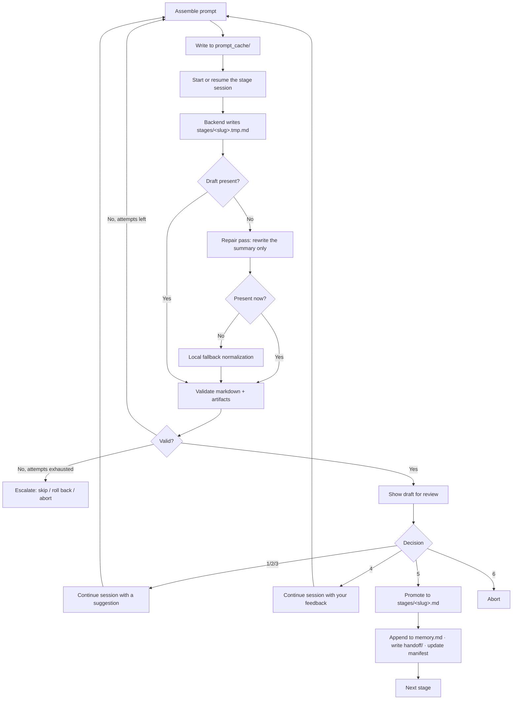

# Architecture

AutoR is a **research control loop layered over a coding-agent execution
loop**. The agent CLI does the work; AutoR decides what work happens, checks
what came back, and stops for a human at every stage boundary.

This page describes how that is put together. For what a run *produces*, see
[Run Artifacts](run-artifacts.md); for what a stage must satisfy, see the
[Stage Contract](stage-contract.md).

---

## Design commitments

Four constraints shape almost every decision in the codebase.

**The filesystem is the database.** A run is a directory. There is no
persistent process, no schema migration, no server that must be up. Run state
survives a crash because it was never anywhere else.

**Approved memory is the only cross-stage channel.** Stage 05 cannot see Stage
03's conversation — only the approved entries in `memory.md`. This is what
makes human approval load-bearing rather than ceremonial: refuse a stage and
its content genuinely does not propagate.

**Validation is structural, not semantic.** AutoR checks that files exist, are
parseable, are fresh, and cross-reference correctly. It never judges whether
the science is right. Every check is one a machine can be trusted with; the
rest is left explicitly to you.

**One conversation per stage.** Refinement continues the same backend session
rather than restarting it, so iterating on a stage does not discard everything
the agent learned in it.

---

## Layers

```
┌─────────────────────────────────────────────────────────────┐
│  Interfaces      main.py (terminal)    studio.py (browser)  │
├─────────────────────────────────────────────────────────────┤
│  Control loop    ResearchManager                            │
│                  stage sequencing · approval · repair ·     │
│                  resume · redo · rollback                   │
├─────────────────────────────────────────────────────────────┤
│  Contract        utils.py · manifest.py · artifact_index.py │
│                  experiment_manifest.py · evidence_ledger.py│
│                  hypothesis_manifest.py · writing_manifest.py│
├─────────────────────────────────────────────────────────────┤
│  Execution       OperatorProtocol                           │
│                  ClaudeOperator · CodexOperator             │
├─────────────────────────────────────────────────────────────┤
│  Backend CLI     claude          codex                      │
└─────────────────────────────────────────────────────────────┘
                              ↕
                   runs/<run_id>/  (the only state)
```

Each layer talks only to the one below it. The control loop never shells out
to a CLI directly; the operators never decide what stage runs next.

---

## Module map

### Entry points

| Module | Responsibility |
| --- | --- |
| [`main.py`](../main.py) | CLI parsing, backend and reviewer construction, new-run vs resume dispatch. Contains no workflow logic. |
| [`studio.py`](../studio.py) | Three-line shim over `src/backend/studio_http.main`. |

### Control loop

| Module | Responsibility |
| --- | --- |
| [`src/manager.py`](../src/manager.py) | `ResearchManager` — the whole workflow. Intake, bootstrap, the stage loop, prompt assembly, validation dispatch, the approval menu, repair and normalization, retry exhaustion handling, skip/back control commands, resume, redo, rollback. |
| [`src/terminal_ui.py`](../src/terminal_ui.py) | All terminal rendering: banners, stage panels, backend event streams, display-width-aware markdown wrapping, keyboard-selectable menus. The manager never writes to stdout directly. |
| [`src/approval_agent.py`](../src/approval_agent.py) | `AutomatedReviewer` — the strict reviewer agent that stands in for the human gate under `--full-auto`. Returns a `ReviewDecision`. |

### Execution

| Module | Responsibility |
| --- | --- |
| [`src/operator_protocol.py`](../src/operator_protocol.py) | `OperatorProtocol` — the interface the manager depends on. Implement this to add a backend. |
| [`src/operator.py`](../src/operator.py) | `ClaudeOperator` — session management, prompt-file invocation, live `stream-json` parsing, resume-failure detection and fallback, the repair pass, per-attempt state records. Also the shared base for other CLI backends. |
| [`src/operator_codex.py`](../src/operator_codex.py) | `CodexOperator` — subclass of `ClaudeOperator` overriding invocation. Runs `codex exec --json`, applies the sandbox mode, and works through a stable temp-directory symlink to the run root. |

### Contract and state

| Module | Responsibility |
| --- | --- |
| [`src/utils.py`](../src/utils.py) | The contract layer. `StageSpec`/`STAGES`, `RunPaths`/`build_run_paths`, prompt assembly, `validate_stage_markdown`, `validate_stage_artifacts`, memory rendering, handoff read/write, venue resolution, `run_config.json` I/O. Everything shared lives here. |
| [`src/manifest.py`](../src/manifest.py) | `run_manifest.json`: stage lifecycle, status transitions, rollback and stale marking, memory rebuild from approved entries. |
| [`src/artifact_index.py`](../src/artifact_index.py) | Scans `data/`, `results/`, `figures/`; infers or reads declared schemas; writes `artifact_index.json`. |
| [`src/experiment_manifest.py`](../src/experiment_manifest.py) | Builds and validates `results/experiment_manifest.json` as a view over the artifact index. |
| [`src/evidence_ledger.py`](../src/evidence_ledger.py) | Validates the Stage 01 `sources.json`/`claims.json` pair and the Stage 07 `citation_verification.json`. |
| [`src/hypothesis_manifest.py`](../src/hypothesis_manifest.py) | Parses Stage 02's typed `T*`/`H*`/`C*` identifiers into `hypothesis_manifest.json`. |
| [`src/preregistration.py`](../src/preregistration.py) | Freezes the hypothesis set before results exist, adjudicates every frozen hypothesis at Stage 06, and traces every manuscript claim back to a supported one at Stage 07. The one part of the pipeline that gates on whether a claim is warranted rather than on whether a file exists. |
| [`src/experimental_protocol.py`](../src/experimental_protocol.py) | Declares the primary metric, the seed count and each baseline's tuning budget before the experiments run, and refuses a verdict that rests on one run or on an unstated dispersion measure. |
| [`src/validity_review.py`](../src/validity_review.py) | The adversarial pass after Stages 05 and 06. Asks why the result is wrong rather than whether the stage is complete, and requires the next stage to answer every finding it raises. Has no authority to approve or reject. |
| [`src/writing_manifest.py`](../src/writing_manifest.py) | Stage 07 support: writing manifest, figure/result scanning, layout review generation and validation. |

### Inputs

| Module | Responsibility |
| --- | --- |
| [`src/intake.py`](../src/intake.py) | Stage 00: clarification-question parsing, resource classification and ingestion, `intake_context.json`. |
| [`src/bootstrap.py`](../src/bootstrap.py) | `--paper-corpus`: scans your prior papers (PDF/LaTeX/BibTeX) into a researcher profile, citation neighborhood, and style profile. |
| [`src/project_bootstrap.py`](../src/project_bootstrap.py) | `--project-root`: scans an existing repository, assesses per-stage completion, recommends a re-entry stage. |

### Output

| Module | Responsibility |
| --- | --- |
| [`src/platform/foundry.py`](../src/platform/foundry.py) | Post-approval packaging: paper package and release package. |
| [`src/diagram_gen.py`](../src/diagram_gen.py) | Optional Gemini method-diagram generation, injected into `report.md` or `method.tex` depending on the run's output format. The only module with a third-party dependency. |
| [`src/prompts/`](../src/prompts) | One markdown template per stage, plus intake and bootstrap templates. Editing these changes agent behaviour with no code change. |
| [`src/skills/`](../src/skills) | Agent skills, installed into each run's `.claude/skills/` by [`src/run_skills.py`](../src/run_skills.py). Pull-based counterpart to the prompt templates: loaded only when the model judges one relevant. The install path is load-bearing — the operator runs with `cwd=run_root`, so skills left in the AutoR checkout are never discovered. |

### Studio

| Module | Responsibility |
| --- | --- |
| [`src/backend/studio_http.py`](../src/backend/studio_http.py) | `ThreadingHTTPServer` request router, static asset serving, SSE for the Notebook. Stdlib `http.server` only. |
| [`src/backend/studio_service.py`](../src/backend/studio_service.py) | The service layer: project index, run summaries, stage documents, file tree, paper preview, version history, iteration planning. |
| [`src/backend/studio_runner.py`](../src/backend/studio_runner.py) | Drives real `ResearchManager` runs in a background thread under the Studio's approval gate. |
| [`src/backend/sessions.py`](../src/backend/sessions.py) | Per-stage trace events for the live view; parses `logs_raw.jsonl` into renderable events. |
| [`src/backend/notebook.py`](../src/backend/notebook.py) | The Notebook view's Claude conversation over a run. |
| [`src/frontend/static/`](../src/frontend/static) | The single-page UI: `index.html`, `app.js`, `notebook.js`, `styles.css`. No build step, no framework. |

`src/studio_http.py` and `src/studio_service.py` are backwards-compatible
shims that re-export from `src/backend/`. New code should import from
`src.backend.*`.

---

## The stage attempt loop

This is the core of the system. Everything else supports it.



### Prompt assembly

`ResearchManager._build_stage_prompt` composes, in order:

1. The stage template from `src/prompts/<slug>.md`.
2. The stage summary contract and execution-discipline constraints.
3. `user_input.txt` — the original goal.
4. `memory.md` — approved stage summaries.
5. `intake_context.json`, when present.
6. Venue configuration for the run.
7. The structured artifact index, regenerated at prompt time.
8. The experiment bundle manifest, for Stage 05 and later.
9. Up to four prior handoff summaries, with the Decision Ledger stripped.
10. Refinement feedback, on a refinement attempt.
11. The current draft and workspace context, on a continuation attempt.
12. Previous validation errors, when re-running after a failure.

The result is written to `prompt_cache/<slug>_attempt_NN.prompt.md` and passed
to the CLI **by reference** (`-p @<path>`). Two consequences worth knowing:
the prompt cache is load-bearing during a run rather than a log, and every
prompt that ever ran is auditable afterwards.

### Backend invocation

**Claude**, first attempt for a stage:

```bash
claude --model <model> \
  --permission-mode bypassPermissions \
  --dangerously-skip-permissions \
  --session-id <stage_session_id> \
  -p @runs/<run_id>/prompt_cache/<stage>_attempt_01.prompt.md \
  --output-format stream-json --verbose
```

Continuation within the same stage swaps `--session-id` for `--resume`.

**Codex:**

```bash
codex -C <workspace-symlink> exec --json \
  --sandbox <workspace-write|read-only|danger-full-access> \
  --skip-git-repo-check [-m <model>] [resume <session_id>] -
```

Codex reads the prompt from stdin and runs through a stable symlink under the
system temp directory, so its working directory stays constant across
attempts.

Both backends run with permission prompts disabled — that is what makes an
unattended research run possible, and it is the main reason to care about what
goes into a goal. See [SECURITY.md](../SECURITY.md).

### Three levels of recovery

Failures are handled at escalating cost, and only the cheapest one that works
is used:

1. **Repair pass** — the draft is missing or malformed. A narrowly scoped
   prompt asks the backend to rewrite *only* the stage summary file, with web
   access forbidden and no instruction to continue the research. Written to
   `<slug>_attempt_NN_repair.prompt.md`.
2. **Local normalization** — repair also failed. AutoR synthesizes a
   contract-shaped draft locally from whatever the attempt produced, with no
   backend call at all.
3. **Re-run** — the draft is present but validation failed. The next attempt
   receives the validation errors and tries again.

A separate mechanism handles a **resume failure**: if the backend reports that
a session ID no longer exists, the operator detects it from the error text and
falls back to a fresh session rather than failing the stage.

After `MAX_STAGE_ATTEMPTS` (5), AutoR stops and offers you skip, roll back, or
abort. It never silently gives up and it never silently continues.

---

## Rollback and staleness

`--redo-stage` and `--rollback-stage` differ in blast radius:

**Redo** re-runs one stage. Downstream stages are untouched. Use it when the
output was weak but the direction was right.

**Rollback** returns to a stage and marks every downstream stage `stale` in
`run_manifest.json`, recording `invalidated_reason` and `invalidated_by_stage`
on each. `memory.md` is rebuilt from the approved entries that survive. Use it
when a later stage proved an earlier decision wrong — which is the normal
shape of real research, not an exception.

Staleness is recorded rather than enforced: a stale stage is visibly marked,
and re-running it clears the mark.

---

## Two interfaces, one model

The Studio is not a second system. It drives the same `ResearchManager` over
the same run directories, writing the same files.

| | Terminal | Studio |
| --- | --- | --- |
| Backends | Claude, Codex | Claude only |
| Approval | six-option menu | Approve button / feedback box |
| Live output | streamed to the terminal | session trace from `logs_raw.jsonl` |
| Restart safety | resume by `run_id` | lazy-resume on the next approve/feedback |
| Extra state | none | `.autor/projects.json`, `<run>/sessions/`, `<run>/notebook/` |

You can start a run in the terminal and inspect it in the Studio, or the
reverse. The run directory is the contract between them.

---

## Extension points

Ordered by how much of the system you have to understand first.

| To change… | Edit | Code change needed |
| --- | --- | --- |
| What a stage asks the agent to do | `src/prompts/<slug>.md` | none |
| Craft guidance an agent can pull mid-stage | a new `src/skills/<name>/SKILL.md` | none |
| The set of target venues | `templates/registry.yaml` | none |
| What a stage must produce | `validate_stage_artifacts` in `src/utils.py` | small |
| What counts as a warranted claim | `src/preregistration.py` | small |
| What counts as adequate evidence | `src/experimental_protocol.py` | small |
| What a hostile reviewer would object to | `VALIDITY_CATEGORIES` in `src/validity_review.py` | none |
| The summary contract | `REQUIRED_STAGE_HEADINGS` + `validate_stage_markdown` | small |
| The stage list | `STAGES` in `src/utils.py`, plus a new prompt template | moderate |
| The execution backend | implement `OperatorProtocol`, or subclass `ClaudeOperator` | moderate |
| The approval policy | `AutomatedReviewer` in `src/approval_agent.py` | moderate |

Step-by-step recipes are in [Development](development.md#extending-autor).

---

## What AutoR deliberately is not

- **Not a multi-agent framework.** One agent executes; one loop supervises.
- **Not concurrent.** Stages run in order, one at a time. Ordering is the
  point.
- **Not database-backed.** Files, and nothing else.
- **Not a dashboard product.** The Studio is a view over run directories.
- **Not autonomous.** The default is that nothing advances without a human.
